目标：

种子生成拎出来

这个 pod 的输入是什么，输出是什么。

针对协议和内核的 fuzz，py 脚本如何适配


局限性 cwe 效果


# buttercup
## buttercup 介绍
github 链接：[https://github.com/trailofbits/buttercup](https://github.com/trailofbits/buttercup)

介绍链接：[https://blog.trailofbits.com/2025/08/08/buttercup-is-now-open-source/?utm_](https://blog.trailofbits.com/2025/08/08/buttercup-is-now-open-source/?utm_source=chatgpt.com)[source=chatgpt.com](https://blog.trailofbits.com/2025/08/08/buttercup-is-now-open-source/?utm_source=chatgpt.com)

介绍 pdf：[https://www.trailofbits.com/documents/DEFCON_](https://www.trailofbits.com/documents/DEFCON_AIxCC_Stage_Talk.pdf)[AIxCC_](https://www.trailofbits.com/documents/DEFCON_AIxCC_Stage_Talk.pdf)[Stage_](https://www.trailofbits.com/documents/DEFCON_AIxCC_Stage_Talk.pdf)[Talk.pdf](https://www.trailofbits.com/documents/DEFCON_AIxCC_Stage_Talk.pdf)

[DEFCON_](https://www.yuque.com/attachments/yuque/0/2025/pdf/34357387/1757341587124-07fc7a25-1ef3-49bc-879c-4b710958a229.pdf)[AIxCC_](https://www.yuque.com/attachments/yuque/0/2025/pdf/34357387/1757341587124-07fc7a25-1ef3-49bc-879c-4b710958a229.pdf)[Stage_](https://www.yuque.com/attachments/yuque/0/2025/pdf/34357387/1757341587124-07fc7a25-1ef3-49bc-879c-4b710958a229.pdf)[Talk.pdf](https://www.yuque.com/attachments/yuque/0/2025/pdf/34357387/1757341587124-07fc7a25-1ef3-49bc-879c-4b710958a229.pdf)

理想状态：

<!-- 这是一张图片，ocr 内容为： -->
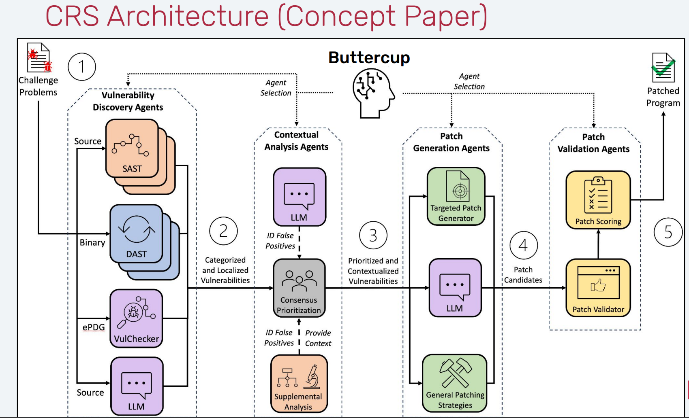

实际代码实现：

<!-- 这是一张图片，ocr 内容为： -->
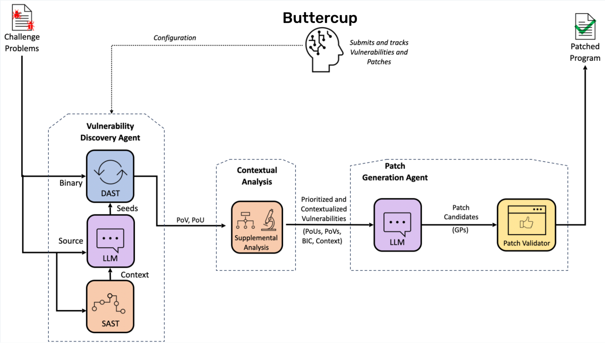

当 Buttercup 启动时，它会以兼容 OSS-Fuzz 的源代码存储库的形式等待用户的任务。一旦完成任务，Buttercup 就会检索代码存储库，在启用和不启用各种清理器的情况下构建程序，并在基于 AI 的输入生成器的帮助下开始模糊测试程序。当输入触发程序中的清理器、超时或崩溃时，这些输入将被记录为漏洞证明 （PoV）。

接下来，Buttercup 的编排器会删除重复的 PoV，并将唯一的崩溃发送到补丁生成系统进行修补。补丁生成系统使用来自上下文分析系统的信息，迭代地创建、测试和完善补丁，直到它生成一个补丁，该补丁 1） 防止 PoV 及其重复触发漏洞，以及 2） 维护程序的其他功能。最后，Buttercup 的编排器会保留 PoV 和补丁，以便可以向用户报告它们。

###### --------问题：
1.ai 生成了什么？怎么做 fuzz 的

2.生成的 pov 的格式是什么

3.系统如何分析上下文的

4.分析上下文的结果是什么

5.patch 如何生成的，如何进行测试，如何进行完善

### 杂七杂八
```plain
(buttercup) buttercup2@buttercup2-virtual-machine:~/AI/AIxCC/buttercup$ cloc .
   10448 text files.
    9575 unique files.                                          
    1981 files ignored.

github.com/AlDanial/cloc v 1.90  T=39.56 s (224.5 files/s, 52593.3 lines/s)
-------------------------------------------------------------------------------
Language                     files          blank        comment           code
-------------------------------------------------------------------------------
Python                        7772         287870         371627        1151335
JSON                           544           1139              0         155889
C                               50           2344           3155          17618
YAML                           119            445            304          15385
Cython                          60           2629           1157           9567
Markdown                        83           3060              0           7998
C/C++ Header                    63           1729           2701           7965
Protocol Buffers                64            937           5874           2843
C++                             15            580           1136           2782
Bourne Shell                    31            471            501           2394
vim script                       1            424            610           2364
Lisp                             1            278            618           1594
JavaScript                       3            211            190           1579
lex                              2            117            314           1266
CSS                              3            319             41           1012
Sass                             1            102             32            626
Perl                             2            158            156            598
TOML                            13             83             31            591
yacc                             1             50             44            588
m4                               2             52            123            472
HTML                             3             31             13            448
XML                              6            189            901            361
make                             9             78             42            352
HCL                              6             44             18            325
XSLT                             4             47             54            308
Dockerfile                       6             74              2            214
reStructuredText                 5             90             92            206
DOS Batch                        5             21              0            135
Assembly                         2             30             14            120
Specman e                        1              8              4             87
Fish Shell                       1             20             34             70
OCaml                            1              7              0             56
XSD                              1              0              3             47
PowerShell                       1             13             23             46
C Shell                          1             14             27             35
-------------------------------------------------------------------------------
SUM:                          8882         303664         389841        1387276
-------------------------------------------------------------------------------
```

```plain
~/AI/AIxCC/buttercup$ docker ps | wc -l
70
```

```plain
┌─────────────────────────────────────────────────────────────────────────────┐
│                   Buttercup 完整数据流程图                                    │
│                (从 GitHub 项目到漏洞修复)                                      │
└─────────────────────────────────────────────────────────────────────────────┘

阶段 1: 任务准备
═══════════════════════════════════════════════════════════════════════════════
GitHub OSS-Fuzz 兼容项目
  │ (例如: tob-challenges/example-libpng)
  │
  ↓
[用户/竞赛服务器] 提交任务 POST /v1/task/
  │
  │ 任务内容：
  │ {
  │   task_id: "uuid",
  │   project_name: "libpng",
  │   sources: [
  │     {type: REPO, url: "https://github.com/.../libpng.tar.gz", sha256: "..."},
  │     {type: FUZZ_TOOLING, url: "https://github.com/.../oss-fuzz.tar.gz", sha256: "..."},
  │     {type: DIFF, url: "...", sha256: "..."} // 可选，delta 模式
  │   ],
  │   deadline: timestamp
  │ }
  │
  ↓
[Task Server] 验证 + 发布消息
  │ → Redis: DOWNLOAD_TASKS 队列
  │ → TaskRegistry: 注册任务

阶段 2: 下载与准备
═══════════════════════════════════════════════════════════════════════════════
[Downloader] 监听 DOWNLOAD_TASKS
  │
  ├→ 下载 source[0]: libpng 源码 → /tasks_storage/{task_id}/src/
  ├→ 下载 source[1]: oss-fuzz 工具 → /tasks_storage/{task_id}/fuzz-tooling/
  └→ 下载 source[2]: diff (可选) → /tasks_storage/{task_id}/diff/
  │
  │ 验证 SHA256 ✓
  │ 保存 meta.json (项目元数据)
  │
  ↓
发布 TaskReady → Redis: READY_TASKS

阶段 3: 调度与索引
═══════════════════════════════════════════════════════════════════════════════
[Scheduler] 监听 READY_TASKS
  │
  ├→ 解析 project.yaml (从 fuzz-tooling)
  │   获取:
  │   - 语言 (C/C++/Java)
  │   - Sanitizers (ASAN/UBSAN/MSAN)
  │   - Fuzz targets (png_read_fuzzer, png_write_fuzzer, ...)
  │
  ├→ 发送索引请求 → Redis: INDEX_REQUESTS
  │   {
  │     task_id: "...",
  │     src_dir: "/tasks_storage/{task_id}/src/"
  │   }
  │
  └→ 发送构建请求 → Redis: BUILD_REQUESTS (×3)
      {
        task_id: "...",
        target: "png_read_fuzzer",
        build_type: COVERAGE  // 或 ASAN, RELEASE
      }

阶段 4A: 程序分析（并行）
═══════════════════════════════════════════════════════════════════════════════
[Program Model] 监听 INDEX_REQUESTS
  │
  ├→ Tree-sitter 解析源码
  │   - 函数定义
  │   - 调用图
  │   - 数据结构
  │   - 宏定义
  │
  ├→ CodeQuery 建立数据库
  │   CREATE TABLE functions (name, file, line, ...);
  │   CREATE TABLE calls (caller, callee, ...);
  │
  ├→ ripgrep 建立文本索引
  │   支持快速搜索关键字
  │
  └→ 发布 IndexOutput → Redis: INDEX_OUTPUT
      {
        task_id: "...",
        status: "completed",
        db_path: "/node_data/{task_id}/codequery.db"
      }

阶段 4B: 编译构建（并行）
═══════════════════════════════════════════════════════════════════════════════
[Build Bot] (×4 副本) 监听 BUILD_REQUESTS
  │
  ├→ 读取构建脚本 (build.sh from oss-fuzz)
  │
  ├→ 编译三种版本:
  │   1. Coverage Build (用于覆盖率收集)
  │      CC=clang -fprofile-instr-generate -fcoverage-mapping
  │
  │   2. ASAN Build (用于内存错误检测)
  │      CC=clang -fsanitize=address -g
  │
  │   3. Release Build (用于最终验证)
  │      CC=clang -O2
  │
  └→ 发布 BuildOutput → Redis: BUILD_OUTPUT
      {
        task_id: "...",
        target: "png_read_fuzzer",
        build_type: ASAN,
        binary_path: "/scratch/{task_id}/build-asan/png_read_fuzzer",
        status: "success"
      }

阶段 5: 种子生成
═══════════════════════════════════════════════════════════════════════════════
[Seed Generator] 监听构建完成信号
  │
  ├→ 分析项目特征
  │   - 文件格式 (PNG)
  │   - 示例文件
  │   - 语法规则
  │
  ├→ 使用 LLM 生成智能种子
  │   Prompt: "Generate valid PNG file structures for fuzzing..."
  │   Model: gpt-4o-mini (快速 + 便宜)
  │
  └→ 保存种子到 corpus
      /scratch/{task_id}/corpus/seed_001.png
      /scratch/{task_id}/corpus/seed_002.png
      ...

阶段 6: 模糊测试 (核心！)
═══════════════════════════════════════════════════════════════════════════════
[Fuzzer Bot] (动态扩展) 监听构建完成
  │
  ├→ 启动 libFuzzer
  │   ./png_read_fuzzer \
  │     -max_len=1048576 \
  │     -timeout=25 \
  │     -rss_limit_mb=2560 \
  │     /scratch/{task_id}/corpus/
  │
  ├→ 运行 fuzzing (持续到 deadline)
  │   ┌───────────────────────────────┐
  │   │  libFuzzer 内部循环:          │
  │   │  1. 从 corpus 选择种子         │
  │   │  2. 变异 (bit flip, 插入...)  │							会不会有api帮助种子变异
  │   │  3. 执行目标程序               │
  │   │  4. 检测崩溃/超时              │
  │   │  5. 如果新覆盖 → 加入 corpus  │
  │   │  6. 如果崩溃 → 保存 testcase  │
  │   └───────────────────────────────┘
  │
  └→ 发现崩溃时
      保存 testcase → /scratch/{task_id}/crashes/crash-{hash}
      发布 Crash 消息 → Redis: CRASHES

阶段 7: 崩溃分析
═══════════════════════════════════════════════════════════════════════════════
[Coverage Bot] (并行运行)
  │
  ├→ 定期采样 corpus (默认 200 个样本)
  │
  ├→ 运行 Coverage Build 收集覆盖率
  │   LLVM_PROFILE_FILE="coverage-%p.profraw" ./png_read_fuzzer @corpus
  │
  ├→ 生成覆盖率报告
  │   llvm-profdata merge -o coverage.profdata coverage-*.profraw
  │   llvm-cov show ... > coverage.json
  │
  └→ 发布覆盖率数据											
      用于指导下一轮 fuzzing 策略							是否是libfuzz支持还是有ai加持 

[Tracer Bot] 监听 CRASHES				有异常输出也要分析
  │
  ├→ 使用 GDB 追踪崩溃
  │   gdb -batch \
  │     -ex "run < crash-{hash}" \
  │     -ex "bt full" \
  │     -ex "info registers" \
  │     ./png_read_fuzzer-asan
  │
  ├→ 提取详细信息
  │   {
  │     crash_type: "heap-buffer-overflow",
  │     crash_state: "png_read_row\npng_read_image\npng_process_data",
  │     crash_address: "0x7f1234567890",
  │     stacktrace: "...",
  │     registers: {...},
  │     memory_maps: "...",
  │     testcase: 
  │   }
  │
  └→ 发布 TracedCrash → Redis: TRACED_VULNERABILITIES

阶段 8: 漏洞验证
═══════════════════════════════════════════════════════════════════════════════
[POV Reproducer] 监听 TRACED_VULNERABILITIES
  │
  ├→ 重新编译 ASAN build (隔离环境)
  │
  ├→ 重放 testcase
  │   ./png_read_fuzzer-asan < testcase
  │
  ├→ 检查崩溃特征
  │   - Crash type 一致？
  │   - Crash state 一致？
  │   - 可稳定复现？
  │
  ├→ 如果验证通过
  │   标记为 "confirmed vulnerability"
  │   生成 POV (Proof of Vulnerability) 							如何生成pov
  │   └→ 提交到 Competition API: POST /v1/task/{task_id}/pov/
  │
  └→ 如果验证失败
      标记为 "flaky" 或 "false positive"

阶段 9: 根因分析与补丁生成 (AI 核心！)
═══════════════════════════════════════════════════════════════════════════════
[Scheduler] 收到 confirmed vulnerability
  │
  └→ 发布 Patch Request → Redis: PATCHES
      {
        task_id: "...",
        vulnerability_id: "...",
        crash_info: TracedCrash,
        project_context: {
          language: "C",
          sanitizer: "ASAN",
          build_type: "fuzz"
        }
      }

[Patcher] 监听 PATCHES
  │
  │ ┌─────────────────────────────────────────────────────────────┐
  │ │          多智能体补丁生成流水线                               │
  │ └─────────────────────────────────────────────────────────────┘
  │
  ├→ 智能体 1: Root Cause Analysis
  │   │
  │   ├→ 分析栈帧
  │   │   crash_state: "png_read_row → png_read_image → png_process_data"
  │   │
  │   ├→ 查询 Program Model (CodeQuery)
  │   │   SELECT * FROM functions WHERE name = 'png_read_row';
  │   │   SELECT * FROM calls WHERE callee = 'png_read_row';
  │   │
  │   ├→ 调用 LLM (claude-3.5-sonnet)
  │   │   Prompt:
  │   │   """
  │   │   Crash Type: heap-buffer-overflow
  │   │   Stack Trace: {stacktrace}
  │   │   Function: png_read_row at png.c:1234
  │   │   
  │   │   Analyze the root cause of this vulnerability.
  │   │   What is the vulnerable code pattern?
  │   │   """
  │   │
  │   └→ 输出
  │       {
  │         root_cause: "Missing bounds check on row_buf allocation",
  │         vulnerable_function: "png_read_row",
  │         vulnerable_file: "src/png.c",
  │         vulnerable_lines: [1234, 1235]
  │       }
  │
  ├→ 智能体 2: Context Retriever
  │   │
  │   ├→ 使用 Program Model 提取上下文
  │   │   - 函数签名
  │   │   - 调用者
  │   │   - 被调用者
  │   │   - 相关数据结构
  │   │
  │   ├→ 使用 ripgrep 搜索相关代码
  │   │   rg "png_read_row" -A 20 -B 10
  │   │
  │   └→ 压缩上下文 (避免超出 LLM token 限制)
  │       {
  │         function_code: "...",
  │         caller_code: "...",
  │         struct_definitions: "...",
  │         related_macros: "..."
  │       }
  │
  ├→ 智能体 3: SWE (Software Engineer)
  │   │
  │   ├→ 调用 LLM (claude-3.5-sonnet / gpt-4o)
  │   │   Prompt:
  │   │   """
  │   │   Root Cause: {root_cause}
  │   │   Vulnerable Code:
  │   │   {vulnerable_code}
  │   │   
  │   │   Context:
  │   │   {context}
  │   │   
  │   │   Generate a patch to fix this vulnerability.
  │   │   Requirements:
  │   │   1. Fix the root cause
  │   │   2. Don't break existing functionality
  │   │   3. Follow project coding style
  │   │   4. Add necessary checks/validations
  │   │   """
  │   │
  │   └→ 生成补丁
  │       diff --git a/src/png.c b/src/png.c
  │       @@ -1234,6 +1234,10 @@
  │        void png_read_row(...) {
  │       +  if (row_buf_size < required_size) {
  │       +    return PNG_ERROR;
  │       +  }
  │          memcpy(row_buf, data, size);
  │        }
  │
  ├→ 智能体 4: QE (Quality Engineer)
  │   │
  │   ├→ 应用补丁到代码
  │   │   git apply patch.diff
  │   │
  │   ├→ 重新编译
  │   │   CC=clang -fsanitize=address ... build.sh
  │   │
  │   ├→ 运行原始 testcase
  │   │   ./png_read_fuzzer-patched < original_crash_testcase
  │   │
  │   ├→ 检查结果
  │   │   - 崩溃是否消失？ ✓
  │   │   - 功能测试是否通过？ (运行 make test)
  │   │   - 回归测试？ (运行 corpus)
  │   │
  │   └→ 如果测试失败 → 触发 Reflection
  │
  └→ 智能体 5: Reflection (可选)
      │
      ├→ 分析失败原因
      │   Test failed: "segfault in png_write_data"
      │
      ├→ 调用 LLM
      │   Prompt:
      │   """
      │   The generated patch caused a regression:
      │   {test_failure_info}
      │   
      │   Original patch:
      │   {patch}
      │   
      │   Suggest improvements.
      │   """
      │
      └→ 生成改进版补丁
          重复 SWE → QE 流程

阶段 10: 补丁验证与提交
═══════════════════════════════════════════════════════════════════════════════
[Scheduler] 监听 PATCHES 队列的成功补丁
  │
  ├→ 检查是否已提交过
  │   (避免重复提交)
  │
  ├→ 验证补丁质量
  │   - 补丁大小合理？
  │   - 没有引入新的编译错误？
  │
  └→ 提交到 Competition API
      POST /v1/task/{task_id}/patch/
      {
        patch: base64_encode(patch_content)
      }

阶段 11: Bundle 打包（可选）
═══════════════════════════════════════════════════════════════════════════════
[UI / Competition API] 创建提交包
  │
  └→ POST /v1/task/{task_id}/bundle/
      {
        pov_id: "...",           # 漏洞证明
        patch_id: "...",         # 补丁
        submitted_sarif_id: "...", # SARIF 分析报告
        description: "heap-buffer-overflow in png_read_row"
      }

阶段 12: 监控与可视化
═══════════════════════════════════════════════════════════════════════════════
[UI Dashboard] http://localhost:31323
  │
  ├→ 显示所有任务
  ├→ 显示发现的 POV
  ├→ 显示生成的 Patch
  ├→ 下载产物
  └→ 查看日志

[SigNoz] http://localhost:33301 (可选)
  │
  ├→ 分布式追踪
  ├→ 日志聚合
  └→ 性能指标

[Langfuse] https://cloud.langfuse.com (可选)
  │
  ├→ LLM 调用追踪
  ├→ Token 消耗统计
  ├→ 成本分析
  └→ Prompt 调试
```


```plain
┌─────────────────────────────────────────────────────────────────┐
│               Buttercup 漏洞挖掘与修复完整流程                    │
│                    (时间线 + 并行关系)                            │
└─────────────────────────────────────────────────────────────────┘

T=0: 任务提交
─────────────────────────────────────────────────────────────────
POST /v1/task/ (提交 OSS-Fuzz 兼容项目)
  └→ Task Server 验证
      └→ 发布到 DOWNLOAD_TASKS

T=10s: 下载阶段
─────────────────────────────────────────────────────────────────
Downloader 消费 DOWNLOAD_TASKS
  ├→ 下载 repo (源码)
  ├→ 下载 fuzz-tooling (OSS-Fuzz)
  └→ 下载 diff (可选，delta 模式)
  └→ 验证 SHA256
  └→ 解压到 /tasks_storage/{task_id}/
  └→ 发布 TaskReady

T=30s: 并行阶段开始 ⚡
─────────────────────────────────────────────────────────────────
Scheduler 消费 TaskReady

【并行分支 A: 静态分析】         【并行分支 B: 编译构建】
├→ 发送 IndexRequest             ├→ 发送 3×N 个 BuildRequest
│                                 │   (N=fuzz_targets 数量)
↓                                 ↓
Program Model                     Build Bot (×4 副本)
├→ Tree-sitter 解析               ├→ Coverage Build
│   └→ 提取函数/类/调用图          ├→ ASAN Build  
├→ CodeQuery 建库                 ├→ Release Build
│   └→ 创建 SQL 数据库            │
├→ ripgrep 索引                   ├→ 编译时间: 2-5 分钟
│   └→ 全文搜索支持               │
├→ 分析时间: 1-3 分钟             └→ 发布 BuildOutput
└→ 发布 IndexOutput               

T=5min: 准备完成，开始 Fuzzing
─────────────────────────────────────────────────────────────────
【触发条件】: Coverage Build 完成

Seed Generator (可选但推荐)
  ├→ 分析项目特征 (project.yaml)
  ├→ 调用 LLM (gpt-4o-mini)
  │   Prompt: "Generate 20 valid PNG test cases..."
  ├→ 生成 20-50 个种子
  └→ 保存到 /scratch/{task_id}/corpus/

Fuzzer Bot (动态扩展)
  ├→ 启动 libFuzzer
  │   ./png_read_fuzzer \
  │     -max_len=1048576 \
  │     -timeout=25 \
  │     /scratch/{task_id}/corpus/
  │
  ├→ 持续运行直到 deadline
  │   ┌──────────────────────────────┐
  │   │  libFuzzer 主循环 (每秒 1k+)│
  │   │  1. 选择种子                 │
  │   │  2. 变异 (翻转/插入/删除)   │
  │   │  3. 执行目标                 │
  │   │  4. 收集覆盖率               │
  │   │  5. 新覆盖→保存到 corpus    │
  │   │  6. 崩溃→触发 Crash 流程    │
  │   └──────────────────────────────┘
  │
  └→ 统计: 每秒执行数 (exec/s)

Coverage Bot (并行)															
  ├→ 每 5 分钟采样一次
  ├→ 随机选择 200 个 corpus 文件
  ├→ 运行 Coverage Build
  ├→ 生成覆盖率报告
  └→ 记录未覆盖的代码路径
      (libFuzzer 会自动利用覆盖率反馈)

T=10min: 发现崩溃 💥
─────────────────────────────────────────────────────────────────
libFuzzer 检测到崩溃
  ├→ 保存 testcase
  │   /scratch/{task_id}/crashes/crash-abc123
  └→ 发布到 CRASHES 队列

Tracer Bot 消费 CRASHES (< 10 秒)
  ├→ 使用 GDB + ASAN build 重新运行
  │   gdb --batch \
  │     -ex "run < crash-abc123" \
  │     -ex "bt full" \
  │     -ex "info registers" \
  │     -ex "x/100xb $rsp" \
  │     ./png_read_fuzzer-asan
  │
  ├→ 解析 ASAN 输出
  │   ==12345==ERROR: AddressSanitizer: heap-buffer-overflow
  │   READ of size 4 at 0x603000000010
  │   #0 png_read_row png.c:1234
  │   #1 png_read_image png.c:2345
  │
  ├→ 提取关键信息
  │   crash_type: "heap-buffer-overflow"
  │   crash_state: "png_read_row\npng_read_image\npng_process_data"
  │   crash_address: 0x603000000010
  │
  ├→ 计算崩溃签名 (去重)
  │   signature = sha256(crash_type + crash_state)
  │
  ├→ 检查是否新崩溃
  │   if signature in seen_crashes:
  │       return  # 跳过重复崩溃
  │
  └→ 发布 TracedCrash 到 TRACED_VULNERABILITIES

T=15min: 漏洞验证
─────────────────────────────────────────────────────────────────
POV Reproducer 消费 TRACED_VULNERABILITIES
  ├→ 隔离环境重新编译 ASAN build
  │   (避免污染)
  │
  ├→ 重放 testcase × 3 次
  │   for i in 1..3:
  │       result = run(./fuzzer-asan < testcase)
  │       check_crash(result)
  │
  ├→ 验证一致性
  │   ✓ 每次都崩溃？
  │   ✓ crash_type 一致？
  │   ✓ crash_state 一致？
  │
  ├→ 如果验证通过
  │   ├→ 标记为 "confirmed_vulnerability"
  │   ├→ 生成 POV 文档
  │   └→ POST /v1/task/{task_id}/pov/
  │       {
  │         architecture: "x86_64",
  │         engine: "libfuzzer",
  │         fuzzer_name: "png_read_fuzzer",
  │         sanitizer: "address",
  │         testcase: 
  │       }
  │
  └→ 如果验证失败
      └→ 标记为 "flaky" (不稳定)

T=20min: 补丁生成 (多智能体流水线) 🤖
─────────────────────────────────────────────────────────────────
Scheduler 收到 confirmed_vulnerability
  └→ 发布 PatchRequest 到 PATCHES 队列

Patcher 消费 PATCHES
  │
  ├─────────────────────────────────────────────────────────────┐
  │  智能体 1: Root Cause Analysis                             │
  │  ────────────────────────────────────────────────────────  │
  │  ├→ 输入:                                                  │
  │  │   - TracedCrash (崩溃详情)                             │
  │  │   - 栈帧: png_read_row → png_read_image                │
  │  │   - ASAN 报告                                          │
  │  │                                                         │
  │  ├→ 使用 CodeQuery 查询                                    │
  │  │   SELECT * FROM functions WHERE name='png_read_row';   │
  │  │                                                         │
  │  ├→ 调用 LLM (claude-3.5-sonnet)                          │
  │  │   Prompt:                                              │
  │  │   """                                                  │
  │  │   Crash Type: heap-buffer-overflow                     │
  │  │   Stack Trace: {stacktrace}                            │
  │  │   ASAN Report: {asan_report}                           │
  │  │   Function Code: {function_code}                       │
  │  │                                                         │
  │  │   Analyze the root cause. What went wrong?            │
  │  │   """                                                  │
  │  │                                                         │
  │  └→ 输出:                                                  │
  │      {                                                     │
  │        root_cause: "Missing bounds check...",             │
  │        vulnerable_function: "png_read_row",               │
  │        vulnerable_lines: [1234, 1235]                     │
  │      }                                                     │
  └─────────────────────────────────────────────────────────────┘
  │
  ├─────────────────────────────────────────────────────────────┐
  │  智能体 2: Context Retriever 													      │
  │  ────────────────────────────────────────────────────────  │
  │  ├→ 从多个来源提取上下文:                                  │
  │  │                                                         │
  │  │  【CodeQuery 查询】                                     │
  │  │  ├→ 函数定义 (完整代码)                                │
  │  │  ├→ 调用者 (谁调用了这个函数)                          │
  │  │  ├→ 被调用者 (这个函数调用了谁)                        │
  │  │  └→ 相关数据结构                                        │
  │  │                                                         │
  │  │  【ripgrep 搜索】                                       │
  │  │  ├→ 相关代码片段                                        │
  │  │  ├→ 宏定义                                              │
  │  │  └→ 常量定义                                            │
  │  │                                                         │
  │  │  【Tree-sitter 分析】                                   │
  │  │  ├→ 语法结构                                            │
  │  │  └→ 作用域信息                                          │
  │  │                                                         │
  │  ├→ 上下文压缩 (关键！)                                    │
  │  │   原始上下文: 50,000 tokens                            │
  │  │   ├→ 规则过滤: 保留相关部分                            │
  │  │   ├→ LLM 辅助筛选: "Which parts are most relevant?"   │
  │  │   └→ 压缩后: 8,000 tokens                             │
  │  │                                                         │
  │  └→ 输出: 精简的上下文包                                   │
  └─────────────────────────────────────────────────────────────┘
  │
  ├─────────────────────────────────────────────────────────────┐
  │  智能体 3: SWE (Software Engineer)                         │
  │  ────────────────────────────────────────────────────────  │
  │  ├→ 输入:                                                  │
  │  │   - Root cause 分析结果                                │
  │  │   - 压缩后的上下文                                      │
  │  │   - 项目编码规范                                        │
  │  │                                                         │
  │  ├→ 调用 LLM (claude-3.5-sonnet / gpt-4o)                │
  │  │   Prompt (简化):                                       │
  │  │   """                                                  │
  │  │   Root Cause: Missing bounds check on buffer access    │
  │  │                                                         │
  │  │   Vulnerable Function:                                 │
  │  │   void png_read_row(png_ptr, row_buf, size) {         │
  │  │       memcpy(row_buf, data, size);  // <- 溢出!       │
  │  │   }                                                    │
  │  │                                                         │
  │  │   Context:                                             │
  │  │   - row_buf allocated with fixed size 1024            │
  │  │   - size comes from untrusted input                   │
  │  │   - Caller: png_read_image                            │
  │  │                                                         │
  │  │   Generate a minimal patch to fix this vulnerability.  │
  │  │   Requirements:                                        │
  │  │   1. Add bounds check                                 │
  │  │   2. Return error on invalid size                     │
  │  │   3. Don't break existing functionality               │
  │  │   4. Follow libpng coding style                       │
  │  │   """                                                  │
  │  │                                                         │
  │  └→ 输出: 候选补丁                                         │
  │      diff --git a/src/png.c b/src/png.c                   │
  │      @@ -1233,6 +1233,11 @@                              │
  │       void png_read_row(...) {                            │
  │      +  if (size > row_buf_size) {                        │
  │      +    png_error(png_ptr, "Invalid row size");         │
  │      +    return;                                         │
  │      +  }                                                 │
  │      +                                                    │
  │         memcpy(row_buf, data, size);                      │
  │       }                                                   │
  └─────────────────────────────────────────────────────────────┘
  │
  ├─────────────────────────────────────────────────────────────┐
  │  智能体 4: QE (Quality Engineer)                           │
  │  ────────────────────────────────────────────────────────  │
  │  ├→ 应用补丁                                               │
  │  │   git apply /tmp/candidate.patch                       │
  │  │                                                         │
  │  ├→ 重新编译                                               │
  │  │   CC=clang -fsanitize=address build.sh                │
  │  │                                                         │
  │  ├→ 测试 1: 原始崩溃是否消失                               │
  │  │   ./fuzzer-patched < original_crash_testcase           │
  │  │   ✓ 不再崩溃！                                         │
  │  │                                                         │
  │  ├→ 测试 2: 功能测试                                       │
  │  │   make test                                            │
  │  │   ✓ 全部通过！                                         │
  │  │                                                         │
  │  ├→ 测试 3: 回归测试                                       │
  │  │   for f in corpus/*; do                                │
  │  │     ./fuzzer-patched < $f                              │
  │  │   done                                                 │
  │  │   ✓ 无新崩溃！                                         │
  │  │                                                         │
  │  ├→ 如果所有测试通过                                       │
  │  │   └→ 标记补丁为 "approved"                            │
  │  │                                                         │
  │  └→ 如果测试失败                                           │
  │      └→ 触发 Reflection Agent                            │
  └─────────────────────────────────────────────────────────────┘
  │
  └─────────────────────────────────────────────────────────────┐
    │  智能体 5: Reflection (可选，失败时触发)                 │
    │  ────────────────────────────────────────────────────  │
    │  ├→ 分析失败原因                                        │
    │  │   Test Output:                                       │
    │  │   "test_write_png FAILED: segfault in png_write..."  │
    │  │                                                       │
    │  ├→ 调用 LLM 反思                                        │
    │  │   Prompt:                                            │
    │  │   """                                                │
    │  │   The patch caused a regression:                     │
    │  │   {test_failure}                                     │
    │  │                                                       │
    │  │   Original patch:                                    │
    │  │   {patch}                                            │
    │  │                                                       │
    │  │   Why did this happen? How to improve?              │
    │  │   """                                                │
    │  │                                                       │
    │  └→ 输出: 改进建议                                       │
    │      └→ 重新触发 SWE Agent                             │
    │          (最多迭代 3 次)                                │
    └─────────────────────────────────────────────────────────┘

T=30min: 补丁提交
─────────────────────────────────────────────────────────────────
Scheduler 监听 PATCHES 队列的成功补丁
  ├→ 检查是否重复提交
  ├→ 验证补丁格式
  └→ POST /v1/task/{task_id}/patch/
      {
        patch: "base64_encoded_diff"
      }

T=deadline: 任务结束
─────────────────────────────────────────────────────────────────
Scheduler 检测到 deadline 到达
  ├→ 停止所有 Fuzzer
  ├→ 生成最终报告
  ├→ 清理 /scratch/ (保留 /tasks_storage/)
  └→ 标记任务为 "completed"
```

## 部署流程
环境全新 ubuntu 22.04+miniconda py3.12+梯子

github 下载源码：

<!-- 这是一张图片，ocr 内容为： -->
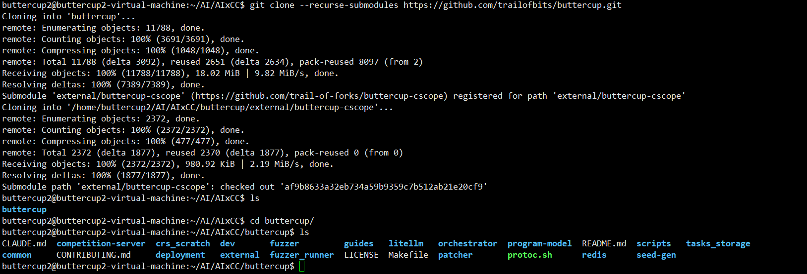

### make setup-local
clash开启了tun模式，为了能ping通docker.io  这样就不用再挂换源了

<!-- 这是一张图片，ocr 内容为： -->
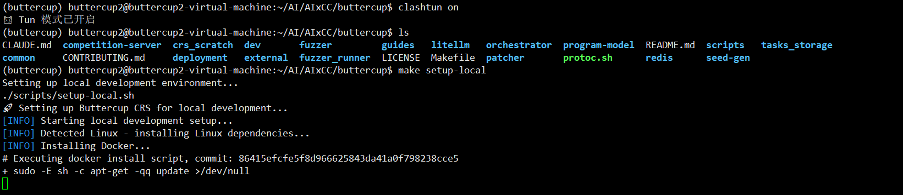

如果 docker 报错权限不足，将当前用户添加到 docker 用户组

```plain
sudo usermod -aG docker $USER && newgrp docker
```

<!-- 这是一张图片，ocr 内容为： -->
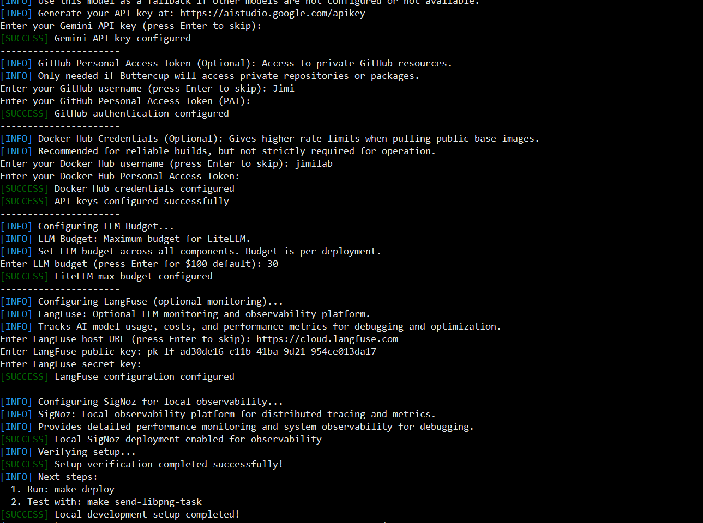

### make deploy
（时间比较长，而且这一步报错的很多）

该命令实际运行的脚本是：/deployment/crs-architecture.sh

```plain
make deploy (项目根目录)
    ↓
    检查 deployment/env 存在
    ↓
    检查 git submodules 初始化
    ↓
    显示配置并确认
    ↓
cd deployment && make up
    ↓
bash crs-architecture.sh up
    ↓
    加载 deployment/env 环境变量
    ↓
    ┌─────────────────────────────────┐
    │  集群部署（根据 CLUSTER_TYPE）  │
    ├─────────────────────────────────┤
    │ AKS:                            │
    │   terraform init                │
    │   terraform apply               │
    │   az aks get-credentials        │
    │ Minikube:                       │
    │   minikube start                │
    │   eval $(minikube docker-env)   │
    │   docker build orchestrator     │
    │   docker build fuzzer           │
    │   docker build seed-gen         │
    │   docker build patcher          │
    │   docker build program-model    │
    └─────────────────────────────────┘
    ↓
    ┌─────────────────────────────────┐
    │  Kubernetes 基础设置            │
    ├─────────────────────────────────┤
    │ kubectl create namespace crs    │
    │ kubectl create secret ghcr      │
    │ kubectl create configmap ...    │
    │ kubectl create secret tls ...   │
    │ (可选) Tailscale 配置           │
    └─────────────────────────────────┘
    ↓
    ┌─────────────────────────────────┐
    │  Helm 安装                      │
    ├─────────────────────────────────┤
    │ envsubst < values-template >    │
    │   values-overrides.yaml         │
    │                                 │
    │ helm upgrade --install          │
    │   buttercup ./k8s               │
    │   -f values-overrides.yaml      │
    └─────────────────────────────────┘
    ↓
    ┌─────────────────────────────────┐
    │  Helm 部署所有子 chart:         │
    ├─────────────────────────────────┤
    │ ✓ redis (外部依赖)              │
    │ ✓ litellm-helm (LLM 网关)      │
    │ ✓ task-server (任务接收)        │
    │ ✓ task-downloader (下载源码)    │
    │ ✓ scheduler (调度器)            │
    │ ✓ program-model (程序建模)      │
    │ ✓ build-bot (构建机器人)        │
    │ ✓ fuzzer-bot (Fuzz 机器人)      │
    │ ✓ coverage-bot (覆盖率)         │
    │ ✓ tracer-bot (追踪机器人)       │
    │ ✓ seed-gen (种子生成)           │
    │ ✓ patcher (补丁生成)            │
    │ ✓ pov-reproducer (漏洞复现)     │
    │ ✓ competition-api (竞赛 API)    │
    │ ✓ ui (Web 界面)                 │
    │ ✓ registry-cache (镜像缓存)     │
    │ ✓ scratch-cleaner (清理)        │
    │ ✓ dind-daemon (Docker-in-Docker)│
    │ ✓ signoz (可观测性，可选)       │
    └─────────────────────────────────┘
    ↓
回到顶层 Makefile
    ↓
make crs-instance-id (显示实例 ID)
    ↓
make wait-crs (等待所有 Pod Running)
    ↓
部署完成！
```

<!-- 这是一张图片，ocr 内容为： -->
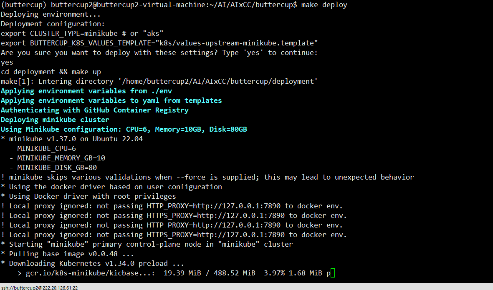

<!-- 这是一张图片，ocr 内容为： -->
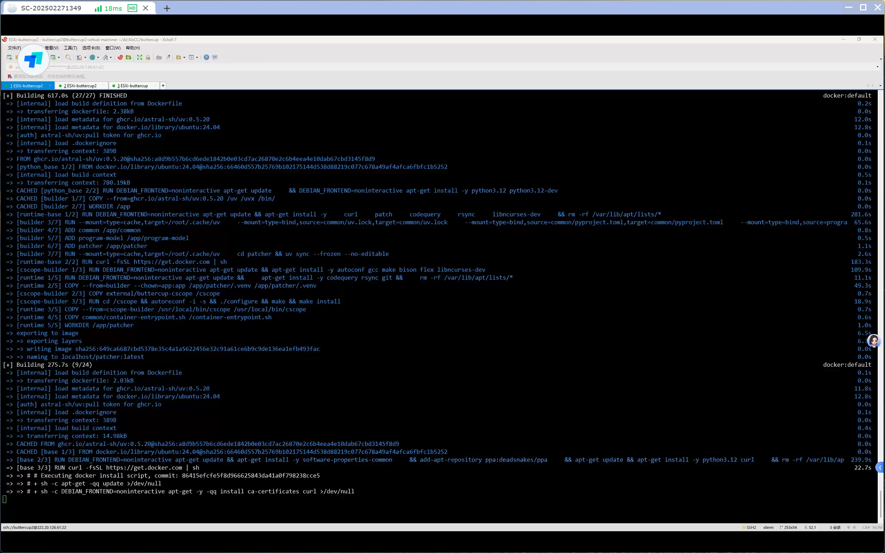

### make status
部署成功：需要所有 pods 都成功启动

<!-- 这是一张图片，ocr 内容为： -->
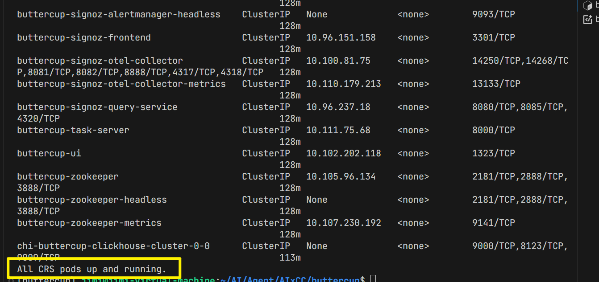

### make send-libpng.sh
运行该命令进行测试

<!-- 这是一张图片，ocr 内容为： -->
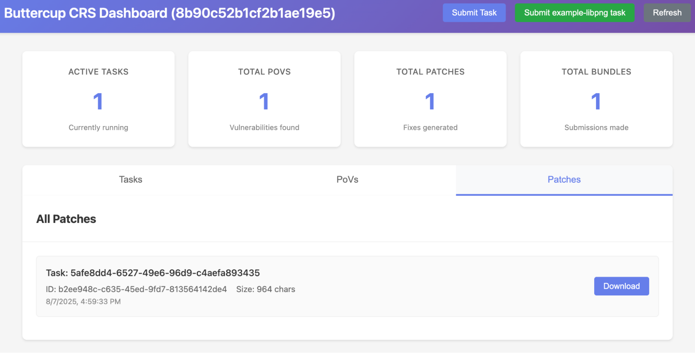

<!-- 这是一张图片，ocr 内容为： -->
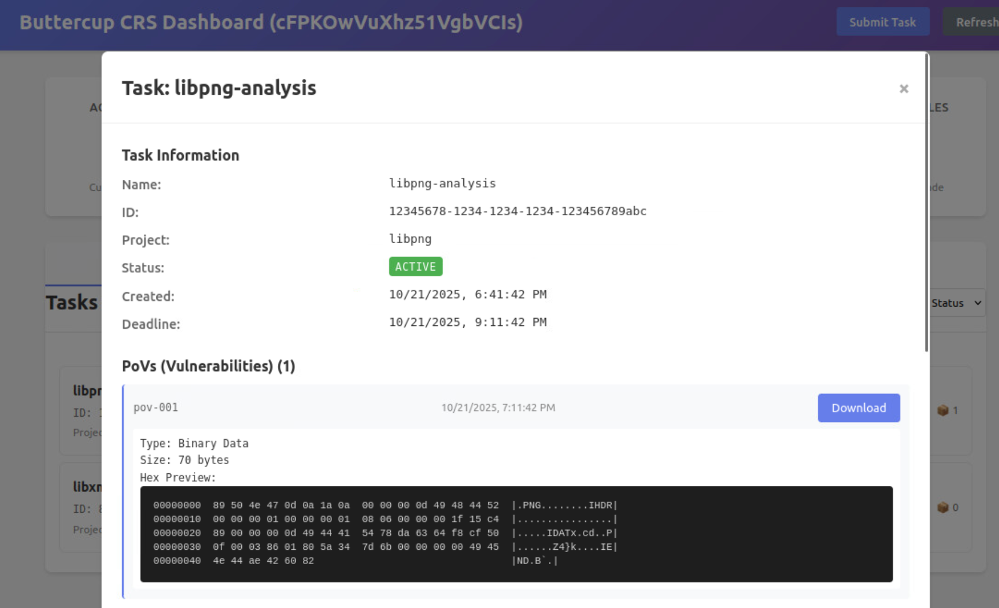

<!-- 这是一张图片，ocr 内容为： -->
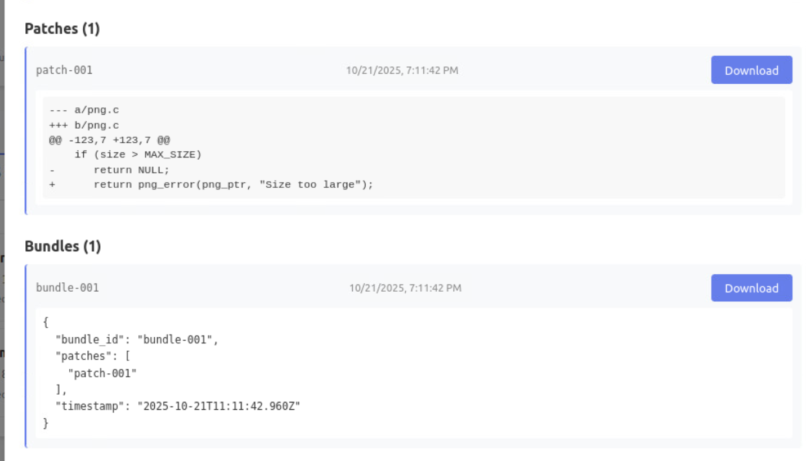

SigNoz 界面：

<!-- 这是一张图片，ocr 内容为： -->
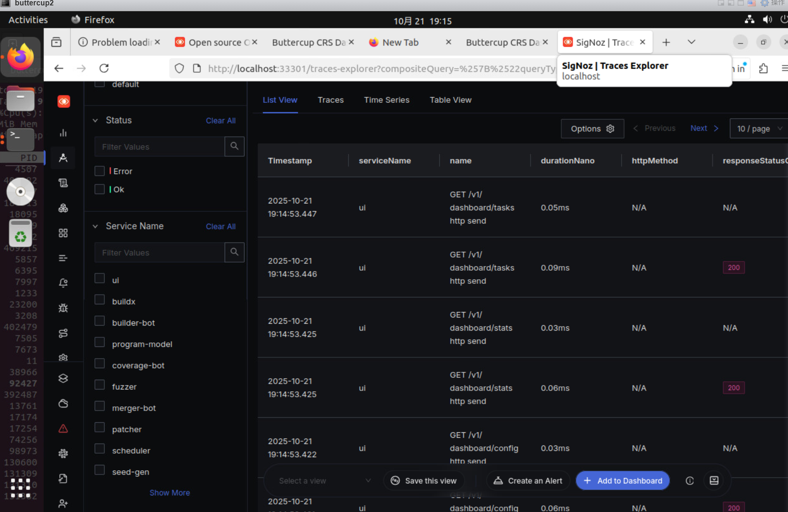

与 make send-libpng.sh 相同效果的代码：

```plain
一个shell中启动web：
kubectl port-forward -n crs service/buttercup-ui 31323:1323

一个shell中启动SigNoz：
make signoz-ui

一个shell中指定项目进行测试：
(buttercup) jimi@jimi-virtual-machine:~/AI/AIxCC/buttercup/buttercup$ ./orchestrator/scripts/task_crs.sh
```

### 调试命令
#### make 命令：
```plain
(buttercup) buttercup2@buttercup2-virtual-machine:~/AI/AIxCC/buttercup$ make
Trail of Bits AIxCC Finals CRS - Available Commands:

Setup:
  setup-local       - Automated local development setup
  setup-azure       - Automated production AKS setup
  validate          - Validate current setup and configuration

Deployment:
  deploy            - Deploy to current environment (local or azure)

Status:
  status              - Check the status of the deployment
  crs-instance-id     - Get the CRS instance ID
  download-artifacts  - Download submitted artifacts from the CRS
  signoz-ui           - Open the SigNoz UI

Testing:
  send-integration-task  - Run integration-test task
  send-libpng-task  - Run libpng task

Development:
  install-cscope    - Install cscope tool
  lint              - Lint all Python code
  lint-component    - Lint specific component (e.g., make lint-component COMPONENT=orchestrator)

Cleanup:
  undeploy          - Remove deployment and clean up resources
  clean-local       - Delete Minikube cluster and remove local config
```

#### kubectl 调试命令
```plain
# View all resources
kubectl get pods -A
kubectl get services -A
kubectl get ingress -A

# View specific namespace
kubectl get namespace -A
kubectl get pods -n crs
kubectl get services -n crs

# Port forwarding
kubectl port-forward -n crs service/buttercup-competition-api 31323:1323

# View logs (alternative to SigNoz UI)
kubectl get pods -n crs
kubectl logs -n crs 
kubectl logs -n crs  -f  # Follow logs in real-time
kubectl logs -n crs -l app=scheduler --tail=-1 --prefix

# Debug pods
kubectl exec -it -n crs <pod-name> -- /bin/bash

# Check cluster connectivity
kubectl cluster-info
kubectl get nodes

# Check pods
kubectl describe pod < pod name > -n crs
kubectl logs <pod name> -n crs --previous

# Check events
kubectl get events -n crs --sort-by='.lastTimestamp'

# Monitor resources
kubectl top pods -A

#删除镜像
kubectl delete pod <pod name> -n crs

# 回滚
kubectl rollout restart deployment/buttercup-litellm -n  crs

```

#### minikube
```plain
# Start/stop
minikube start --driver=docker
minikube stop
minikube delete

# Status
minikube status
minikube dashboard

# Reset minikube
minikube delete
minikube start --driver=docker

# Check status
minikube status
kubectl cluster-info
```

#### Helm
```plain
# Update repositories
helm repo update
helm dependency update deployment/k8s/

# Check chart
helm lint deployment/k8s/
```

#### Logs analysis
```plain
# check Patch Submission
kubectl logs -n crs -l app=scheduler --tail=-1 --prefix | grep "WAIT_PATCH_PASS -> SUBMIT_BUNDLE"

# Check competition API
kubectl logs -n crs -l app=competition-api --tail=-1 --prefix

# Check fuzzer
kubectl logs -n crs -l app=fuzzer --tail=-1 --prefix
```

#### 部署失败解决：
1.send-gen 和 patcher pod 失败

[https://github.com/trailofbits/buttercup/issues/315](https://github.com/trailofbits/buttercup/issues/315)

```plain
Error: UPGRADE FAILED: post-upgrade hooks failed: 1 error occurred:
    * timed out waiting for the condition
```

[https://github.com/trailofbits/buttercup/issues/317](https://github.com/trailofbits/buttercup/issues/317)

# 使用
## 项目输入
buttercup 的项目的输入是一个开源的 github 的链接，需要兼容 Oss-Fuzz 的格式。

项目有两个项目输入点：

一个是/orchestrator/scripts/task_upstream_libpng.sh

```plain
#!/bin/bash
curl -X 'POST' 'http://127.0.0.1:31323/webhook/trigger_task' -H 'Content-Type: application/json' -d '{
    "challenge_repo_url": "https://github.com/pnggroup/libpng",
    "challenge_repo_head_ref": "libpng16",
    "fuzz_tooling_url": "https://github.com/google/oss-fuzz",
    "fuzz_tooling_ref": "master",
    "fuzz_tooling_project_name": "libpng",
    "duration": 1800
}'
```

一个是 web

<!-- 这是一张图片，ocr 内容为： -->
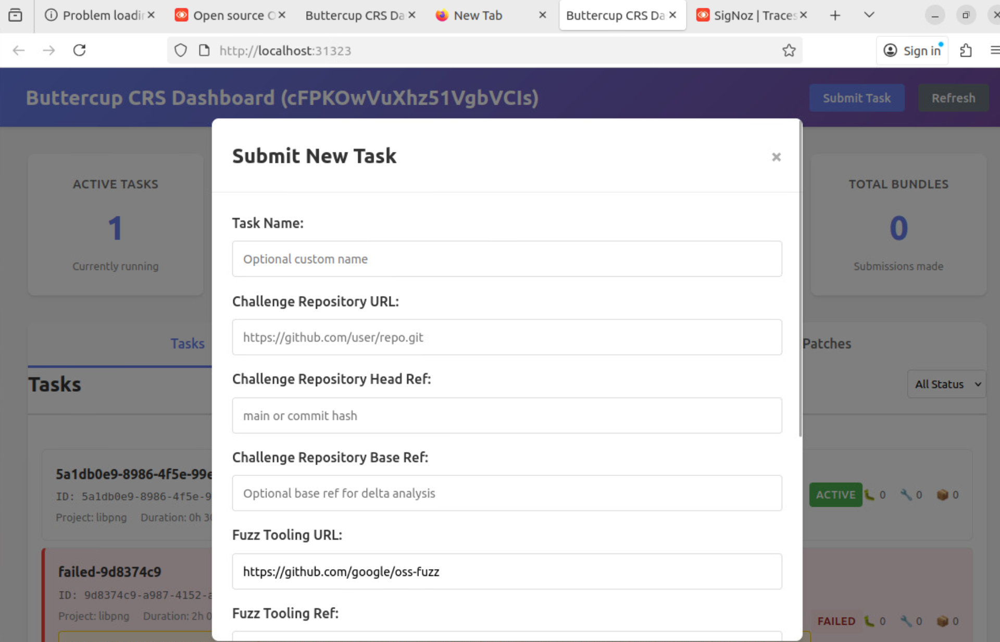

## 执行流程


### 任务提交
运行任务后的执行流程： task_upstream_libpng.sh

```plain
#!/bin/bash
curl -X 'POST' 'http://127.0.0.1:31323/webhook/trigger_task' -H 'Content-Type: application/json' -d '{
    "challenge_repo_url": "https://github.com/pnggroup/libpng",
    "challenge_repo_head_ref": "libpng16",
    "fuzz_tooling_url": "https://github.com/google/oss-fuzz",
    "fuzz_tooling_ref": "master",
    "fuzz_tooling_project_name": "libpng",		//项目名称
    "duration": 1800			//模糊测试运行时长
}'
```

通过 curl 向本地 31323 端口发送一个 json 格式的 post 请求， /webhook/trigger_task 路由

buttercup-main\orchestrator\src\buttercup\orchestrator\ui\competition_api\main.py

```plain
@app.post("/webhook/trigger_task")
def trigger_task(
    body: Challenge,				#将json转换成challenge模型
    challenge_service: ChallengeService = Depends(get_challenge_service),		#得到挑战服务
    crs_client: CRSClient = Depends(get_crs_client),							#得到crs客户端
    database_manager: DatabaseManager = Depends(get_database_manager),			#得到数据库管理
) -> Message | Error:
    """Trigger a task"""
    logger.info(f"Triggering task: {body.model_dump()}")
    return _create_task(body, challenge_service, crs_client, database_manager)		#调用_create_task函数


create_task函数:
├── challenge_service.create_task_for_challenge()
│   ├── 创建Task protobuf对象
│   ├── 设置任务元数据
│   └── 返回Task对象
    ↓
├── database_manager.create_task()
│   ├── 在数据库中创建任务记录
│   ├── 设置状态为"active"
│   └── 存储任务元数据
    ↓
├── crs_client.submit_task(task)
│   ├── HTTP POST到CRS系统
│   ├── 提交任务到CRS
│   └── 返回提交结果
    ↓
├── database_manager.update_task_crs_status()
│   ├── 更新CRS提交状态
│   ├── 记录错误信息（如果失败）
│   └── 存储详细错误信息
```


buttercup-main\orchestrator\src\buttercup\orchestrator\ui\competition_api\services\crs_client.py

```arkts
submit_task.py

url = f"{self.crs_base_url}/v1/task/"
 response = requests.post(
                url,
                json=task.model_dump(),
                auth=auth,
                headers={"Content-Type": "application/json"},
                timeout=30,
            )


```


buttercup-main\orchestrator\src\buttercup\orchestrator\task_server\server.py

```arkts
后端接口

@app.post(
    "/v1/task/",
    response_model=None,
    responses={"202": {"model": str}},
    tags=["task"],
)
def post_v1_task_(
    credentials: Annotated[HTTPBasicCredentials, Depends(check_auth)],
    body: Task,
    tasks_queue: Annotated[ReliableQueue, Depends(get_task_queue)],
) -> str | None:
    """Submit Task"""
    logger.debug("Accepting Task: %s", body)
    return new_task(body, tasks_queue)


```


buttercup-main\orchestrator\src\buttercup\orchestrator\task_server\backend.py

```arkts


def new_task(task: Task, tasks_queue: ReliableQueue) -> str:
    for task_proto in _api_task_to_proto(task):					#将API层的Task对象转换为protobuf格式的TaskProto对象
        task_download = TaskDownload(task=task_proto)				# 下载源orchestrator\src\buttercup\orchestrator\downloader\downloader.py    源码下载好之后的目录:src;fuzz-tooling;diff
        tasks_queue.push(task_download)										
        logger.info(f"New task: {task_proto}")

    return "DONE"

```


buttercup-main\orchestrator\src\buttercup\orchestrator\downloader\downloader.py

```arkts
创建redis队列,获取taskdownload消息
检查目标任务是否存在  
创建临时目录
源码下载
完整性校验
解压(src;fuzz-tooling;diff)

任务注册


        task_download: TaskDownload = rq_item.deserialized
        success = self.process_task(task_download.task)

    if success:		
        self.registry.set(task_download.task)																		# 任务注册			
        self.ready_queue.push(TaskReady(task=task_download.task))								# 任务推送至就绪队列
        self.task_queue.ack_item(rq_item.item_id)
        logger.info(f"Successfully processed task {task_download.task.task_id}")


本地机器
├── /node_data_storage/           # 主机目录
│   ├── tasks_storage/            # 任务存储
│   │   └── task_id/             # 解压后的任务目录
│   │       ├── src/             # 源码
│   │       ├── fuzz-tooling/    # 模糊测试工具
│   │       └── task_meta.json   # 任务元数据
│   └── task_id.tgz              # 压缩的任务文件
│
└── Kubernetes Pods
    ├── task-downloader: /node_data → /node_data_storage
    ├── scheduler: /node_data → /node_data_storage  
    ├── build-bot: /node_data → /node_data_storage
    └── fuzzer-bot: /node_data → /node_data_storage


```


```arkts
时间线              组件                  操作
━━━━━━━━━━━━━━━━━━━━━━━━━━━━━━━━━━━━━━━━━━━━━━━━━━━━━
T1              Downloader          完成下载，推送到READY_TASKS队列
                ↓
T2              Scheduler           接收任务，并行触发：
                ├─→ Index Queue     (程序分析)
                └─→ Build Queue      (构建请求)
                ↓
T3.1            Program Model       处理IndexRequest
                ├─→ 创建RW副本
                ├─→ 初始化CodeQuery
                └─→ 构建索引数据库
                ↓
T3.2            Builder Bot         处理BuildRequest
                ├─→ 获取任务目录
                ├─→ 应用Diff/Patch
                └─→ 执行实际构建
                ↓
T4              索引+构建完成后      推送到各自输出队列
                ↓
T5              Scheduler           处理构建输出，推送到harness map
                ↓
T6              Fuzzer Bot          开始模糊测试
```


### 程序分析-构建
buttercup-main\orchestrator\src\buttercup\orchestrator\scheduler\scheduler.py

生成 IndexRequest 并写入 INDEX 队列

调用 process_ready_task 生成 BuildRequest 并写入 BUILD 队列

```arkts
# scheduler.py Line 224-262
def serve_ready_task(self) -> bool:
    """Handle a ready task"""
    task_ready_item: RQItem[TaskReady] | None = self.ready_queue.pop()

    if task_ready_item is not None:
        task_ready: TaskReady = task_ready_item.deserialized

        try:
            # Create and push index request
            challenge_task = ChallengeTask(self.tasks_storage_dir / task_ready.task.task_id)
            index_request = IndexRequest(
                task_id=task_ready.task.task_id,
                task_dir=str(challenge_task.task_dir),
                package_name=task_ready.task.project_name,
            )
            self.index_queue.push(index_request)  # 🔑 推送到程序分析队列
            logger.info(f"Pushed index request for task {task_ready.task.task_id} to index queue")

            # Process build requests
            for build_req in self.process_ready_task(task_ready.task):
                self.build_requests_queue.push(build_req)  # 🔑 推送到构建队列
                logger.info(f"[{task_ready.task.task_id}] Pushed build request...")
```


#### 程序分析
```arkts
# program_model.py Line 59-95
def process_task_codequery(self, args: IndexRequest) -> bool:
    """Process a single task for indexing a program"""
    try:
        logger.info(f"Processing task {args.package_name}/{args.task_id}/{args.task_dir} with codequery")
        challenge = ChallengeTask(
            read_only_task_dir=args.task_dir,
            python_path=self.python,
        )
        with challenge.get_rw_copy(work_dir=self.wdir) as local_challenge:
            # log telemetry
            tracer = trace.get_tracer(__name__)
            with tracer.start_as_current_span("index_task_with_codequery") as span:
                set_crs_attributes(
                    span,
                    crs_action_category=CRSActionCategory.PROGRAM_ANALYSIS,
                    crs_action_name="index_task_with_codequery",
                    task_metadata=dict(challenge.task_meta.metadata),
                )
                # No need to pass tasks_storage because the IndexRequest
                # already uses the original task
                cqp = CodeQueryPersistent(local_challenge, work_dir=self.wdir)
                # 这里创建CodeQuery数据库
                logger.info(f"Successfully processed task {args.package_name}/{args.task_id}/{args.task_dir} with codequery")
                span.set_status(Status(StatusCode.OK))
            # Push it to the remote storage
            node_local.dir_to_remote_archive(cqp.challenge.task_dir)
        return True
    except Exception as e:
        logger.exception(f"Failed to process task {args.task_id}: {e}")
        return False


# codequery.py Line 198-294
def _copy_src_from_container(self) -> None:
    """Build and copy the /src directory from the container to the challenge task directory."""
    container_name = self.challenge.task_meta.task_id + "_" + str(uuid.uuid4())[:16]
    res = self.challenge.build_fuzzers_save_containers(container_name)
    if not res.success:
        raise RuntimeError("Failed to build fuzzers.")

    src_dst = self._get_container_src_dir()
    src_dst.mkdir(parents=True, exist_ok=True)
    try:
        command = ["docker", "cp", f"{container_name}:/src", src_dst.resolve().as_posix()]
        subprocess.run(command, check=True, capture_output=True)
    except subprocess.CalledProcessError as e:
        logger.error("Failed to copy src from container: %s", e)
        raise RuntimeError(f"Failed to copy src from container: {e}")
    finally:
        command = ["docker", "rm", container_name]
        subprocess.run(command, check=True, capture_output=True)

def _create_codequery_db(self) -> None:
    """Create the codequery database."""
    self._copy_src_from_container()  # 🔑 先构建并获得容器中的源代码

    # 创建cscope索引文件列表
    with self._get_container_src_dir().joinpath(self.CSCOPE_FILES).open("w") as f:
        project_yaml = ProjectYaml(self.challenge, self.challenge.task_meta.project_name)
        if project_yaml.unified_language in [Language.C, Language.CPP]:
            extensions = C_CPP_EXTENSIONS
        elif project_yaml.unified_language == Language.JAVA:
            extensions = JAVA_EXTENSIONS
        else:
            raise ValueError(f"Unsupported language: {project_yaml.language}")

        # Find all files with the given extensions
        for ext in extensions:
            for file in self._get_container_src_dir().rglob(ext):
                f.write(str(file) + "\n")

    # 构建cscope索引
    try:
        subprocess.run(["cscope", "-bkq"], check=False, cwd=self._get_container_src_dir(), capture_output=True, timeout=200)
    except (subprocess.CalledProcessError, subprocess.TimeoutExpired):
        raise RuntimeError("Failed to create cscope index.")

    # 构建ctags索引
    try:
        subprocess.run(["ctags", "--fields=+i", "-n", "-L", self.CSCOPE_FILES], check=False, 
                      cwd=self._get_container_src_dir(), capture_output=True, timeout=300)
    except (subprocess.CalledProcessError, subprocess.TimeoutExpired):
        raise RuntimeError("Failed to create ctags index.")

    # 构建CodeQuery数据库
    try:
        subprocess.run(["cqmakedb", "-s", self.CODEQUERY_DB, "-c", self.CSCOPE_OUT, 
                       "-t", self.TAGS, "-p"], check=False, 
                      cwd=self._get_container_src_dir(), capture_output=True, timeout=2700)
    except (subprocess.CalledProcessError, subprocess.TimeoutExpired):
        raise RuntimeError("Failed to create cquery database.")

```


##### tree-sitter
Tree-sitter 由 CodeTS 封装，负责加载不同语言的解析器与查询模板，并将源码字节解析成结构化的Function与TypeDefinition对象。Tree-sitter.py的输入是code和file_path，其中code指传入的源代码内容，file_path指文件路径，tree-sitter的输出是结构化的Function（函数）与TypeDefinition（类型定义），最终以字典形式返回。

**整体的目标为：**（以函数为例）

CodeTS.get_function(function_name, file_path) 负责在指定文件里解析源码，找到名称匹配的函数，并返回封装好的 Function 对象（含所有候选函数体）。

**执行步骤为：**

+ 入口 get_function 首先调用 get_functions(file_path)，也就是对整个文件做一次函数扫描。
+ get_functions 读取目标文件的字节内容 code，交给核心逻辑 get_functions_in_code(code, file_path)。
+ get_functions_in_code 根据语言类型选用 code 或剔除预处理指令后的 code_no_preproc，然后调用 tree-sitter parser 生成 

tree = self.parser.parse(...)

，取root_node。

+ 事先构建好的 self.query（Tree-sitter Query）在 root_node 上执行 matches，产出所有函数定义的 capture 集。每个 capture 会包含函数名、定义范围、函数体等信息（如果命中宏模式，也会带 

macro.call

标记）。

+ 对于每个匹配：
1. 取出 function.definition / function.name / function.body节点，判断是否为宏展开；
2. 根据节点的 start_byte / end_byte、start_point / end_point，在原字节串里切出函数体文本，计算 1-based 行号范围；
3. 用 FunctionBody 和 Function dataclass 组装好函数记录，并按函数名塞进 functions 字典；若同名函数有多个体（例如 #ifdef 分支），都会保留。
+ 全部遍历后返回 dict[str, Function]。
+ get_function 再从该字典中 functions.get(function_name)，拿到匹配的 Function；如果没找到就返回 None。

##### codequery
codequery可以为“挑战项目（ChallengeTask）”在**OSS-Fuzz 容器视角**下建立代码索引（cscope/ctags/CodeQuery），并提供**函数/类型的精确与模糊检索**、**调用者/被调者关系**、**类型使用位置**等能力。

核心的工作流程如下：

初始化（`__post_init__`）

1. 检查依赖命令。
2. 建立 Tree-sitter 解析器 `CodeTS`。
3. 读项目语言（通过 `ProjectYaml`），选择对应的**模糊导入解析器**。
4. 若索引已存在（四件套：`cscope.files`/`cscope.out`/`tags`/`codequery.db`），直接复用；否则：
+ 要求 `ChallengeTask` 为可写（否则抛错）。
+ 触发 `_create_codequery_db()`：复制容器 `/src`、生成 cscope 列表、跑 `cscope`/`ctags`/`cqmakedb` 构建数据库。

索引构建（`_create_codequery_db`）

+ `docker cp <container>:/src -> <task_dir>/container_src_dir`
+ 按语言（C/C++ 或 Java）收集扩展名列表，递归写入 `cscope.files`
+ `cscope -bkq` → `ctags --fields=+i -n -L cscope.files` → `cqmakedb` 将 `cscope.out`+`tags`合并为 `codequery.db`
+ 每步都容错并显式校验产物是否存在，失败即抛错。

路径重映射

+ `_rebase_path()`：把`<task_dir>/container_src_dir/...`重映射为容器视角`/src/...`（对外返回统一容器绝对路径）。
+ `_rebase_*_file_paths()`：把函数/类型/类型使用信息中的文件路径统一重映射。

通用查询子程序

+ `_run_cqsearch(*args)`：封装 `cqsearch` 调用与结果解析为 `CQSearchResult`。

函数检索（`get_functions`）

+ 思路：先用 `cqsearch` 的 **符号**（-p 1）与 **函数**（-p 2）两种模式取候选，再用 `CodeTS.get_function()`做 AST 级别精确解析，最终返回 `Function` 对象（可能有多个 body 区块）。
+ 支持：
    - 限定文件与行号（用于 disambiguation）。
    - 模糊检索（可选，没给文件时才启用）：对全局函数表跑 `rapidfuzz` 相似度过滤，再按相似度降序追加候选。
+ 结果排序：保持与 `cqsearch` 的返回顺序一致（先 exact 再 fuzzy）。
+ Telemetry：把函数名、是否 fuzzy、文件、行号等写进 span 属性。

调用者（`get_callers`）

+ 用 `-p 6`（“函数的调用者”）在 db 中查到**调用者的函数定义名**及其位置，再对每个结果调用 `get_functions`，转为结构化 `Function`。
+ 可能是**超集**（因为没法限定“在具体行号定义的那个 f 的调用者”），返回前**不过滤**。

被调者（`get_callees`）

+ 先用 `get_functions` 定位**精准的函数定义**（获取其一个或多个 body 的起止行）。
+ 用 `-p 7` 查询**调用点**（注意：返回的是“调用发生的行”，不是被调者的定义）。
+ 只保留：文件路径匹配、且调用行号落在该函数 body 范围内的调用点。
+ 对每个调用点再 `get_functions(result.value)` 找到被调者的**定义**。
+ 最后可选用 `imports_resolver.filter_callees()` 按导入/包/包含关系过滤（减少跨库同名误配）。
+ 仍可能是**超集**（database 粒度限制），但已经借助 AST 与行号做了较强过滤。

类型定义与使用（`get_types` / `get_type_calls`）

+ `get_types`：用 `-p 1`（符号）+ `-p 3`（class/struct）搜候选，再交给 `CodeTS.parse_types_in_code(file, typename, fuzzy)` 做精解析，得到 `TypeDefinition`（包含定义行、原始定义文本、文件等）。
    - 可指定 `function_name`，则只保留**落在该函数体范围内的局部类型定义**（如局部 `typedef`/`struct`）。
    - 亦支持 fuzzy（无 file_path 时）。
+ `get_type_calls`：以 `type_definition.name` 用 `-p 1`+`-p 8`（类型使用点）搜，返回 `TypeUsageInfo`（文件、行号）。


#### 编译构建


```arkts
# scheduler.py Line 160-194
def process_ready_task(self, task: Task) -> list[BuildRequest]:
    """Parse a task that has been downloaded and is ready to be built"""
    logger.info(f"Processing ready task {task.task_id}")

    challenge_task = ChallengeTask(self.tasks_storage_dir / task.task_id)
    logger.info(f"Processing task {task.task_id} / {task.focus}")

    project_yaml = ProjectYaml(challenge_task, task.project_name)

    engine = self.select_preferred(project_yaml.fuzzing_engines, ["libfuzzer", "afl"])
    sanitizers = project_yaml.sanitizers
    logger.info(f"Selected engine={engine}, sanitizers={sanitizers} for task {task.task_id}")

    # 🔑 决定构建类型
    build_types = [
        (BuildType.COVERAGE, "coverage", True),  # 覆盖率构建
    ]

    for san in sanitizers:
        build_types.append((BuildType.FUZZER, san, True))  # 模糊测试构建
        if len(challenge_task.get_diffs()) > 0:
            build_types.append((BuildType.TRACER_NO_DIFF, san, False))  # Tracer构建

    # 🔑 生成多个构建请求
    build_requests = [
        BuildRequest(
            engine=engine,
            task_dir=str(challenge_task.task_dir),
            task_id=task.task_id,
            build_type=build_type,
            sanitizer=san,
            apply_diff=apply_diff,
        )
        for build_type, san, apply_diff in build_types
    ]

    return build_requests


```


```arkts
# builder_bot.py Line 98-145
def serve_item(self) -> bool:
    rqit = self._build_requests_queue.pop()
    if rqit is None:
        return False

    msg = rqit.deserialized
    logger.info(f"Received build request for {msg.task_id} | {msg.engine} | {msg.sanitizer} | {BuildType.Name(msg.build_type)}")

    # Check if task should not be processed (expired or cancelled)
    if self._registry.should_stop_processing(msg.task_id):
        logger.info(f"Skipping expired or cancelled task {msg.task_id}")
        self._build_requests_queue.ack_item(rqit.item_id)
        return False

    task_dir = Path(msg.task_dir)
    if self.allow_caching:
        origin_task = ChallengeTask(task_dir, python_path=self.python, local_task_dir=task_dir)
    else:
        origin_task = ChallengeTask(task_dir, python_path=self.python)

    with origin_task.get_rw_copy(work_dir=self.wdir) as task:
        # 🔑 应用challenge diff
        if not self._apply_challenge_diff(task, msg):
            # 重试逻辑...
            return True

        # 🔑 应用补丁（如果存在）
        if not self._apply_patch(task, msg):
            # 重试逻辑...
            return True

        # 🔑 执行构建
        tracer = trace.get_tracer(__name__)
        with tracer.start_as_current_span("build_fuzzers_with_cache") as span:
            set_crs_attributes(
                span,
                crs_action_category=CRSActionCategory.BUILDING,
                crs_action_name="build_fuzzers_with_cache",
                task_metadata=dict(task.task_meta.metadata),
                extra_attributes={
                    "crs.action.target.engine": msg.engine,
                    "crs.action.target.sanitizer": msg.sanitizer,
                },
            )
            # 实际构建逻辑

```


### 种子生成


<!-- 这是一张图片，ocr 内容为： -->
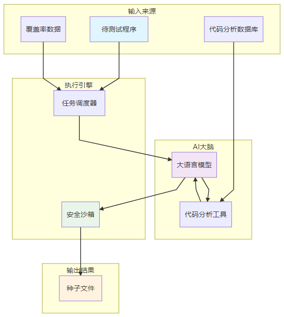


### FUZZ


崩溃分析


漏洞验证


漏洞补丁阶段


1.定位漏洞


2.提取并压缩上下文


3.生成补丁


4.补丁筛除


5.


# AI 的应用


## 1.AI 优化种子的生成


```plain
阶段 1: Fuzzer 构建
├→ Builder Bot 消费 BUILD 队列
├→ 编译 fuzzer 二进制文件
└→ 发布 BUILD_OUTPUT

阶段 2: 种子生成触发
├→ SeedGenBot 监听 Fuzzer Build 完成
├→ 选择任务类型（seed-init/vuln-discovery/seed-explore）
└→ 启动 AI 驱动种子生成

阶段 3: AI 生成种子（核心）
├→ 获取 Harness 代码
├→ 检索代码上下文（CodeQuery + LLM）
├→ LLM 生成 Python 函数
└→ 执行函数生成种子文件

阶段 4: 使用种子进行 Fuzzing
└→ Fuzzer Bot 使用生成的种子启动 libFuzzer
```


### 第一步：Fuzzer 构建流程
1.1 Scheduler 发起构建请求

```python
# buttercup/orchestrator/src/buttercup/orchestrator/scheduler/scheduler.py:254-260

for build_req in self.process_ready_task(task_ready.task):
    self.build_requests_queue.push(build_req)
    logger.info(
        f"[{task_ready.task.task_id}] Pushed build request of type "
        f"{BuildType.Name(build_req.build_type)} | {build_req.sanitizer} | "
        f"{build_req.engine} | {build_req.apply_diff}",
    )
```

**构建类型包括：**

+ `COVERAGE`: 用于覆盖率分析的构建
+ `FUZZER`: 用于 fuzzing 的构建（ASAqN/UBSAN）
+ `TRACER_NO_DIFF`: 用于调试的构建

1.2 Builder Bot 处理构建请求

```python
# buttercup/fuzzer/src/buttercup/fuzzing_infra/builder_bot.py:98-159

def serve_item(self) -> bool:
    # 1. 从队列获取 BuildRequest
    rqit = self._build_requests_queue.pop()
    
    # 2. 获取 ChallengeTask
    task_dir = Path(msg.task_dir)
    origin_task = ChallengeTask(task_dir, python_path=self.python)
    
    # 3. 创建可写副本
    with origin_task.get_rw_copy(work_dir=self.wdir) as task:
        # 4. 应用 diff（如果需要）
        if msg.apply_diff:
            task.apply_patch_diff()
        
        # 5. 构建 Docker 镜像
        res = task.build_fuzzers_with_cache(
            engine=msg.engine,      # 通常是 "libfuzzer"
            sanitizer=msg.sanitizer, # 通常是 "address"
        )
        
        # 6. 发布 BuildOutput
        self._build_outputs_queue.push(BuildOutput(...))
```

**关键操作：**

1. 使用 `OSS-Fuzz helper.py` 构建 Docker 镜像
2. 在 Docker 容器中编译 fuzzer 二进制
3. 编译目标：生成带 sanitizer 的 fuzzer 可执行文件

1.3 构建完成后的触发

```python
# buttercup/orchestrator/src/buttercup/orchestrator/scheduler/scheduler.py:196-222

def process_build_output(self, build_output: BuildOutput) -> list[WeightedHarness]:
    """Build output 完成后提取 fuzz targets"""
    if build_output.build_type != BuildType.FUZZER:
        return []
    
    # 1. 加载 ChallengeTask
    tsk = ChallengeTask(read_only_task_dir=build_output.task_dir)
    
    # 2. 获取 build_dir
    build_dir = tsk.get_build_dir()
    
    # 3. 提取 fuzz_targets（如 png_read_fuzzer）
    targets = get_fuzz_targets(build_dir)
    
    # 4. 为每个 target 创建 WeightedHarness
    return [
        WeightedHarness(
            weight=1.0,
            harness_name=Path(tgt).name,
            package_name=tsk.task_meta.project_name,
            task_id=build_output.task_id,
        )
        for tgt in targets
    ]
```

**WeightedHarness 发布到 HARNESS_MAP** → 触发 Fuzzer Bot 和 SeedGenBot

---

### 第二步：种子生成的触发
2.1 SeedGenBot 监听构建完成

```python
# buttercup/seed-gen/src/buttercup/seed_gen/seed_gen_bot.py:125-258

def run_task(
    self,
    task: WeightedHarness,
    builds: dict[BuildTypeHint, list[BuildOutput]],
) -> None:
    """当 fuzzer build 完成后，SeedGenBot 被触发"""
    
    # 1. 获取 build 目录
    build_dir = Path(builds[BuildType.FUZZER][0].task_dir)
    
    # 2. 加载 ChallengeTask
    ro_challenge_task = ChallengeTask(read_only_task_dir=build_dir)
    
    # 3. 创建临时目录
    with ro_challenge_task.get_rw_copy(work_dir=temp_dir) as challenge_task:
        # 4. 初始化 CodeQuery（用于代码检索）
        codequery = CodeQueryPersistent(challenge_task, work_dir=self.wdir)
        
        # 5. 选择任务类型
        task_choice = self.sample_task(task, is_delta)
        
        # 6. 执行选定的任务
        if task_choice == TaskName.SEED_INIT.value:
            seed_init = SeedInitTask(...)
            seed_init.do_task(out_dir)  # ⭐ 启动 AI 种子生成
```

2.2 任务选择的逻辑

```python
# buttercup/seed-gen/src/buttercup/seed_gen/seed_gen_bot.py:68-123

def sample_task(self, task: WeightedHarness, is_delta: bool) -> str:
    """根据执行次数选择任务"""
    
    # 优先级 1: 确保 SEED_INIT 至少运行 3 次
    seed_init_count = self.task_counter.get_count(
        task.harness_name,
        task.package_name,
        task.task_id,
        TaskName.SEED_INIT.value,
    )
    
    if seed_init_count < self.MIN_SEED_INIT_RUNS:  # MIN = 3
        return TaskName.SEED_INIT.value  # 强制运行 seed-init
    
    # 优先级 2: 确保 VULN_DISCOVERY 至少运行 1 次
    if vuln_discovery_count < self.MIN_VULN_DISCOVERY_RUNS:
        return TaskName.VULN_DISCOVERY.value
    
    # 优先级 3: 按概率分布选择
    if is_delta:
        task_distribution = [
            (TaskName.SEED_INIT.value, 0.05),      # 5%
            (TaskName.VULN_DISCOVERY.value, 0.45), # 45%
            (TaskName.SEED_EXPLORE.value, 0.50),   # 50%
        ]
    else:
        task_distribution = [
            (TaskName.SEED_INIT.value, 0.05),      # 5%
            (TaskName.VULN_DISCOVERY.value, 0.35), # 35%
            (TaskName.SEED_EXPLORE.value, 0.60),   # 60%
        ]
    
    return random.choices(tasks, weights=weights, k=1)[0]
```

任务类型解释：

+ **SEED_INIT**: 使用 AI 生成初始种子（本文重点）
+ **VULN_DISCOVERY**: 使用 AI 针对性发现漏洞
+ **SEED_EXPLORE**: 基于覆盖率扩展种子

---

### 第三步：AI 生成种子的详细过程
3.1 SeedInitTask 初始化

```python
# buttercup/seed-gen/src/buttercup/seed_gen/seed_init.py:24-59

@dataclass
class SeedInitTask(SeedBaseTask):
    SEED_INIT_SEED_COUNT = 8  # 生成 8 个种子函数
    MAX_CONTEXT_ITERATIONS = 4  # 最多进行 4 次上下文检索
    
    def do_task(self, output_dir: Path) -> None:
        """执行种子生成任务"""
        # 1. 获取 harness 源代码
        harness = self.get_harness_source()
        
        # 2. 调用 AI 生成种子
        self.generate_seeds(harness, output_dir)
```

3.2 核心流程：AI 多步骤生成

```python
# buttercup/seed-gen/src/buttercup/seed_gen/seed_task.py:61-84

def generate_seeds(self, harness: HarnessInfo, output_dir: Path) -> None:
    """使用 LangGraph 多步骤生成种子"""
    
    # 1. 创建初始状态
    state = BaseTaskState(
        harness=harness,              # Harness 代码
        task=self,                    # Task 实例
        output_dir=output_dir,        # 输出目录
        messages=[],                  # LLM 对话历史
        retrieved_context={},         # 检索的代码上下文
        generated_functions="",        # 生成的种子函数
        context_iteration=0,          # 迭代次数
    )
    
    # 2. 构建工作流（State Graph）
    workflow = self._build_workflow(BaseTaskState)
    
    # 3. 配置 LangFuse 回调（用于追踪 LLM 调用）
    llm_callbacks = get_langfuse_callbacks()
    
    # 4. 编译并运行工作流
    chain = workflow.compile().with_config(
        RunnableConfig(tags=["seed-init"], callbacks=llm_callbacks),
    )
    
    # 5. 执行工作流（触发 AI 生成）
    chain.invoke(state)
```

3.3 工作流节点定义

```python
# buttercup/seed-gen/src/buttercup/seed_gen/seed_task.py:529-600

def _build_workflow(self, state_class):
    """构建多步骤工作流"""
    
    workflow = StateGraph(state_class)
    
    # 节点 1: 获取上下文（最多 4 次迭代）
    workflow.add_node("get_context", self._get_context_node)
    
    # 节点 2: 生成种子函数
    workflow.add_node("generate_seeds", self._generate_seeds_node)
    
    # 节点 3: 执行种子函数
    workflow.add_node("execute_seeds", self._execute_seeds_node)
    
    # 定义流程：
    # 如果 context_iteration < MAX_ITERATIONS:
    #   get_context → 检查是否需要继续 → get_context OR generate_seeds
    # 否则：
    #   generate_seeds → execute_seeds → END
    
    return workflow
```

3.4 节点 1: 获取上下文（AI 工具调用）

```python
# buttercup/seed-gen/src/buttercup/seed_gen/seed_init.py:46-59

def _get_context(self, state: BaseTaskState) -> Command:
    """使用 AI Agent 检索代码上下文"""
    
    prompt_vars = {
        "harness": str(state.harness),
        "retrieved_context": state.format_retrieved_context(),
    }
    
    # 调用 LLM with tools
    res = self._get_context_base(
        SEED_INIT_GET_CONTEXT_SYSTEM_PROMPT,
        SEED_INIT_GET_CONTEXT_USER_PROMPT,
        state,
        prompt_vars,
    )
    
    return res
```

AI 可以使用以下工具：

```python
# buttercup/seed-gen/src/buttercup/seed_gen/task.py:103-110

self.tools = [
    get_function_definition,  # 获取函数定义
    get_type_definition,      # 获取类型定义
    batch_tool,               # 批量调用
    cat,                       # 读取文件
    get_callers,              # 获取调用者
]
```

3.5 Prompt 示例

系统提示词：

```python
SEED_INIT_GET_CONTEXT_SYSTEM_PROMPT = """
You are an expert security engineer who is creating seed inputs for a fuzzing corpus.

Your task is to retrieve relevant code that will help you create high-quality inputs.

You have access to tools that can retrieve code from the project.
Use these tools to retrieve context about the program.
"""
```

用户提示词：

```python
SEED_INIT_GET_CONTEXT_USER_PROMPT = """
Retrieved context about the codebase:
<retrieved_context>
{retrieved_context}  # 已检索的代码片段
</retrieved_context>
The harness is:
{harness}  # Harness 代码

Your goal is to retrieve additional code that will help create high-quality seeds.

When making a tool call:
1. Focus on code that processes or validates inputs
2. Look for code that defines the expected input format or structure
3. You can use the batch tool to make several tool calls in one call.

Your response:
"""
```

3.6 AI Agent 的工作示例

```python
# AI 的思考过程

Input:
  harness = """
  int LLVMFuzzerTestOneInput(const uint8_t *data, size_t size) {
      // Parse PNG header
      png_structp png_ptr = png_create_read_struct(...);
      png_infop info_ptr = png_create_info_struct(...);
      
      // Read PNG data
      png_read_info(png_ptr, info_ptr);
      // ... more processing ...
      
      return 0;
  }
  """

LLM 分析：
  "这个 harness 调用 png_read_info 解析 PNG 数据。
   我需要了解：
   1. png_read_info 的实现
   2. PNG 文件格式
   3. 如何构造有效的 PNG 数据"

AI 调用工具：
  get_function_definition("png_read_info")
  ↓
  get_type_definition("png_struct")
  ↓
  get_callers("png_create_read_struct")
```

3.7 节点 2: 生成种子函数（LLM 生成代码）

```python
# buttercup/seed-gen/src/buttercup/seed_gen/seed_init.py:30-43

def _generate_seeds(self, state: BaseTaskState) -> Command:
    """生成种子函数"""
    
    prompt_vars = {
        "count": self.SEED_INIT_SEED_COUNT,  # 8
        "harness": str(state.harness),
        "retrieved_context": state.format_retrieved_context(),  # AI 检索的上下文
    }
    
    # 调用 LLM 生成 Python 函数
    generated_functions = self._generate_python_funcs_base(
        PYTHON_SEED_INIT_SYSTEM_PROMPT,
        PYTHON_SEED_INIT_USER_PROMPT,
        prompt_vars,
    )
    
    return Command(update={"generated_functions": generated_functions})
```

生成提示词：

```python
PYTHON_SEED_INIT_SYSTEM_PROMPT = """
You are an expert security engineer who is fuzzing a program via a test harness. 
Write python functions to create seeds that bootstrap the fuzzer's corpus.
"""

PYTHON_SEED_INIT_USER_PROMPT = """
Retrieved context about the codebase:
<retrieved_context>
{retrieved_context}
</retrieved_context>
The harness is:
{harness}

You are creating seed inputs to bootstrap the fuzzing corpus. 
You are provided:
1. Retrieved context about the codebase
2. The harness code

Write {count} deterministic Python functions that each create a valid input.

Put the functions in ONE MARKDOWN BLOCK. The signature:
def gen_test() -> bytes

Example output for an FTP server harness:
<example>
def gen_bytes_user() -> bytes:
    # user command
    username = "anonymous"
    user_cmd = "USER %s\r\n" % (username)
    return user_cmd.encode()

def gen_bytes_pass() -> bytes:
    # pass command
    password = "mypassword"
    pass_cmd = "PASS %s\r\n" % (password)
    return pass_cmd.encode()
</example>
Remember:
- The functions must create a deterministic sequence of bytes.
- A valid input is one that does not cause an error.
- Create inputs that trigger different functionality.
- Each function creates a different input.
"""
```

3.8 LLM 生成的示例

```python
# LLM 的输出示例

def gen_png_minimal() -> bytes:
    """Generate a minimal valid PNG file"""
    # PNG signature
    png_signature = b'\x89PNG\r\n\x1a\n'
    
    # IHDR chunk
    ihdr_data = struct.pack('>2I5B', 1, 1, 8, 2, 0, 0, 0)
    ihdr = b'IHDR' + ihdr_data
    ihdr_crc = zlib.crc32(ihdr) & 0xffffffff
    ihdr_chunk = struct.pack('>I', len(ihdr_data)) + ihdr + struct.pack('>I', ihdr_crc)
    
    # IEND chunk
    iend_chunk = struct.pack('>I', 0) + b'IEND' + struct.pack('>I', 0xae426082)
    
    return png_signature + ihdr_chunk + iend_chunk

def gen_png_with_palette() -> bytes:
    """Generate a PNG with palette"""
    # ... implementation
    return png_bytes

# ... 6 more functions ...
```

3.9 节点 3: 执行种子函数（WASM 沙箱）

```python
# buttercup/seed-gen/src/buttercup/seed_gen/seed_task.py:271-274

def _execute_python_funcs(self, state: BaseTaskState) -> None:
    """在沙箱中执行 Python 函数"""
    logger.info("Executing python functions")
    sandbox_exec_funcs(state.generated_functions, state.output_dir)
```

**沙箱执行：**

```python
# buttercup/seed-gen/src/buttercup/seed_gen/sandbox/sandbox.py:14-25

def sandbox_exec_funcs(functions: str, output_dir: Path) -> None:
    """在 WASI 沙箱中执行函数"""
    with tempfile.TemporaryDirectory() as workdir:
        # 1. 保存生成的 Python 代码
        function_path = workdir / "func.py"
        function_path.write_text(functions)
        
        # 2. 在沙箱中执行
        script_args = [function_path.name, wasm_outdir.name]
        wasm_run_script(workdir, SEED_EXEC_RUNNER, script_args)
        
        # 3. 复制生成的种子文件
        for pov_file in wasm_outdir.iterdir():
            if pov_file.is_file():
                shutil.copy(pov_file, output_dir / pov_file.name)
```

**沙箱运行器：**

```python
# buttercup/seed-gen/src/buttercup/seed_gen/sandbox/runner.py:25-51

def exec_seed_funcs(seed_func_path: Path, output_dir: Path) -> None:
    """执行种子函数并保存种子文件"""
    # 1. 加载 Python 模块
    module = load_module_from_path(seed_func_path)
    
    # 2. 遍历所有函数
    for func_name, func in inspect.getmembers(module, inspect.isfunction):
        try:
            logger.info(f"Executing function: {func_name}")
            
            # 3. 调用函数生成种子
            seed = func()  # 例如：gen_png_minimal() -> bytes
            
            # 4. 保存为文件
            filename = f"{func_name}.seed"
            path = output_dir / filename
            with open(path, "wb") as f:
                f.write(seed)
        except Exception as e:
            logger.exception(f"Error occurred: {e}")
```

---

### 第四步：种子的验证与使用
4.1 复制种子到语料库

```python
# buttercup/seed-gen/src/buttercup/seed_gen/seed_gen_bot.py:254-258

copied_files = corp.copy_corpus(out_dir)
logger.info("Copied %d files to corpus %s", len(copied_files), corp.corpus_dir)
```

4.2 Fuzzer Bot 使用种子

```python
# buttercup/fuzzer/src/buttercup/fuzzing_infra/fuzzer_bot.py

def run_task(self, task: WeightedHarness, builds):
    """启动 fuzzer，使用生成的种子"""
    
    # 1. 同步语料库（包含 AI 生成的种子）
    corpus = Corpus(self.wdir, task.task_id, task.harness_name)
    corpus.sync_from_remote()
    
    # 2. 启动 libFuzzer
    result = self.challenge.run_fuzzer(
        harness_name=task.harness_name,
        corpus_dir=corpus.path,  # 包含 AI 生成的种子
        engine="libfuzzer",
        sanitizer="address",
        fuzzer_args=[
            f"-max_len={MAX_LENGTH}",
            f"-timeout={TIMEOUT}",
        ],
    )
    
    # 3. 新发现的种子会自动添加到语料库
    corpus.sync_to_remote()
```


## 2.AI 驱动的上下文检索
在本项目中上下文检索的应用场景是补丁生成。


+ **作用 1: 智能代码检索（Intelligent Code Search）**

不是简单的 grep 搜索，而是让 LLM 分析漏洞，主动决定需要哪些代码。

+ **作用 2: 上下文压缩（Context Compression）**

将 50,000+ 行代码压缩到 8,000 tokens 的相关片段，节省 LLM 成本，提高补丁质量。

+ **作用 3: 增量检索（Incremental Retrieval）**

根据初步分析结果，逐步请求更多相关的代码片段。


```plain
┌─────────────────────────────────────────────────────────────┐
│              Context Retrieval Agent                         │
├─────────────────────────────────────────────────────────────┤
│                                                              │
│  Layer 1: LLM 决策层                                         │
│  ────────                                                     │
│  • 分析崩溃堆栈，决定需要哪些代码                            │
│  • 判断代码片段是否相关                                       │
│  • 去重已检索的代码                                           │
│                                                              │
├─────────────────────────────────────────────────────────────┤
│                                                              │
│  Layer 2: 工具层（Tools）                                     │
│  ────────                                                     │
│  • get_function()   - 从 CodeQuery 获取函数                  │
│  • grep()           - 全文搜索                                │
│  • get_callers()    - 查找调用者                              │
│  • get_callees()    - 查找被调用者                            │
│  • get_type()       - 获取类型定义                             │
│  • track_snippet() - 记录代码片段                             │
│                                                              │
├─────────────────────────────────────────────────────────────┤
│                                                              │
│  Layer 3: 数据层（Data Sources）                              │
│  ────────                                                     │
│  • CodeQuery（SQL 数据库）- 代码索引                         │
│  • ripgrep               - 全文搜索                          │
│  • Tree-sitter           - AST 解析                          │
│                                                              │
└─────────────────────────────────────────────────────────────┘
```


```python
# buttercup/patcher/src/buttercup/patcher/agents/context_retriever.py

@dataclass
class ContextRetrieverAgent(PatcherAgentBase):
    """AI Agent 控制代码检索"""

    redis: Redis | None
    find_tests: bool

    def __post_init__(self):
        # 1. 创建 LLM
        self.llm = create_default_llm(model_name=ButtercupLLM.OPENAI_GPT_4_1_MINI.value)

        # 2. 定义可用工具
        self.tools = [
            ls,                    # 列出文件
            grep,                  # 全文搜索
            get_lines,             # 读取行范围
            cat,                   # 读取文件
            get_function,          # 获取函数定义
            get_type,              # 获取类型定义
            get_callers,           # 获取调用者
            get_callees,           # 获取被调用者
            track_snippet,         # 记录代码片段
            think,                 # 思考工具
        ]

        # 3. 创建 ReAct Agent
        self.agent = create_react_agent(
            model=self.llm,
            state_schema=CodeSnippetManagerState,
            tools=self.tools,
            prompt=self._prompt,
        )
```


### 实现流程
### 场景示例：修复 buffer overflow 漏洞
输入：崩溃堆栈跟踪

```plain
heap-buffer-overflow in png_read_row
#0 png_read_row at png.c:1234
#1 memcpy at 0x603000000010 (READ size 4)
```

#### 阶段 1: 初始代码请求提取
```python
def _get_code_requests_from_stacktrace(self, stacktraces, configuration):
    """从堆栈跟踪提取代码请求"""
    
    # 1. 解析堆栈帧
    stackframes = parse_stacktrace(stacktraces)
    
    # 2. 提取函数名和文件名
    requests_data = [
        (frame.function_name, frame.filename, frame.fileline)
        for frame in stackframes
        if frame.function_name  # 过滤掉 __libc_start_main 等
    ]
    
    # 3. 生成代码请求
    requests = []
    for (func_name, filename), group in groupby(requests_data):
        requests.append(
            CodeSnippetRequest(
                request=f"Implementation of `{func_name}` in `{filename}`"
            )
        )
    
    return requests
```

**LLM 输出：**

```xml
<request>Implementation of `png_read_row` in `src/png.c` around line 1234</request>

```

---

#### 阶段 2: AI Agent 执行代码检索
```python
def process_request(self, challenge_task_dir, relevant_code_snippets, 
                   request, configuration):
    """处理单个代码请求"""
    
    # 1. 检查是否已检索
    if self.is_code_snippet_already_retrieved(relevant_code_snippets, request):
        logger.info("Code snippet for '%s' already retrieved", request.request)
        return []
    
    # 2. 调用 AI Agent
    input_state = {
        "request": request.request,
        "challenge_task_dir": challenge_task_dir,
        "work_dir": configuration.work_dir,
    }
    
    # AI Agent 会自动调用工具
    self.agent.invoke(
        input_state,
        config=RunnableConfig(
            recursion_limit=configuration.ctx_retriever_recursion_limit,
        ),
    )
    
    # 3. 获取检索结果
    ctx_state = self.agent.get_state().values
    return ctx_state.code_snippets
```

##### AI Agent 的 ReAct 循环
```python
# ReAct 循环示例
while not solved:
    # 1. Reasoning: LLM 思考
    thought = llm.think("Need to find png_read_row function...")
    
    # 2. Action: 调用工具
    result = get_function("png_read_row", "src/png.c")
    
    # 3. Observation: 获取工具结果
    if result:
        code = result.code
        # 4. 继续思考或调用更多工具
        thought = llm.think("Got the function. Now need to check who calls it...")
        result = get_callers("png_read_row")
        
        # 5. 记录代码片段
        track_snippet("png_read_row implementation with callers")
```

---

#### 阶段 3: 工具实现详解
##### Tool 1: get_function()
```python
@tool
def get_function(function_name: str, file_path: str | None, 
                state: BaseCtxState) -> str:
    """获取函数定义"""
    
    # 1. 获取 CodeQuery 实例
    codequery = get_codequery(state.challenge_task_dir, state.work_dir)
    
    # 2. 查询 SQL 数据库
    functions = codequery.get_functions(function_name, file_path)
    
    if not functions:
        # 模糊搜索
        functions = codequery.get_functions(function_name, file_path, fuzzy=True)
    
    # 3. 返回代码片段
    return format_function_code(functions)
```

**CodeQuery SQL 查询：**

```sql
SELECT name, file_path, start_line, end_line, body
FROM functions
WHERE name = 'png_read_row' AND file_path = 'src/png.c'
```

**输出：**

```xml
<command_output>
<command>get_function png_read_row src/png.c</command>
<returncode>0</returncode>
<stdout>
void png_read_row(png_ptr, row_buf, size) {
    // Buffer allocation
    row_buf = malloc(row_buf_size);
    
    // NO BOUNDS CHECK HERE! 🐛
    memcpy(row_buf, input_data, size);
    
    // ... more code
}
</stdout>
</command_output>

```

---

##### Tool 2: get_callers()
```python
@tool
def get_callers(function_name: str, state: BaseCtxState) -> list[str]:
    """查找谁调用了这个函数"""
    
    codequery = get_codequery(state.challenge_task_dir, state.work_dir)
    
    # SQL 查询
    callers = codequery.get_callers(function_name)
    
    # 返回调用者函数名列表
    return [caller.name for caller in callers]
```

**SQL 查询：**

```sql
SELECT DISTINCT fc.caller_name, fc.caller_file
FROM function_calls fc
WHERE fc.callee_name = 'png_read_row'
```

**输出：**

```plain
["png_read_image", "png_process_row"]
```

---

##### Tool 3: grep()
```python
@tool
def grep(pattern: str, file_path: str | None, state: BaseCtxState) -> str:
    """全文搜索"""
    
    args = ["grep", "-C", "5", "-nHrE", pattern]
    if file_path:
        args.append(file_path)
    
    challenge = get_challenge(state.challenge_task_dir)
    grep_cmd_res = challenge.exec_docker_cmd(args)
    
    return format_grep_output(grep_cmd_res)
```

**调用示例：**

```python
grep("PNG_BUFFER_SIZE", "src/")
```

**输出：**

```plain
src/png.c:100: #define PNG_BUFFER_SIZE 1024
src/png.c:1235: if (size > PNG_BUFFER_SIZE) {
src/png_utils.c:45: buffer = malloc(PNG_BUFFER_SIZE);
```

---

##### Tool 4: track_snippet()
```python
@tool
def track_snippet(
    file_path: str,
    code_snippet_description: str,
    function_name: str | None,
    type_name: str | None,
    start_line: int | None,
    end_line: int | None,
    *,
    state: CodeSnippetManagerState,
    tool_call_id: str,
) -> Command:
    """记录代码片段"""
    
    # 1. 获取代码
    if function_name:
        code_snippets = get_function_tool_impl(function_name, file_path, state)
    elif type_name:
        code_snippets = get_type_tool_impl(type_name, file_path, state)
    elif start_line and end_line:
        code_snippets = get_lines(file_path, start_line, end_line)
    
    # 2. 创建代码片段对象
    snippet = ContextCodeSnippet(
        key=CodeSnippetKey(file_path=file_path),
        start_line=start_line,
        end_line=end_line,
        code=code,
        description=code_snippet_description,
        can_patch=True  # 是否可以应用补丁
    )
    
    # 3. 更新状态
    return Command(update={"code_snippets": [snippet]})
```

---

#### 阶段 4: LLM 驱动的上下文需求分析
AI Agent 完成初步检索后，LLM 会分析：

```python
def get_initial_context(self, state, config):
    """获取初始上下文"""
    
    # 1. 从前面的检索结果提取代码片段
    existing_snippets = state.relevant_code_snippets
    
    # 2. 调用 LLM 判断是否需要更多上下文
    additional_requests = self.initial_snippets_chain.invoke({
        "STACKTRACES": state.stacktraces,
        "CODE_SNIPPETS": existing_snippets
    })
    
    # 3. LLM 输出额外请求
    # <request>Type definition of buffer_t that gets corrupted</request>
    # <request>Implementation of memcpy wrapper that lacks bounds check</request>

```

**LLM Prompt：**

```xml
<system>
You are analyzing a security vulnerability. You have access to:
1. Stack traces showing where the vulnerability occurred
2. Code snippets already retrieved

Your task: Generate requests for additional code snippets ONLY if ABSOLUTELY ESSENTIAL.

IMPORTANT: Only request code snippets that are:
- The EXACT line where vulnerability occurs
- The EXACT security check that failed
- The EXACT variable that was corrupted

DO NOT request:
- Helper functions
- Indirectly related code
- Context or background code
</system>
<user>
<stacktraces>
heap-buffer-overflow in png_read_row
#0 memcpy at 0x603000000010
</stacktraces>
<code_snippets>
[已有的代码片段...]
</code_snippets>
List additional code snippets needed (if any):
</user>

```

---

#### 阶段 5: 上下文过滤
```python
def _filter_code_snippets(self, requests, code_snippets, config):
    """使用 LLM 过滤代码片段"""
    
    filtered = []
    for snippet in code_snippets:
        # LLM 判断是否相关
        is_relevant = self.filter_code_snippets_chain.invoke({
            "REQUESTS": "\n".join(req.request for req in requests),
            "CODE_SNIPPET": snippet
        })
        
        if is_relevant:
            filtered.append(snippet)
    
    return filtered
```

**过滤 Prompt：**

```xml
<system>
Your job is to evaluate whether a code snippet is relevant to a vulnerability request.
</system>
<user>
Here are the requests:
<requests>
Implementation of function png_read_row
Type definition of buffer_t
</requests>
Here is the code snippet:
<code_snippet>
...
</code_snippet>
Evaluate whether the code snippet is relevant.
Return:
<is_relevant>TRUE/FALSE</is_relevant>
</user>

```

---

#### 阶段 6: 上下文压缩
目标：从 50,000 行代码压缩到 8,000 tokens 的相关片段

```python
def compress_context(self, code_snippets):
    """压缩上下文"""
    
    # 1. 计算当前上下文大小
    total_tokens = sum(snippet.token_count for snippet in code_snippets)
    
    if total_tokens <= MAX_CONTEXT_TOKENS:
        return code_snippets
    
    # 2. 使用 LLM 判断哪些是最重要的
    important_snippets = self.llm.evaluate_importance(code_snippets)
    
    # 3. 裁剪每个代码片段（保留关键部分）
    compressed = []
    for snippet in important_snippets:
        # 只保留关键行
        compressed.append(
            snippet.crop_lines(
                start=key_start_line,
                end=key_end_line
            )
        )
    
    return compressed
```

**压缩规则：**

+ 保留漏洞所在函数
+ 保留直接调用/被调用的函数
+ 移除无关的注释
+ 只保留关键变量定义


### 示例
```python
# 1. 触发上下文检索
vulnerability = ConfirmedVulnerability(
    crash_type="heap-buffer-overflow",
    crash_state="png_read_row\npng_read_image",
    sanitizer_output="..."
)

# 2. Context Retriever Agent 启动
retriever = ContextRetrieverAgent(...)
snippets = retriever.get_initial_context(vulnerability)

# 3. AI Agent 与工具的交互
while not satisfied:
    # Reasoning
    "I need to find png_read_row function where the overflow occurs"
    
    # Action: 调用工具
    result = get_function("png_read_row", "src/png.c")
    
    # Observation
    "Found function. I can see memcpy on line 1234. Need to check buffer allocation."
    
    # Action: 继续调用
    result = grep("PNG_BUFFER_SIZE", "src/")
    
    # Observation
    "Found buffer size constant. Need to check if there's any bounds checking."
    
    # Action: 查找调用者
    callers = get_callers("png_read_row")
    
    # Reasoning
    "Now I have enough context: png_read_row, its callers, and buffer size. 
    I can track this snippet."
    
    # Action: 记录代码片段
    track_snippet(
        file_path="src/png.c",
        function_name="png_read_row",
        description="Vulnerable function with missing bounds check"
    )

# 4. 输出压缩后的上下文
print(snippets)
```


```python
[
    ContextCodeSnippet(
        file_path="src/png.c",
        start_line=100,
        end_line=105,
        code="#define PNG_BUFFER_SIZE 1024",
        description="Buffer size constant definition"
    ),
    ContextCodeSnippet(
        file_path="src/png.c",
        start_line=1228,
        end_line=1240,
        code="""
        void png_read_row(...) {
            row_buf = malloc(row_buf_size);  // Line 1230
            // NO BOUNDS CHECK HERE! 
            memcpy(row_buf, input_data, size);  // Line 1234
        }
        """,
        description="Vulnerable function: missing bounds check before memcpy"
    ),
    ContextCodeSnippet(
        file_path="src/png.c",
        start_line=1100,
        end_line=1110,
        code="""
        void png_read_image(...) {
            ...
            png_read_row(...);  // Calls vulnerable function
            ...
        }
        """,
        description="Caller of vulnerable function"
    )
]
```


## 3.多智能体补丁生成
### <font style="color:rgb(51, 51, 51);">智能体架构</font>
```plain
# buttercup/patcher/src/buttercup/patcher/agents/leader.py

class PatcherLeaderAgent:
    """补丁生成协调器"""
    
    def _init_patch_team(self):
        # 创建 6 个专业智能体
        team = {
            # 1. 根因分析专家
            'root_cause_agent': RootCauseAgent(...),
            
            # 2. 上下文检索专家
            'context_retriever': ContextRetrieverAgent(...),
            
            # 3. 软件工程师
            'swe_agent': SWEAgent(...),
            
            # 4. 质量工程师
            'qe_agent': QEAgent(...),
            
            # 5. 反思专家
            'reflection_agent': ReflectionAgent(...),
            
            # 6. 输入处理专家
            'input_processing_agent': InputProcessingAgent(...)
        }
        
        # 构建状态图（State Graph）
        workflow = StateGraph(PatcherAgentState)
        workflow.add_node("ROOT_CAUSE_ANALYSIS", root_cause_agent.analyze)
        workflow.add_node("PATCH_STRATEGY", swe_agent.select_strategy)
        workflow.add_node("CREATE_PATCH", swe_agent.create_patch)
        workflow.add_node("BUILD_PATCH", qe_agent.build)
        workflow.add_node("RUN_TESTS", qe_agent.run_tests)
        workflow.add_node("REFLECTION", reflection_agent.reflect)
        
        return workflow
```

<font style="color:rgb(51, 51, 51);"></font>

#### <font style="color:rgb(51, 51, 51);">智能体 1：Root Cause Agent（根因分析专家）</font>
**<font style="color:rgb(51, 51, 51);">职责</font>**<font style="color:rgb(51, 51, 51);">：分析漏洞的根本原因</font>

```plain
# buttercup/patcher/src/buttercup/patcher/agents/rootcause.py

ROOT_CAUSE_PROMPT = """
You are PatchGen-LLM, analyzing a security vulnerability.

Vulnerability stacktrace:
<stacktraces>
{png_read_row} → {memcpy} → heap-buffer-overflow
#0 png_read_row at png.c:1234
#1 memcpy at 0x603000000010 (READ size 4)
</stacktraces>

Code context:
<code_snippets>
{relevant_functions}
</code_snippets>

Task: Produce a **precise, detailed Root Cause Analysis**.

Request additional code snippets if they are *critical* to understand the root cause:
  - Exact failure location
  - Vulnerable control/data flow
  - Failed security checks
```

**<font style="color:rgb(51, 51, 51);">输出示例：</font>**

```plain
<root_cause_analysis>
<hypothesis>
Buffer overflow in png_read_row function.
</hypothesis>

<vulnerable_code>
Line 1234: memcpy(row_buf, input_data, input_size);
</vulnerable_code>

<problem>
Missing bounds check: input_size is not validated against row_buf allocated size.
</problem>

<cause>
row_buf allocated with fixed size 1024 bytes,
but input_size comes from untrusted PNG file header,
no validation before memcpy.
</cause>

<impact>
Heap corruption → potential RCE
</impact>
</root_cause_analysis>
```

---

#### <font style="color:rgb(51, 51, 51);">智能体 2：SWE Agent（软件工程师）</font>
**<font style="color:rgb(51, 51, 51);">职责</font>**<font style="color:rgb(51, 51, 51);">：设计补丁策略并生成补丁代码</font>

```plain
# buttercup/patcher/src/buttercup/patcher/agents/swe.py

SWE_PROMPT = """
Your goal is to fix the described vulnerability without making unrelated changes.

Root Cause Analysis:
<root_cause_analysis>
{ROOT_CAUSE_ANALYSIS}
</root_cause_analysis>

Code Snippets that need modification:
<code_snippets>
{CODE_SNIPPETS}
</code_snippets>

Instructions:
1. Analyze the vulnerability and plan your approach
2. Describe the changes and why
3. Generate the patch using unified diff format

Patch output format:
<patch_planning>
... step-by-step approach ...
</patch_planning>

<description>
Clear explanation of changes
</description>

<patch>
--- a/src/png.c
+++ b/src/png.c
@@ -1233,6 +1233,11 @@ void png_read_row(...)
+  if (size > row_buf_size) {
+    png_error(png_ptr, "Invalid row size");
+    return;
+  }
   memcpy(row_buf, data, size);
</patch>
"""
```

**<font style="color:rgb(51, 51, 51);">输出示例：</font>**

```plain
--- a/src/png.c
+++ b/src/png.c
@@ -1233,6 +1233,11 @@ void png_read_row(png_ptr, row_buf, size) {
+  // Add bounds check before buffer access
+  if (size > row_buf_size) {
+    png_error(png_ptr, "Invalid row size");
+    return;
+  }
+  
   memcpy(row_buf, data, size);
 }
```

---

#### <font style="color:rgb(51, 51, 51);">智能体 3：QE Agent（质量工程师）</font>
**<font style="color:rgb(51, 51, 51);">职责</font>**<font style="color:rgb(51, 51, 51);">：测试补丁的正确性</font>

```plain
# buttercup/patcher/src/buttercup/patcher/agents/qe.py

class QEAgent:
    """质量工程师：测试补丁"""
    
    def run_pov_node(self, state):
        """测试 1: 原崩溃是否消失"""
        for pov in state.context.povs:
            result = self._run_pov_test(pov)
            if result.did_crash:
                return "REFLECTION"  # 失败，触发反思
        
        return "RUN_TESTS"  # 通过，继续测试
    
    def run_tests_node(self, state):
        """测试 2: 功能测试"""
        if state.tests_instructions:
            test_result = self._run_test_suite(state)
            if not test_result.success:
                return "REFLECTION"
        
        """测试 3: 回归测试"""
        corpus_result = self._run_corpus_tests(state)
        if corpus_result.new_crashes:
            return "REFLECTION"
        
        return END  # 所有测试通过
```

**<font style="color:rgb(51, 51, 51);">测试流程：</font>**

```plain
1. 应用补丁
   git apply patch.diff

2. 重新编译
   build_fuzzers()  # 使用 ASAN

3. 测试原崩溃是否消失
   ./fuzzer-asan < original_crash_testcase
   ✓ 不再崩溃！

4. 功能测试
   ./run_tests.sh
   ✓ 全部通过！

5. 回归测试
   for f in corpus/*; do ./fuzzer-asan < $f; done
   ✓ 无新崩溃！
```

---

#### <font style="color:rgb(51, 51, 51);">智能体 4：Reflection Agent（反思专家）</font>
**<font style="color:rgb(51, 51, 51);">职责</font>**<font style="color:rgb(51, 51, 51);">：当补丁失败时，分析原因并改进</font>

```plain
# buttercup/patcher/src/buttercup/patcher/agents/reflection.py

REFLECTION_PROMPT = """
The patch caused a regression. Analyze why.

Test failure:
{test_failure}

Original patch:
{patch}

Why did this happen? How to improve?

Instructions:
1. Analyze the failure
2. Identify the mistake in the patch
3. Suggest specific improvements
4. Provide refined guidance
"""

# 最多迭代 3 次
MAX_REFLECTIONS = 3
```

<font style="color:rgb(51, 51, 51);"></font>

<font style="color:rgb(51, 51, 51);">完整工作流程</font>

```plain
ConfirmedVulnerability 到达
  ↓
【智能体 1】Root Cause Agent
├→ 分析崩溃堆栈
├→ 调用 LLM 识别根本原因
└→ 输出：root_cause, vulnerable_function, vulnerable_lines
  ↓
【智能体 2】Context Retriever Agent
├→ 从堆栈提取代码请求
├→ 使用工具查询相关代码（get_function, grep, etc.）
├→ LLM 判断是否需要更多上下文
└→ 输出：compressed_context (50k → 8k tokens)
  ↓
【可选】Find Tests Agent
├→ 搜索项目测试指令
├→ 尝试构建和运行测试
└→ 输出：tests_instructions (shell script)
  ↓
【智能体 3】SWE Agent
├→ 设计补丁策略
│   "Add bounds check before memcpy"
├→ 生成补丁代码（unified diff 格式）
└→ 输出：candidate_patch
  ↓
【智能体 4】QE Agent - Build Patch
├→ 应用补丁：git apply patch.diff
├→ 重新编译：build_fuzzers()
└→ 输出：patched_binary
  ↓
【智能体 4】QE Agent - Run POV Tests
├→ 重放原始崩溃测试
└→ 如果仍崩溃 → 转到 Reflection Agent
  ↓
【智能体 4】QE Agent - Run Tests
├→ 功能测试：make test
├→ 回归测试：运行整个 corpus
└→ 如果失败 → 转到 Reflection Agent
  ↓
【智能体 4】QE Agent - 所有测试通过
└→ 返回：approved_patch
  ↓
发布补丁到 PATCHES 队列
  ↓
Scheduler 提交补丁到 Competition API
```


