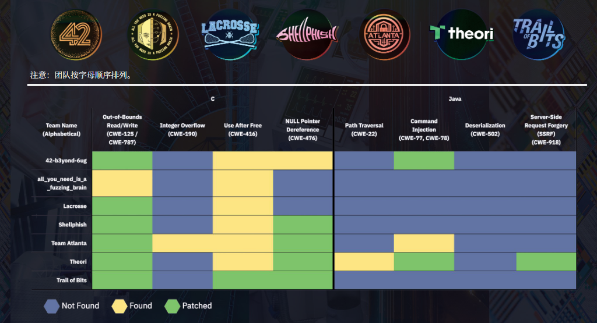
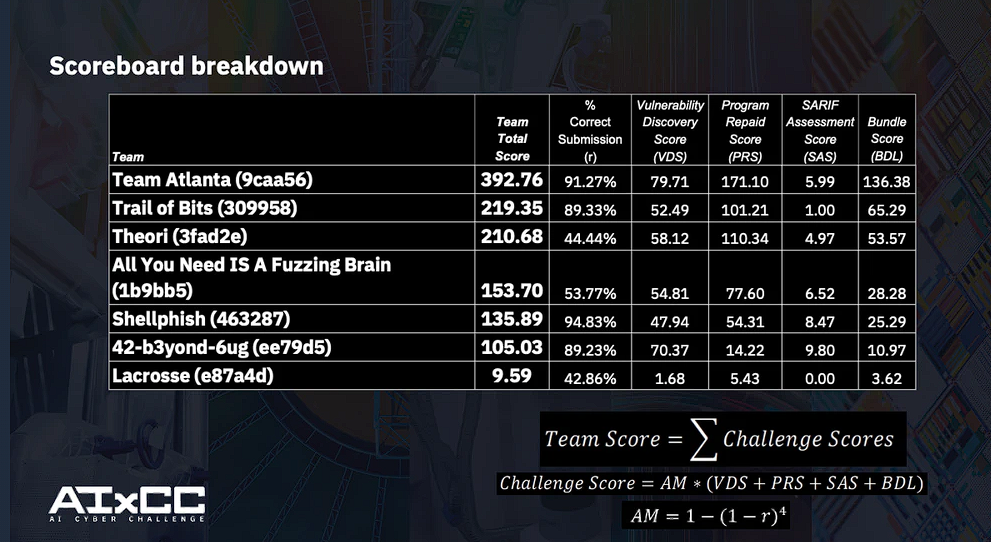
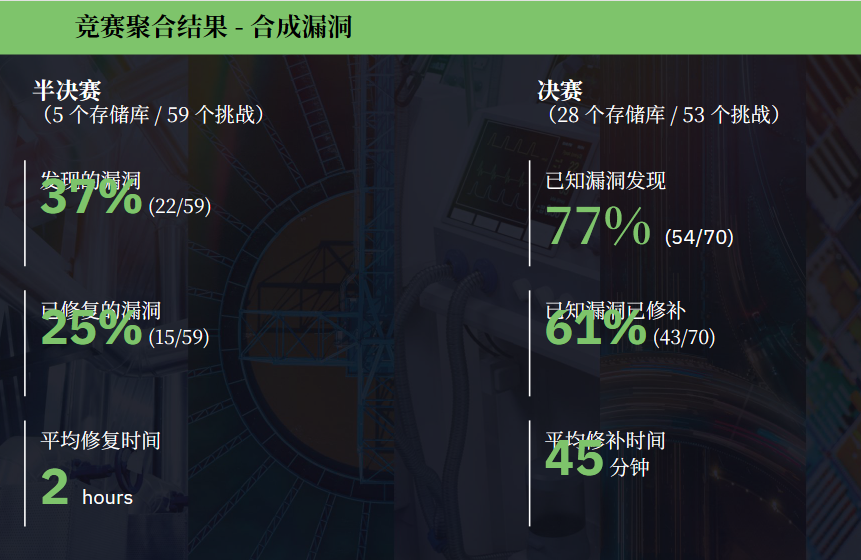
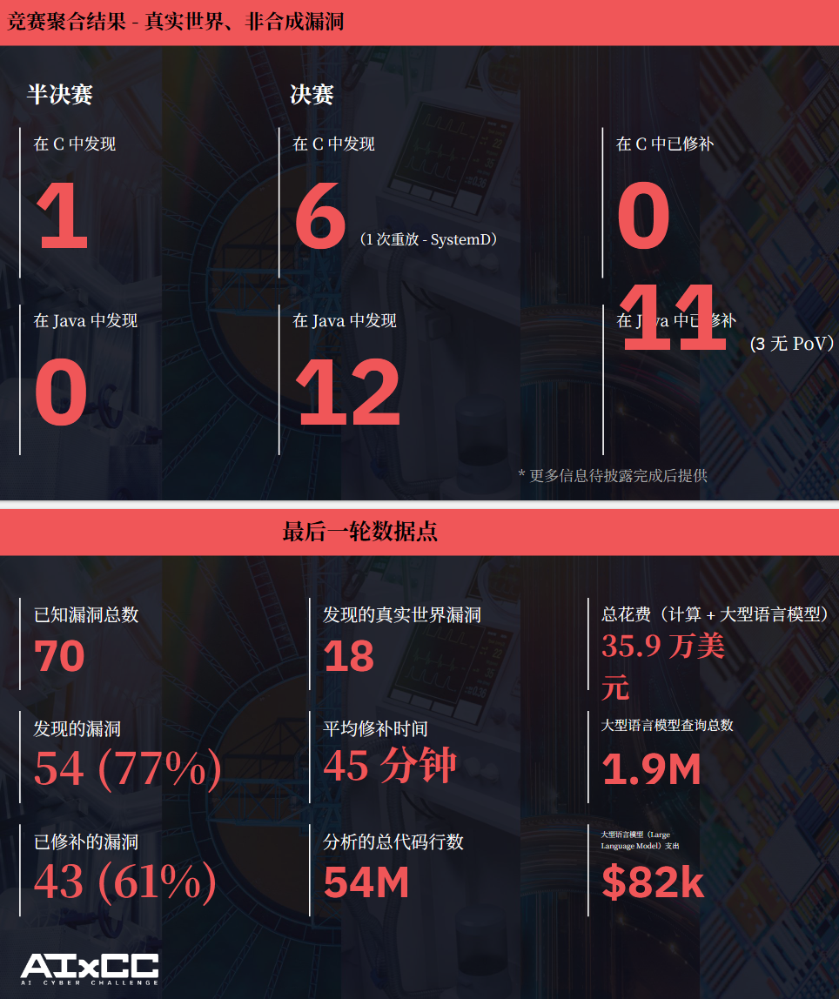

## AIxCC
[https://www.darpa.mil/research/programs/ai-cyber](https://www.darpa.mil/research/programs/ai-cyber)

[https://aicyberchallenge.com/](https://aicyberchallenge.com/)

ASC 比赛

AFC 比赛

网络系统推理结构

[https://github.com/AIxCyberChallenge/example-crs-architecture](https://github.com/AIxCyberChallenge/example-crs-architecture)

每个决赛队伍的获奖视频

[https://www.youtube.com/@ctfradiooo](https://www.youtube.com/@ctfradiooo)

全部获奖的开源项目：

[https://archive.aicyberchallenge.com/](https://archive.aicyberchallenge.com/)

团队的路演介绍：

[https://aicyberchallenge.com/finalist-teams/](https://aicyberchallenge.com/finalist-teams/)

<!-- 这是一张图片，ocr 内容为： -->

<!-- 这是一张图片，ocr 内容为： -->

<!-- 这是一张图片，ocr 内容为： -->

<!-- 这是一张图片，ocr 内容为： -->

每个团队的优缺点

[https://blog.trailofbits.com/2025/08/07/aixcc-finals-tale-of-the-tape/](https://blog.trailofbits.com/2025/08/07/aixcc-finals-tale-of-the-tape/)

决赛队伍解析

[https://blog.csdn.net/weixin_42016744/article/details/151661395](https://blog.csdn.net/weixin_42016744/article/details/151661395)

| 排名 | 系统 | 团队 | 路线 | 亮点 | 缺点 | 结果 |
| :---: | :---: | :---: | --- | --- | --- | --- |
| 1 | Atlantis | Team Atlanta | 混合式架构，将传统程序分析、定向模糊测试、语言特化模型和多组件集成结合起来 | 1.唯一一支使用在 Llama 7B 上使用经过fine-tune的定制模型，并专门针对 C 语言进行大量微调； 2.对不同语言与任务采用不同 PoV生成策略，例如定向模糊测试、LLM 生成定制 mutator、输入字典等； 3.强调多模块集成（ensembling），通过多路分析引擎提升鲁棒性和多样性； 4.在补丁提交上采取保守策略，只在 PoV与补丁形成高置信匹配时提交。 | 1.系统工程复杂度高，多组件集成、模型微调、定向分析都会提升实现和维护成本； 2.高度依赖系统稳定性与工程质量，任何一个环节失效都可能拖累整体效果； 3.保守补丁策略虽然能保证准确率，但可能错过高风险高收益的机会； 4.专门针对 C 分析优化的策略，在跨语言泛化上未必同样强势； 5.对模型、分析器、编排器之间的协同要求极高，调参成本很大。 | 总分：392.76 漏洞发现数量：43 成功补丁数量：31 |
| 2 | Buttercup | Trail of Bits | 典型的“传统安全工具 + AI 增强”路线代表 | 1.以传统模糊测试、静态分析和漏洞研究方法为骨架； 2.利用 LLM 生成高质量 seed input 或 Python 输入生成程序，帮助 fuzzing 更快触达复杂路径； 3.通过 AI 理解复杂输入格式，如 SQL、URL、路径遍历类输入； 4.把 AI 生成的语义化输入纳入 coverage-guided fuzzing 的语料库； 5.对 PoV和补丁进行交叉验证，避免提交低质量结果； 6.补丁策略偏保守，不轻易提交没有 PoV支撑的修复。 | 1.对 fuzzing 仍然有较强依赖，若目标程序不适合 fuzzing，效果可能受限； 2.LLM 更多承担增强角色，而不是完整推理闭环，因此在某些深层语义漏洞上可能不如 AI-first 路线激进； 3.AI 生成高质量 seed 的效果，仍依赖 prompt、模型能力和目标格式复杂度； 4.保守提交策略提高准确率，但可能牺牲部分进攻性得分； 5.系统整体效率依赖良好的 fuzz harness 和覆盖率反馈，工程门槛不低。 | 总分：219.35 漏洞发现数量：28 成功补丁数量：19 |
| 3 | RoboDuck | Theori | “LLM-first”路线 | 1.以 LLM agent 作为主要推理引擎； 2.让 agent 按照逆向分析工作流推进，但对 agent 行为做强约束，避免“乱跑”； 3.使用静态分析工具（如 Infer）先生成大量 bug candidate； 4.再由 LLM agent 进行语义判断，筛掉误报并聚焦真实漏洞； 5.在 PoV生成上依赖 LLM 的语义理解能力，尤其适合复杂格式输入； 6.AI 生成失败时，再把失败样本转化为 fuzzing seed，形成反馈闭环； 7.在补丁策略上比前两名更激进，甚至允许在没有 PoV的情况下按策略提交补丁。 | 1.LLM-first 架构天然面临稳定性和可重复性问题； 2.静态分析候选很多，若 LLM 过滤效果不稳定，误报仍可能很高； 3.过于依赖大模型的语义推理能力，对 prompt、上下文构造、模型质量非常敏感； 4.激进补丁策略可能带来准确率惩罚； 5.在复杂仓库级分析中，LLM 成本、上下文窗口、并发调度都可能成为瓶颈。 | 总分：210.68 漏洞发现数量：34 成功补丁数量：20 |
| 4 | All You Need IS A Fuzzing Brain | All You Need IS A Fuzzing Brain | “LLM-first”路线 | 1.LLM 被用作主要推理引擎； 2.系统将 LLM 用于漏洞分析、系统决策和代码生成； 3.Trail of Bits 的文章提到，该队约 `90%` 的 PoV通过 AI reasoning 生成； 4.当 AI 方法失败时，传统 fuzzing 用作 fallback 机制。 | 1.路线高度依赖 AI 推理； 2.系统仍保留 fuzzing 作为 fallback，说明 AI 路线本身并非完全覆盖所有场景。 | 总分：153.70 漏洞发现数量：28 成功补丁数量：14 |
| 5 | ARTIPHISHELL | Shellphish | “传统能力 + AI 增强”的代表，但更强调 fuzzing 侧的强化。 | 1.以 fuzzing 为核心基础设施； 2.利用名为 `Grammar Guy` 的模块，让 LLM 生成和演化渐进式 grammar； 3.根据覆盖率反馈持续改进 grammar，使其更适合复杂输入格式和协议； 4.通过 AI 解决传统变异式 fuzzing 对复杂结构化输入不够敏感的问题； 5.在补丁策略上偏保守，不提交无 PoV支撑的补丁。 | 1.仍较依赖 fuzzing 主线，对深层逻辑漏洞未必总有优势； 2.Grammar 生成虽强，但会消耗大量 LLM 预算； 3.对复杂 grammar 的演化过程可能较慢，且质量波动受模型输出影响； 4.补丁策略较保守，得分上可能不如更激进的队伍； 5.把 CTF 经验迁移到大规模真实代码库时，仍需要额外工程打磨。 | 总分：135.89 漏洞发现数量：28 成功补丁数量：11 |
| 6 | BugBuster | 42-b3yond-6ug | “混合路线 + LLM 驱动补丁创新” | 1.以集成工具链形式运行，LLM agent 负责检测、分析和修复； 2.保留传统 fuzzing 作为 PoV生成核心； 3.结合静态分析报告与 SARIF 机制做验证； 4.采用多 fuzzer协同和强化学习调度； 5.其最有代表性的技术是“super patches”，即一个补丁同时修复多个看似无关的漏洞； 6.系统能够识别多个 crash 背后的共同根因，并尝试一次性修补。 | 1.“super patch” 很有想象力，但风险也高，修复范围越大，越容易引入副作用； 2.一次修多个漏洞，对根因分析准确性要求极高； 3.多工具链协同会提升系统复杂度和维护难度； 4.强化学习调度、多 fuzzer编排等能力虽然先进，但也增加工程调试成本； 5.如果补丁过于泛化，可能影响程序原有行为，导致功能正确性问题。 | 总分：105.03 漏洞发现数量：41 成功补丁数量：3 |

