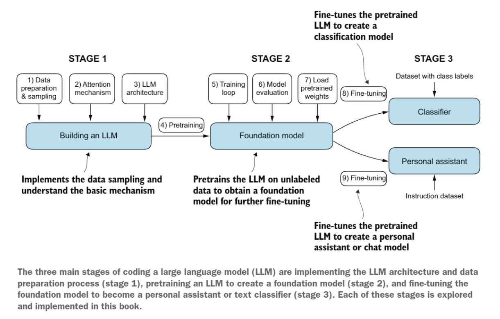
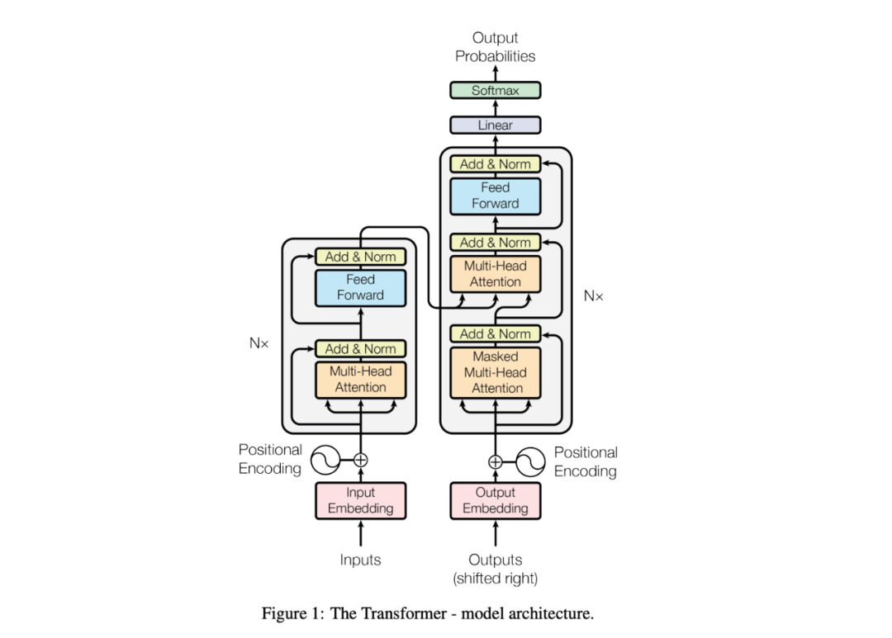
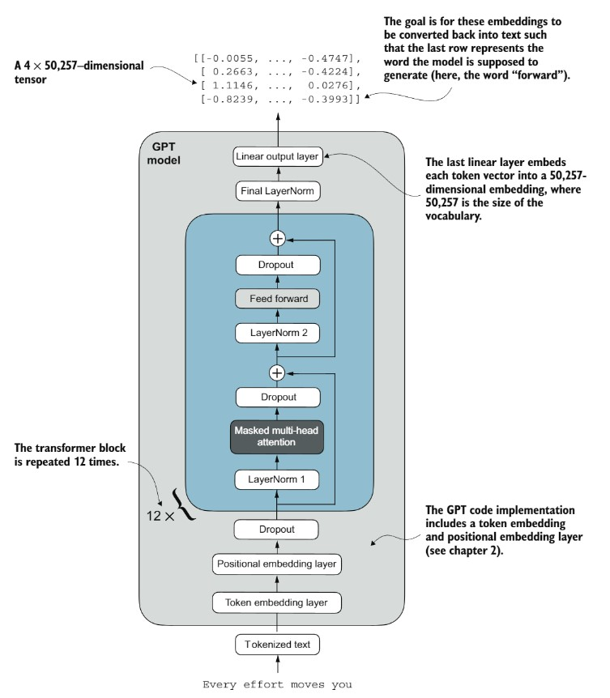
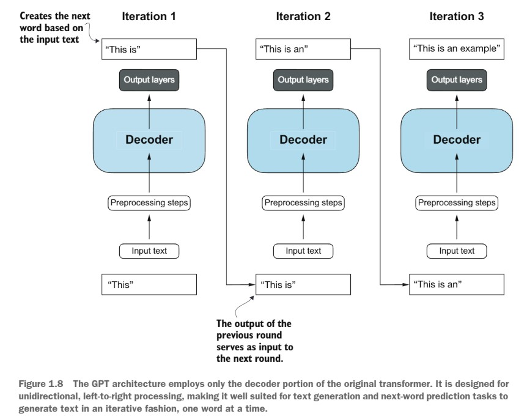

**说明**：本文是 Transformer / LLM 架构的学习与代码复现笔记。内容与代码实践参考了 Bilibili 视频 [《手撕一个大模型看这个视频就够了【代码精读】》](https://www.bilibili.com/video/BV1rDfDB4EAN/)；本文在此基础上按个人学习逻辑进行了整理，并针对 Hexo Blog 的阅读体验做了排版适配。

<!-- 本站当前没有单独安装数学公式 Markdown 渲染器，因此本文章单独加载 MathJax。 -->

<script> window.MathJax = { tex: { inlineMath: [['$', '$'], ['\\(', '\\)']], displayMath: [['$$', '$$'], ['\\[', '\\]']] } }; </script> <script defer src="https://cdn.jsdelivr.net/npm/mathjax@3/es5/tex-mml-chtml.js"></script>

本文从代码出发，完整梳理 Transformer 的基础架构、核心模块以及大模型从训练到推理的基本流程。重点不是只会调用现成模型，而是把 Tokenizer、Embedding、Position Encoding、Multi-Head Attention、FFN、Normalization 和 Decoder 串起来，理解一个自回归大模型究竟是怎样工作的。

**大模型生命周期（概念图）**

```plain
                ┌──────────────┐
                │   模型架构    │
                │ Transformer  │
                └──────┬───────┘
                       │
        ┌──────────────┼──────────────┐
        │              │              │
        v              v              v
   ┌─────────┐    ┌─────────┐    ┌─────────┐
   │   数据   │    │   算力   │    │  AI Infra│
   │训练/评测 │    │ GPU/集群 │    │训练与部署 │
   └────┬────┘    └────┬────┘    └────┬────┘
        └──────────────┼───────────────┘
                       v
      Pretraining → SFT → RL/Post-training → Inference
```


<!-- 这是一张图片，ocr 内容为： -->



**High Level Insight**

+ 算法（大模型架构）：完全从零手撕大模型
+ 数据（训练数据、评测数据）：完全从零评测大模型
+ 算力（基础设施建设，即AI Infra）：完全从零训练大模型、完全从零部署大模型

<!-- more -->

pip install torch modelscope tokenizers

## Step1 Transformer架构总览（Overview）
**Transformer 架构总览**

```plain
输入 Token
   │
   v
Token Embedding + Position Encoding
   │
   ├──────────────────────────────┐
   │                              │
   v                              v
Encoder Block × N             Decoder Block × N
Self-Attention               Masked Self-Attention
      │                              │
      v                              v
Feed Forward                 Cross-Attention（Encoder-Decoder 架构）
      │                              │
      └──────────────┬───────────────┘
                     v
                  LM Head
                     │
                     v
               Next Token Logits
```

GPT 类大模型通常采用 **Decoder-only** 架构；T5 则是典型的 **Encoder-Decoder** 架构。


<!-- 这是一张图片，ocr 内容为： -->



```plain
from modelscope import AutoModelForSeq2SeqLM, snapshot_download

print("正在下载T5模型...")
model_dir = snapshot_download(
    'AI-ModelScope/t5-small',
    local_dir='models/t5-small',
    ignore_file_pattern=[
        '*.bin',              
        '*.h5',            
        '*.ot',      
        '*.msgpack',
        'onnx/*',
        'onnx/**',            # 排除onnx文件夹及其子目录所有内容
    ]
)
model = AutoModelForSeq2SeqLM.from_pretrained(model_dir)

print("T5模型结构:")
print(model)
```

**运行输出（点击展开）**

```plain
正在下载T5模型...
T5模型结构:
T5ForConditionalGeneration(
  (shared): Embedding(32128, 512)
  (encoder): T5Stack(
    (embed_tokens): Embedding(32128, 512)
    (block): ModuleList(
      (0): T5Block(
        (layer): ModuleList(
          (0): T5LayerSelfAttention(
            (SelfAttention): T5Attention(
              (q): Linear(in_features=512, out_features=512, bias=False)
              (k): Linear(in_features=512, out_features=512, bias=False)
              (v): Linear(in_features=512, out_features=512, bias=False)
              (o): Linear(in_features=512, out_features=512, bias=False)
              (relative_attention_bias): Embedding(32, 8)
            )
            (layer_norm): T5LayerNorm()
            (dropout): Dropout(p=0.1, inplace=False)
          )
          (1): T5LayerFF(
            (DenseReluDense): T5DenseActDense(
              (wi): Linear(in_features=512, out_features=2048, bias=False)
              (wo): Linear(in_features=2048, out_features=512, bias=False)
              (dropout): Dropout(p=0.1, inplace=False)
              (act): ReLU()
            )
            (layer_norm): T5LayerNorm()
            (dropout): Dropout(p=0.1, inplace=False)
          )
        )
      )
      (1-5): 5 x T5Block(
        (layer): ModuleList(
          (0): T5LayerSelfAttention(
            (SelfAttention): T5Attention(
              (q): Linear(in_features=512, out_features=512, bias=False)
              (k): Linear(in_features=512, out_features=512, bias=False)
              (v): Linear(in_features=512, out_features=512, bias=False)
              (o): Linear(in_features=512, out_features=512, bias=False)
            )
            (layer_norm): T5LayerNorm()
            (dropout): Dropout(p=0.1, inplace=False)
          )
          (1): T5LayerFF(
            (DenseReluDense): T5DenseActDense(
              (wi): Linear(in_features=512, out_features=2048, bias=False)
              (wo): Linear(in_features=2048, out_features=512, bias=False)
              (dropout): Dropout(p=0.1, inplace=False)
              (act): ReLU()
            )
            (layer_norm): T5LayerNorm()
            (dropout): Dropout(p=0.1, inplace=False)
          )
        )
      )
    )
    (final_layer_norm): T5LayerNorm()
    (dropout): Dropout(p=0.1, inplace=False)
  )
  (decoder): T5Stack(
    (embed_tokens): Embedding(32128, 512)
    (block): ModuleList(
      (0): T5Block(
        (layer): ModuleList(
          (0): T5LayerSelfAttention(
            (SelfAttention): T5Attention(
              (q): Linear(in_features=512, out_features=512, bias=False)
              (k): Linear(in_features=512, out_features=512, bias=False)
              (v): Linear(in_features=512, out_features=512, bias=False)
              (o): Linear(in_features=512, out_features=512, bias=False)
              (relative_attention_bias): Embedding(32, 8)
            )
            (layer_norm): T5LayerNorm()
            (dropout): Dropout(p=0.1, inplace=False)
          )
          (1): T5LayerCrossAttention(
            (EncDecAttention): T5Attention(
              (q): Linear(in_features=512, out_features=512, bias=False)
              (k): Linear(in_features=512, out_features=512, bias=False)
              (v): Linear(in_features=512, out_features=512, bias=False)
              (o): Linear(in_features=512, out_features=512, bias=False)
            )
            (layer_norm): T5LayerNorm()
            (dropout): Dropout(p=0.1, inplace=False)
          )
          (2): T5LayerFF(
            (DenseReluDense): T5DenseActDense(
              (wi): Linear(in_features=512, out_features=2048, bias=False)
              (wo): Linear(in_features=2048, out_features=512, bias=False)
              (dropout): Dropout(p=0.1, inplace=False)
              (act): ReLU()
            )
            (layer_norm): T5LayerNorm()
            (dropout): Dropout(p=0.1, inplace=False)
          )
        )
      )
      (1-5): 5 x T5Block(
        (layer): ModuleList(
          (0): T5LayerSelfAttention(
            (SelfAttention): T5Attention(
              (q): Linear(in_features=512, out_features=512, bias=False)
              (k): Linear(in_features=512, out_features=512, bias=False)
              (v): Linear(in_features=512, out_features=512, bias=False)
              (o): Linear(in_features=512, out_features=512, bias=False)
            )
            (layer_norm): T5LayerNorm()
            (dropout): Dropout(p=0.1, inplace=False)
          )
          (1): T5LayerCrossAttention(
            (EncDecAttention): T5Attention(
              (q): Linear(in_features=512, out_features=512, bias=False)
              (k): Linear(in_features=512, out_features=512, bias=False)
              (v): Linear(in_features=512, out_features=512, bias=False)
              (o): Linear(in_features=512, out_features=512, bias=False)
            )
            (layer_norm): T5LayerNorm()
            (dropout): Dropout(p=0.1, inplace=False)
          )
          (2): T5LayerFF(
            (DenseReluDense): T5DenseActDense(
              (wi): Linear(in_features=512, out_features=2048, bias=False)
              (wo): Linear(in_features=2048, out_features=512, bias=False)
              (dropout): Dropout(p=0.1, inplace=False)
              (act): ReLU()
            )
            (layer_norm): T5LayerNorm()
            (dropout): Dropout(p=0.1, inplace=False)
          )
        )
      )
    )
    (final_layer_norm): T5LayerNorm()
    (dropout): Dropout(p=0.1, inplace=False)
  )
  (lm_head): Linear(in_features=512, out_features=32128, bias=False)
)
```

</details>

```plain
total_params = sum(p.numel() for p in model.parameters())
print(f"总参数量: {total_params:,} ({total_params/1e6:.1f}M)")


config = model.config
print(f"""
T5模型配置:
隐藏维度 (d_model): {config.d_model}
FFN中间维度 (d_ff): {config.d_ff}
注意力头数 (num_heads): {config.num_heads}
Encoder层数: {config.num_layers}
Decoder层数: {config.num_decoder_layers}
词表大小: {config.vocab_size}
注意力头维度 (d_kv): {config.d_kv}
""")
```

**运行输出：**

```plain
总参数量: 60,506,624 (60.5M)

T5模型配置:
隐藏维度 (d_model): 512
FFN中间维度 (d_ff): 2048
注意力头数 (num_heads): 8
Encoder层数: 6
Decoder层数: 6
词表大小: 32128
注意力头维度 (d_kv): 64
```

## Step2 实现Transformer大类（Building Blocks）
**Decoder-only Transformer 的核心数据流**

```plain
Token IDs
   │
   v
Token Embedding
   │
   + Position Encoding
   │
   v
┌─────────────────────────────┐
│ Transformer Decoder Block   │  × N
│                             │
│  RMSNorm / LayerNorm        │
│          │                  │
│          v                  │
│  Masked Multi-Head Attention│
│          │                  │
│       Residual              │
│          │                  │
│          v                  │
│  RMSNorm / LayerNorm        │
│          │                  │
│          v                  │
│     Feed Forward            │
│          │                  │
│       Residual              │
└──────────┬──────────────────┘
           v
        LM Head
           │
           v
        Logits
```


<!-- 这是一张图片，ocr 内容为： -->



```plain
from modelscope import AutoModelForCausalLM, snapshot_download


print("正在下载GPT2模型...")
model_dir = snapshot_download(
    'AI-ModelScope/gpt2', # Qwen/Qwen3-0.6B
    local_dir='models/gpt2', # models/Qwen3-0.6B
    ignore_file_pattern=[
        '*.bin',
        '*.tflite',           
        '*.h5',              
        '*.ot',               
        '*.msgpack',          
        'onnx/*',             
        'onnx/**',            
    ]
)
model = AutoModelForCausalLM.from_pretrained(model_dir)

print("GPT2模型结构:")
print(model)
```

**运行输出（点击展开）**

```plain
正在下载GPT2模型...
GPT2模型结构:
GPT2LMHeadModel(
  (transformer): GPT2Model(
    (wte): Embedding(50257, 768)
    (wpe): Embedding(1024, 768)
    (drop): Dropout(p=0.1, inplace=False)
    (h): ModuleList(
      (0-11): 12 x GPT2Block(
        (ln_1): LayerNorm((768,), eps=1e-05, elementwise_affine=True)
        (attn): GPT2Attention(
          (c_attn): Conv1D(nf=2304, nx=768)
          (c_proj): Conv1D(nf=768, nx=768)
          (attn_dropout): Dropout(p=0.1, inplace=False)
          (resid_dropout): Dropout(p=0.1, inplace=False)
        )
        (ln_2): LayerNorm((768,), eps=1e-05, elementwise_affine=True)
        (mlp): GPT2MLP(
          (c_fc): Conv1D(nf=3072, nx=768)
          (c_proj): Conv1D(nf=768, nx=3072)
          (act): NewGELUActivation()
          (dropout): Dropout(p=0.1, inplace=False)
        )
      )
    )
    (ln_f): LayerNorm((768,), eps=1e-05, elementwise_affine=True)
  )
  (lm_head): Linear(in_features=768, out_features=50257, bias=False)
)
```

</details>

```plain
total_params = sum(p.numel() for p in model.parameters())
print(f"总参数量: {total_params:,} ({total_params/1e6:.1f}M)")


config = model.config
print(f"""
模型配置:
隐藏维度: {config.n_embd}
层数: {config.n_layer}
注意力头数: {config.n_head}
词表大小: {config.vocab_size}
""")
```

**运行输出：**

```plain
总参数量: 124,439,808 (124.4M)

模型配置:
隐藏维度: 768
层数: 12
注意力头数: 12
词表大小: 50257
```

```plain
from modelscope import AutoModelForCausalLM, AutoTokenizer


print("正在加载GPT2模型...")
model_dir = 'models/gpt2'
model = AutoModelForCausalLM.from_pretrained(model_dir)
tokenizer = AutoTokenizer.from_pretrained(model_dir)


question = "What is artificial intelligence?" # input_ids（数字）


inputs = tokenizer(question, return_tensors="pt")
print(inputs)
print(inputs.input_ids)
```

**运行输出：**

```plain
正在加载GPT2模型...
{'input_ids': tensor([[ 2061,   318, 11666,  4430,    30]]), 'attention_mask': tensor([[1, 1, 1, 1, 1]])}
tensor([[ 2061,   318, 11666,  4430,    30]])
```

```plain
print(f"\n问题: {question}")
print("正在生成回答...")
outputs = model.generate(
    inputs.input_ids, # inditifications
    max_length=100,
    num_return_sequences=1,
    temperature=0.7,
    do_sample=True
)

print(outputs)
```

**运行输出：**

```plain
问题: What is artificial intelligence?
正在生成回答...
tensor([[ 2061,   318, 11666,  4430,    30,   198,   198,  2025, 11666,  4430,
           318,   281, 11666,  4430,   326,   468,   587,  4166,   290,  9177,
           329,   257,  2176,  4007,    11,   290,   326,   468,   587,  6789,
           290, 31031,   416,   281,  1981,  1074,   286,  5519,    13,   198,
           198,  3633,   777,  8514,   389,  1049,    11,   484,   389,   407,
           262,   691,   835,   262,   995,   338,  1266,  4837,   481,   307,
          1498,   284,  7073,   290,  1833,  1692, 31119,    13,   198,   198,
          1890,  4554,    11,   611,   356,   765,   284,  2193,   546,   674,
         10825,   290, 28140,    11,   356,  1183,   761,   284,  2193,   546,
           262,  3632,    13,   198,   198,    40,  1101,   407,  1654,   314]])
```

```plain
answer = tokenizer.decode(outputs[0], skip_special_tokens=True)
print(f"\nGPT-2回答:\n{answer}")
```

**运行输出：**

```plain
GPT-2回答:
What is artificial intelligence?

An artificial intelligence is an artificial intelligence that has been developed and implemented for a specific purpose, and that has been tested and validated by an individual team of scientists.

While these technologies are great, they are not the only way the world's best researchers will be able to discover and understand human cognition.

For instance, if we want to learn about our emotions and motivations, we'll need to learn about the brain.

I'm not sure I
```

```plain
import torch
import torch.nn as nn

class Transformer(nn.Module):
    def __init__(self, config):
        super().__init__()
        self.config = config
        # 后续在Step3中补全
        self.embedding = None      # Module2: 词嵌入 (TokenEmbedding)
        self.pos_encoding = None   # Module3: 位置编码 (PositionalEncoding)
        self.layers = None         # Module4+5+6: Transformer层 (nn.ModuleList of TransformerBlock)
        self.norm = None           # Module6: 最终归一化 (RMSNorm 或 LayerNorm)
        self.lm_head = None        # 模型输出头 (nn.Linear: hidden_size -> vocab_size)
    
    def forward(self, input_ids, labels=None):
        """
        Transformer前向传播
        
        Args:
            input_ids: 输入token ID, shape: (batch_size, seq_len)
            labels: 训练时的标签, shape: (batch_size, seq_len)，用于计算损失
        
        Returns:
            如果 labels 不为 None: 返回 (loss, logits)
            如果 labels 为 None: 返回 logits
        """
        # ==================== Step 1: 词嵌入 ====================
        # input_ids: (B, L) -> x: (B, L, hidden_size) 768
        x = self.embedding(input_ids) #我喜欢打篮球 -》 tensor([10, 10001, 40000, 381])    (1, 4) -> (1, 4, 768)
        
        # ==================== Step 2: 位置编码 ====================
        # 添加位置信息: (B, L, hidden_size) -> (B, L, hidden_size)
        x = self.pos_encoding(x)  # pos_encoding的大小 (1000, 768)
        


        # ==================== Step 3: 创建因果注意力掩码 ====================
        # Decoder-only 模型需要因果掩码，防止看到未来的token
        seq_len = input_ids.size(1)
        # 创建下三角矩阵作为因果掩码
        causal_mask = torch.tril(torch.ones(seq_len, seq_len, device=input_ids.device))

        
        # ==================== Step 4: 通过N层Transformer层 ====================
        # 每层包含: MultiHeadAttention + FFN + LayerNorm/RMSNorm + 残差连接
        for layer in self.layers:
            x = layer(x, mask=causal_mask)  # (B, L, hidden_size)
        
        # ==================== Step 5: 最终归一化 ====================
        x = self.norm(x)  # (B, L, hidden_size)
        
        # ==================== Step 6: 语言模型头 (LM Head) ====================
        # 将隐藏状态映射到词表大小 x是一个(1,4,768)->(1,4, 50257)
        logits = self.lm_head(x)
        
        # ==================== Step 7: 计算损失（如果提供labels）====================
        loss = None
        if labels is not None:
            # 自回归语言模型: 用当前位置预测下一个token
            # shift操作: logits[:-1] 预测 labels[1:]
            shift_logits = logits[:, :-1, :].contiguous()  # (B, L-1, vocab_size)
            shift_labels = labels[:, 1:].contiguous()       # (B, L-1)           
            
            # 交叉熵损失
            loss_fn = nn.CrossEntropyLoss(ignore_index=-100)  # -100 通常是padding的标签
            loss = loss_fn(
                shift_logits.view(-1, shift_logits.size(-1)),  # (B*(L-1), vocab_size)
                shift_labels.view(-1)                           # (B*(L-1),)
            )
        
        # ==================== Step 8: 返回结果 ====================
        if loss is not None:
            return loss, logits
        return logits
```

## Step3 实现Transformer各个模块（Coarse to Fine）
### Module1 分词器（Tokenizer）
```plain
# 方法1: 使用HuggingFace tokenizers库训练BPE分词器（推荐）
from tokenizers import Tokenizer, models, trainers, pre_tokenizers, processors, decoders
from tokenizers.normalizers import NFKC
import os

def train_bpe_tokenizer(texts, vocab_size=6400, save_path="tokenizer.json"):
    """
    训练BPE分词器
    
    Args:
        texts: 训练文本列表 或 文本文件路径列表
        vocab_size: 词表大小
        save_path: 保存路径
    """
    # 1. 初始化BPE模型
    tokenizer = Tokenizer(models.BPE(unk_token="<unk>"))
    
    # 2. 设置预处理：Unicode归一化 + 按字节级别分割
    tokenizer.normalizer = NFKC()
    tokenizer.pre_tokenizer = pre_tokenizers.ByteLevel(add_prefix_space=False)
    
    # 3. 添加ByteLevel解码器
    tokenizer.decoder = decoders.ByteLevel()
    
    # 4. 设置BPE训练器
    trainer = trainers.BpeTrainer(
        vocab_size=vocab_size,
        special_tokens=["<pad>", "<bos>", "<eos>", "<unk>"],
        min_frequency=2,
        show_progress=True
    )
    
    # 5. 训练
    if isinstance(texts[0], str) and os.path.isfile(texts[0]):
        # 从文件训练
        tokenizer.train(texts, trainer)
    else:
        # 从文本列表训练
        tokenizer.train_from_iterator(texts, trainer)
    
    # 6. 设置后处理：添加特殊token
    tokenizer.post_processor = processors.TemplateProcessing(
        single="<bos> $A <eos>",
        special_tokens=[("<bos>", 1), ("<eos>", 2)]
    )
    
    # 7. 保存
    tokenizer.save(save_path)
    print(f"✅ 分词器已保存到 {save_path}，词表大小: {tokenizer.get_vocab_size()}")
    
    return tokenizer


# 准备训练数据（示例）
train_texts = [
    "人工智能是计算机科学的一个分支，致力于创建能够模拟人类智能的系统。",
    "深度学习是机器学习的一个子领域，使用多层神经网络来学习数据的表示。",
    "Transformer是一种基于注意力机制的神经网络架构，广泛用于自然语言处理任务。",
    "大语言模型通过在大规模文本数据上进行预训练，学习了丰富的语言知识。",
    "预训练和微调是当前NLP的主流范式，先在通用数据上预训练，再在特定任务上微调。",
    "自然语言处理让计算机能够理解、生成和处理人类语言。",
    "神经网络由多个层组成，每层包含多个神经元，通过权重连接。",
    "注意力机制允许模型关注输入的不同部分，捕获长距离依赖关系。",
] * 100

# 训练分词器
tokenizer = train_bpe_tokenizer(train_texts, vocab_size=1000, save_path="my_tokenizer.json")
```

**运行输出：**

✅ 分词器已保存到 my_tokenizer.json，词表大小: 481

注意：`**ByteLevel**` 预分词器会将 **UTF-8 字节** 映射到 **可打印的 Unicode 字符**。

| **中文** | **UTF-8 字节** | **ByteLevel 映射** |
| :--- | :--- | :--- |
| 是 | `**0xE6 0x98 0xAF**` | `**æ**``**ĺ**``**¯**`→ `**æĺ¯**` |
| 的 | `**0xE7 0x9A 0x84**` | `**ç**``**ļ**``**Ħ**`→ `**çļĦ**` |
| 学习 | ... | `**åŃ¦ä¹ł**` |
| 神经 | ... | `**ç¥ŀç»ı**` |


tokenizer.json 中: "æĺ¯" → 代表中文 "是" "çļĦ" → 代表中文 "的" "åŃ¦ä¹ł" → 代表中文 "学习"

```plain
# 加载和使用分词器
from tokenizers import Tokenizer

class BPETokenizer:
    """BPE分词器封装类"""
    
    def __init__(self, tokenizer_path="my_tokenizer.json"):
        self.tokenizer = Tokenizer.from_file(tokenizer_path)
        # 特殊token ID
        self.pad_id = self.tokenizer.token_to_id("<pad>")
        self.bos_id = self.tokenizer.token_to_id("<bos>")
        self.eos_id = self.tokenizer.token_to_id("<eos>")
        self.unk_id = self.tokenizer.token_to_id("<unk>")
    
    @property
    def vocab_size(self):
        return self.tokenizer.get_vocab_size()
    
    def encode(self, text, max_length=None, padding=False):
        """编码文本为token ID"""
        encoded = self.tokenizer.encode(text)
        ids = encoded.ids
        
        if max_length:
            ids = ids[:max_length]
            if padding:
                ids = ids + [self.pad_id] * (max_length - len(ids))
        return ids
    
    def decode(self, ids, skip_special=True):
        """解码token ID为文本"""
        if skip_special:
            ids = [i for i in ids if i not in [self.pad_id, self.bos_id, self.eos_id]]
        return self.tokenizer.decode(ids)
    
    def tokenize(self, text):
        """获取token列表"""
        return self.tokenizer.encode(text).tokens


# 测试
tokenizer = BPETokenizer("my_tokenizer.json")
print(f"词表大小: {tokenizer.vocab_size}")

text = "Transformer是深度学习的核心架构"
ids = tokenizer.encode(text)
tokens = tokenizer.tokenize(text)
decoded = tokenizer.decode(ids)

print(f"原文: {text}")
print(f"Tokens: {tokens}")
print(f"Token IDs: {ids}")
print(f"解码: {decoded}")
```

**运行输出：**

```plain
词表大小: 481
原文: Transformer是深度学习的核心架构
Tokens: ['<bos>', 'Tran', 'sfo', 'rmer', 'æĺ¯', 'æ·±å', 'º¦åŃ¦ä¹ł', 'çļĦ', 'æ', 'ł', '¸', 'å', '¿', 'ĥ', 'æŀ¶æŀĦ', '<eos>']
Token IDs: [1, 395, 227, 226, 126, 283, 260, 93, 49, 85, 38, 48, 45, 56, 446, 2]
解码: Transformer是深度学习的核心架构
```

### Module2 词嵌入（Word Token Embedding）
```plain
import torch
import torch.nn as nn
import math

class TokenEmbedding(nn.Module):
    def __init__(self, vocab_size, hidden_size):
        super().__init__()
        self.embedding = nn.Embedding(vocab_size, hidden_size)
        self.hidden_size = hidden_size
    
    def forward(self, x):
        return self.embedding(x) * math.sqrt(self.hidden_size)
```

```plain
embed = TokenEmbedding(1000, 256)
x = torch.randint(0, 1000, (2, 10))
print(f"输入: {x.shape} -> 输出: {embed(x).shape}")
```

**运行输出：**

输入: torch.Size([2, 10]) -> 输出: torch.Size([2, 10, 256])

### Module3 位置嵌入（Word Position Embedding）
$$PE_{(pos, 2i)} = \sin\left(\frac{pos}{10000^{2i/d_{model}}}\right)$$

$$PE_{(pos, 2i+1)} = \cos\left(\frac{pos}{10000^{2i/d_{model}}}\right)$$

其中$pos$为位置索引（0, 1, 2, ...），$i$为维度索引（0, 1, 2, ..., d_model/2）

```plain
import torch 
import torch.nn as nn
import math

class PositionalEncoding(nn.Module):
    def __init__(self, hidden_size, max_len=512, dropout=0.1):
        super().__init__()
        self.dropout = nn.Dropout(dropout)
        
        # 计算正弦余弦位置编码
        pe = torch.zeros(max_len, hidden_size)
        position = torch.arange(max_len).unsqueeze(1).float()
        div_term = torch.exp(torch.arange(0, hidden_size, 2).float() * (-math.log(10000.0) / hidden_size))
        pe[:, 0::2] = torch.sin(position * div_term)
        pe[:, 1::2] = torch.cos(position * div_term)
        self.register_buffer('pe', pe.unsqueeze(0))
    
    def forward(self, x):
        x = x + self.pe[:, :x.size(1)]
        return self.dropout(x)
```

```plain
pos_enc = PositionalEncoding(256)
x = torch.randn(2, 10, 256)
print(f"位置编码后: {pos_enc(x).shape}")
```

**运行输出：**

位置编码后: torch.Size([2, 10, 256])

### Module4 多头注意力机制（Multi-Head Attention）
```plain
import torch.nn.functional as F

class MultiHeadAttention(nn.Module):
    def __init__(self, hidden_size=256, num_heads=4, dropout=0.1):
        super().__init__()
        self.num_heads = num_heads 
        self.head_dim = hidden_size // num_heads # 64
        
        self.q_proj = nn.Linear(hidden_size, hidden_size) # 256*256
        self.k_proj = nn.Linear(hidden_size, hidden_size)
        self.v_proj = nn.Linear(hidden_size, hidden_size)
        self.o_proj = nn.Linear(hidden_size, hidden_size)
        self.dropout = nn.Dropout(dropout)
    
    def forward(self, x, mask=None): # x是[2, 10, 256]
        B, L, _ = x.shape
        
        # 投影并分头
        q = self.q_proj(x).view(B, L, self.num_heads, self.head_dim).transpose(1, 2) #[2, 4, 10, 64]
        k = self.k_proj(x).view(B, L, self.num_heads, self.head_dim).transpose(1, 2)
        v = self.v_proj(x).view(B, L, self.num_heads, self.head_dim).transpose(1, 2)
        
        # 注意力计算: softmax(QK^T / sqrt(d)) * V
        scores = torch.matmul(q, k.transpose(-2, -1)) / math.sqrt(self.head_dim) # [2,4,10,64] * [2,4,64,10] -> [2,4,10,10]
        if mask is not None:
            scores = scores.masked_fill(mask == 0, float('-inf'))
        attn = F.softmax(scores, dim=-1)
        attn = self.dropout(attn)
        
        # 合并多头
        out = torch.matmul(attn, v).transpose(1, 2).contiguous().view(B, L, -1) # [2,4,10,10] * [2,4, 10,64] ->[2,4, 10,64] ->[2,10,4, 64]->[2,10,256]
        return self.o_proj(out) # [2,10,256] ->[2,10,256]
```

```plain
attn = MultiHeadAttention(256, 8)
x = torch.randn(2, 10, 256)
mask = torch.tril(torch.ones(10, 10)).unsqueeze(0).unsqueeze(0)  # 因果掩码
print(f"注意力输出: {attn(x, mask).shape}")
```

**运行输出：**

注意力输出: torch.Size([2, 10, 256])

### Module5 前馈神经网络（Feed Forward Network）
```plain
class FeedForward(nn.Module):
    def __init__(self, hidden_size, intermediate_size, dropout=0.1):
        super().__init__()
        self.fc1 = nn.Linear(hidden_size, intermediate_size) #[2,10,256]->[2,10,1024]
        self.fc2 = nn.Linear(intermediate_size, hidden_size) #[2,10,1024]->[2,10,256]
        self.dropout = nn.Dropout(dropout)
    
    def forward(self, x):
        return self.dropout(self.fc2(F.gelu(self.fc1(x))))
```

```plain
ffn = FeedForward(256, 1024)
print(f"FFN输出: {ffn(torch.randn(2, 10, 256)).shape}")
```

**运行输出：**

FFN输出: torch.Size([2, 10, 256])

### Module6 层归一化（Layer Normalization）
**LayerNorm**$$\text{LayerNorm}(x) = \gamma \odot \frac{x - \mu}{\sqrt{\sigma^2 + \epsilon}} + \beta$$其中：

+ $\mu = \frac{1}{H} \sum_{i=1}^{H} x_i$ （均值）
+ $\sigma^2 = \frac{1}{H} \sum_{i=1}^{H} (x_i - \mu)^2$ （方差）

**RMSNorm**$$\text{RMSNorm}(x) = \frac{x}{\text{RMS}(x)} \cdot \gamma$$$$\text{RMS}(x) = \sqrt{\frac{1}{H} \sum_{i=1}^{H} x_i^2 + \epsilon}$$

```plain
class RMSNorm(nn.Module):
    def __init__(self, hidden_size, eps=1e-6):
        super().__init__()
        self.weight = nn.Parameter(torch.ones(hidden_size))
        self.eps = eps
    
    def forward(self, x): # x:[2,10,256]
        rms = torch.sqrt(x.pow(2).mean(-1, keepdim=True) + self.eps)
        return x / rms * self.weight
```

```plain
norm = RMSNorm(256)
print(f"归一化输出: {norm(torch.randn(2, 10, 256)).shape}")
```

**运行输出：**

归一化输出: torch.Size([2, 10, 256])

```plain
# 大模型配置
from dataclasses import dataclass

@dataclass
class LMConfig:
    vocab_size: int = 6400
    hidden_size: int = 512
    num_layers: int = 8
    num_heads: int = 8 # head_dim = 512 / 8 =64
    intermediate_size: int = 4 * hidden_size
    max_seq_len: int = 512
    dropout: float = 0.1

config = LMConfig()
print(f"配置: {config}")
```

**运行输出：**

配置: LMConfig(vocab_size=6400, hidden_size=512, num_layers=8, num_heads=8, intermediate_size=2048, max_seq_len=512, dropout=0.1)

```plain
class TransformerBlock(nn.Module):
    def __init__(self, config):
        super().__init__()
        self.attn = MultiHeadAttention(config.hidden_size, config.num_heads, config.dropout)
        self.ffn = FeedForward(config.hidden_size, config.intermediate_size, config.dropout)
        self.norm1 = RMSNorm(config.hidden_size)
        self.norm2 = RMSNorm(config.hidden_size)
    
    def forward(self, x, mask=None):
        x = x + self.attn(self.norm1(x), mask)
        x = x + self.ffn(self.norm2(x))
        return x

class Transformer(nn.Module):
    def __init__(self, config):
        super().__init__()
        self.config = config
        self.embedding = TokenEmbedding(config.vocab_size, config.hidden_size)
        self.pos_encoding = PositionalEncoding(config.hidden_size, config.max_seq_len, config.dropout)
        self.layers = nn.ModuleList([TransformerBlock(config) for _ in range(config.num_layers)])
        self.norm = RMSNorm(config.hidden_size)
        self.lm_head = nn.Linear(config.hidden_size, config.vocab_size, bias=False)
        
        # 权重共享
        self.lm_head.weight = self.embedding.embedding.weight
    
    def forward(self, input_ids, labels=None):
        B, L = input_ids.shape
        mask = torch.tril(torch.ones(L, L, device=input_ids.device)).unsqueeze(0).unsqueeze(0)
        
        x = self.embedding(input_ids)
        x = self.pos_encoding(x)
        for layer in self.layers:
            x = layer(x, mask)
        x = self.norm(x)
        logits = self.lm_head(x)
        
        loss = None
        if labels is not None:
            loss = F.cross_entropy(logits[:, :-1].reshape(-1, logits.size(-1)), labels[:, 1:].reshape(-1))
        return loss, logits
    
    @torch.no_grad()
    def generate(self, input_ids, max_new_tokens=50, temperature=1.0):
        for _ in range(max_new_tokens):
            logits = self(input_ids[:, -self.config.max_seq_len:])[1][:, -1] / temperature
            next_token = torch.multinomial(F.softmax(logits, dim=-1), 1)
            input_ids = torch.cat([input_ids, next_token], dim=1)
            if next_token.item() == 2:  # <eos>
                break
        return input_ids

# 测试
config = LMConfig(vocab_size=tokenizer.vocab_size, hidden_size=256, num_layers=4, num_heads=4, intermediate_size=512, max_seq_len=128)
model = Transformer(config)
print(f"模型参数量: {sum(p.numel() for p in model.parameters()):,}")
```

**运行输出：**

模型参数量: 2,229,760

## Step4 训练一个属于你自己的大模型
### 1 构造数据集（Data）
[https://www.modelscope.cn/datasets/gongjy/minimind_dataset](https://www.modelscope.cn/datasets/gongjy/minimind_dataset)

# 预训练阶段数据集、有监督微调数据集和强化学习数据集

### 2 预训练阶段（Pretraining）


<!-- 这是一张图片，ocr 内容为： -->



```plain
# 用下一个token预测的形式，让大模型学会单词接龙

input_ids: (B, L)
     │
     ▼
┌─────────────────┐
│  TokenEmbedding │  →  (B, L, hidden_size)
└─────────────────┘
     │
     ▼
┌─────────────────────┐
│  PositionalEncoding │  →  (B, L, hidden_size)
└─────────────────────┘
     │
     ▼
┌─────────────────────────────────────┐
│     TransformerBlock × N 层         │
│  ┌─────────────────────────────┐    │
│  │ Attention + Residual + Norm │    │
│  │ FFN + Residual + Norm       │    │
│  └─────────────────────────────┘    │
└─────────────────────────────────────┘
     │
     ▼
┌─────────────────┐
│   Final Norm    │  →  (B, L, hidden_size)
└─────────────────┘
     │
     ▼
┌─────────────────┐
│    LM Head      │  →  (B, L, vocab_size)
└─────────────────┘
     │
     ▼ 
logits / (loss, logits)
```

### 3 有监督微调（Supervised Fine Tuning）
# 用对话数据集的形式，让大模型学会遵循指令和回答问题

### 4 强化学习（Reinforcement Learning）
```plain
# 用奖励函数，让大模型学会自主做出决策（比如推理和思考）
# PPO、DPO、GRPO、GSPO、GDPO等
# 后训练框架：verl、LLaMA-Factory、OpenRLHF、TRL等
```

### 5 模型部署（Inference）
```plain
# 高效部署，节省GPU资源和更快响应
# vLLM、SGLang、llama.cpp……
```

主要参考资料如下：

[https://github.com/karpathy/nanoGPT](https://github.com/karpathy/nanoGPT)

[https://github.com/karpathy/nanochat](https://github.com/karpathy/nanochat)

[https://github.com/rasbt/LLMs-from-scratch](https://github.com/rasbt/LLMs-from-scratch)

[https://github.com/jingyaogong/minimind](https://github.com/jingyaogong/minimind)

