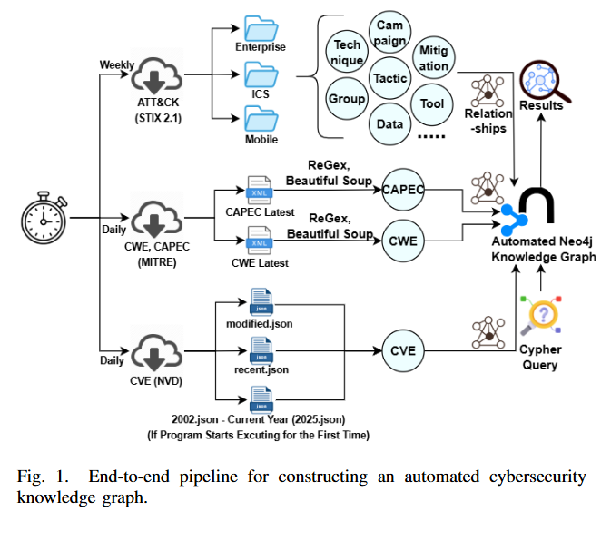
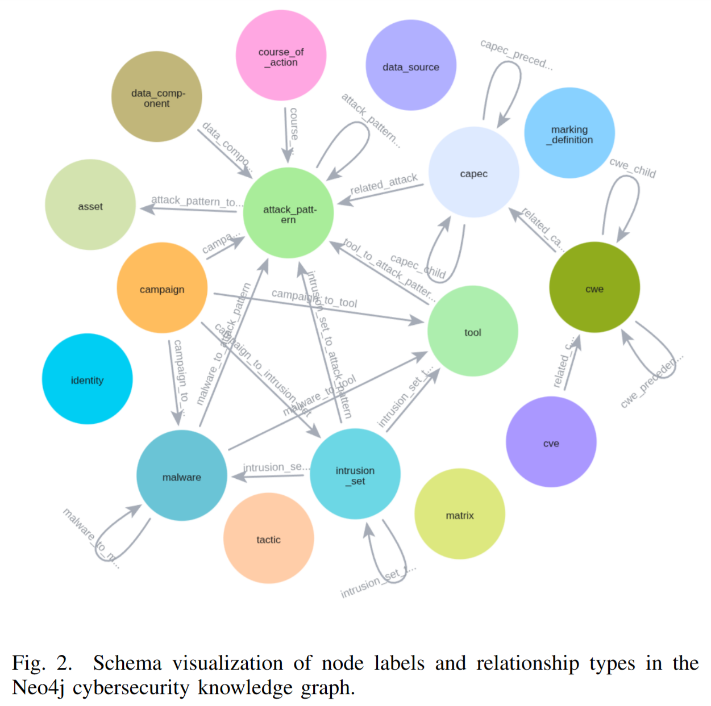

## 摘要

Cyber threat intelligence(CTI)包括收集和分析安全相关的信息通过多元化和参差的。这些信息可能包含整理不同格式、详略程度各异的漏洞、缺陷以及攻击模式相关数据的 repo。分析者必须持续调整这些源文件去增加一个连贯的视角进化威胁形式，然而这些进程通常是手动的，不完整的并且易于出错的。在这个工作中，我们提出了一个完全自动化的网安知识图谱流程，系统化的提取和规范数据从 NVD、mitre cwe、capec 和 atteck 框架，并且整合进入一个 Neo4j 图数据库。我们的系统提取丰富的属性和外在的和内在入口关系来自每一个数据，包括层级链接，跨域映射，和时许元数据，同时与上流数据源确保每日同步。KG 的结果包含成百上千的外部入口和节点，授权的 multi-hop 分析在多个方向（例如从攻击技术到漏洞点，从漏洞点到攻击技术）。我们证明了 KG 对于综合性弱点分析，链接的对手群体的有效性在漏洞利用，并且基于图的推断任务（包括可变长度路径遍历和 link 发现）。我们 case study 在 CISA 告警展示了综合性图遍历发现 CVE 除了那些明确列出的，bridging critical gaps in threat intelligence。通过联合全自动化，完全话和语义丰富，我们的 KG 提供一个可拓展的持续的更新基础为安全威胁分析，图学习与推理方向的业务决策及前沿研究工作。

## 贡献
1 端到端全自动化，完全自动化流程，收集 cve、cwe、capec 和 ATT&CK 数据源，使得可以双向推理在漏洞和攻击者之间

2 丰富的节点和关系拓展。我们构建了一个巨大范围的 KG（捕获广泛的节点，关系，和属性）确保语义丰富度和综合性跨域覆盖

3 综合性 ATT&CK 框架可视化：我们提供一个细粒度的试图给所有的 ATT&CK 入口，包括技术、策略、迁移和相关的对象，并且从而能够系统性地探究攻击者行为

4 基于拓扑的 link 发现：我们介绍基于拓扑的方法（表明可靠的但是未被遵守的关系在图中），证明如何结构相似性覆盖有意义的关系在弱点和攻击模式之间

5 基于 neo4j 查询和分析：我们在 neo4j 部署图并且充分利用表达性Cypher查询语言去支持先进的分析，包括 multi-hop 推理，断 path 发现和模式分析

## METHOD

<!-- 这是一张图片，ocr 内容为： -->

<!-- 这是一张图片，ocr 内容为： -->

