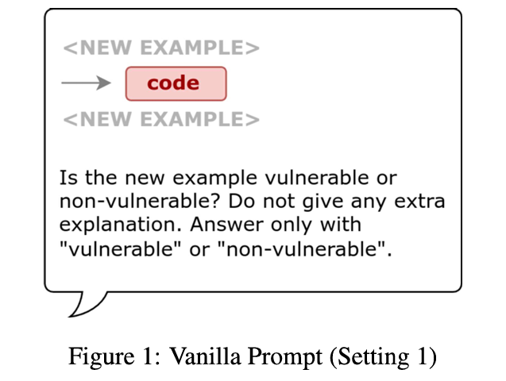
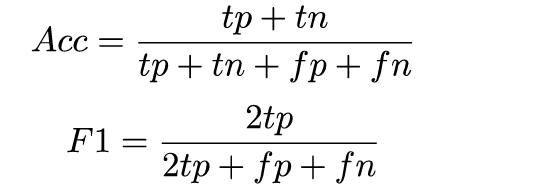

##  LLM 提示能否作为漏洞检测中静态分析的代理
### 1.介绍：
该策略将漏洞的自然语言描述与对比思路链推理方法相结合，并使用来自合成数据集的对比样本进行增强。我们的研究通过将自然语言描述、对比推理和合成示例集成到一个综合提示框架中，突出了 LLM 检测漏洞的潜力。我们的结果表明，这种方法可以增强 LLM 对漏洞的理解。在 SVEN 等高质量漏洞检测数据集上，我们的提示策略可以分别将准确度、F1 分数和成对准确度提高 23%、11% 和 14%。

### 2.针对的漏洞
CWE-78：操作系统命令注入--当外部用户输入未经适当清理而直接传递到系统命令时会发生

CWE-90：整数溢出--当整数的算数运算结果超出变量允许的范围时发生，导致缓冲区溢出或者敏感信息泄露

CWE-476：空指针取消引用--当应用程序尝试取消引用它认为有效实际上却为NULL的指针时，会发生这种情况，从而导致崩溃或意外终止

CWE-416：释放后使用--当应用程序在释放内存后访问内存时发生，从而导致可利用的情况

### 3.提示策略：
该论文使用精选的Juliet CIC++数据和LLM提示来生成详细的漏洞解释。论文使用易受攻击和固定的代码对（第1阶段），提示LLM提供特定于CWE的检测指令（第2阶段），并生成比较这些代码对思想链解释（第3阶段）。最后，合成一个对比模板，突出显示漏洞和修复（第四阶段）

##### 1）.香草提示
<!-- 这是一张图片，ocr 内容为：<NEW EXAMPLE> CODE <NEW EXAMPLE> IS THE NEW EXAMPLE VULNERABLE OR NON-VULNERABLE? DO NOT GIVE ANY EXTRA EXPLANATION. ANSWER ONLY WITH "VULNERABLE"OR"NON-VULNERABLE". FIGURE 1:VANILLA PROMPT (SETTING 1) -->

##### 2).自然语言指令
采用了三种不同的基于自然语言的提示策略，以不同的方式描述漏洞类型。这三种提示策略旨在探索向LLM提供不同指令源的有效性。

(s1)：利用LLM生成用于检测特定CWE的指令，利用其对CWE的固有理解来提供有洞察力和相关的指令。

(s2)：采用更定制化的方法，我们利用LLM从SVEN验证集中提取的3个成对样本（包括脆弱和已修复的）来生成基于少数样本的指令。

(s3)：选择使用与MITRE CWE词典中提供的描述完全匹配的方法。

##### 3).自然语言描述 + 对比链式思考
结合了自然语言处理和推理步骤提示的技术

##### 4).评估指标
**准确率**和**F1分数是标准指标**

<!-- 这是一张图片，ocr 内容为：TP+TM ACC三 TP+TN+FP+FN 2TP F1 2TP+FP+FM -->
  

### 4.实验设置
**环境**：GPT-4o（gpt-40-2024-05-13）||   GPT-4（gpt-4-turbo-2024-04-09）

数据集：重点使用SVEN（He和Vechev，2023）,也使用了CVEFixes（存在数据重复和标签不准确的问题）进行对比实验结果

**SVEN**：这是一个手动标记的平衡数据集，已知具有94%的标签准确性。这个数据集最初包含803个脆弱/非脆弱对（总共1.6k个样本）。我们为4个CWE过滤出184个样本（占整个数据集的11.5%）。由于成本限制，我们只在随机子集上进行测试，为每个CWE分配46个样本。

**CVEFixes**：Bhandari等人（2021）使用自动化收集工具从开源软件库中检索样本。该数据集包含39.8k个样本，包括脆弱和非脆弱类别。我们为4个CWE过滤出1784个样本。见表2的我们的数据集（见CWEs部分）。

### 结论
本文中采用的提示策略提高了LLMs在现实世界样本中识别漏洞的能力，结果表明这些策略优于基本提示，特别是在最重要的指标：成对准确率上。具体来说，成对准确率提高了15-36%，有效地增加了真实漏洞的检测同时减少了误报——这是实际应用中的关键挑战。此外，这些策略超过了现有方法在漏洞检测提示方面的性能。最后，我们对LLM响应的手动分析突出了它们识别问题（如字符串插值和shell命令执行）的能力，同时也暴露了它们在理解上下文、内存分配和数据结构方面的困难。

