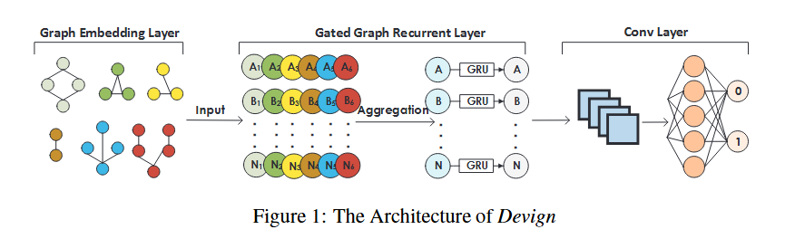
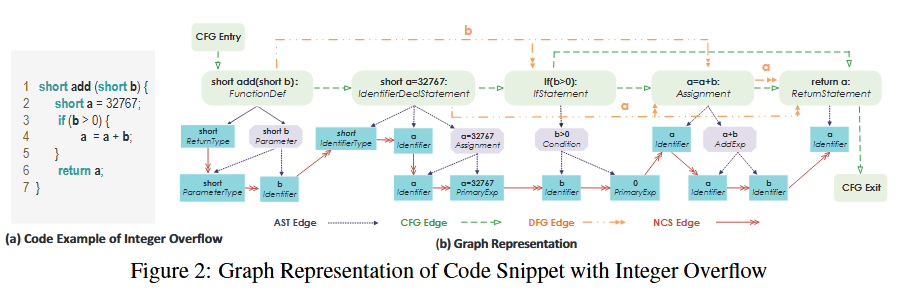

这篇文章我感觉写的挺好的，结构清晰，而且没什么废话，直入主题。


## 摘要
漏洞识别是重要的去保护软件系统安全的攻击来自网络安全。定位漏洞函数是尤其重要的来自源码中去促进修补。然而，这是一脚有挑战和冗长的进程，并且也需要特定的安全专家意见。受到在大量代码表征图中手动定义漏洞模式的启发和最近先进的图神经网络，我们提出了 Devign，一个生成式图神经网络基础模型用于图像分类通过丰富的代码语义表征学习。它包括一种全新的卷积模块去有效的拓展有用的特征在学习丰富节点表征对于图级分类。模型被手动标注的数据集训练，构建在 4 个分类大型开源 c 项目（包含搞复杂度和多样性的真实源代码而不是先前工作的合成代码）。在多个评估数据集上证明了 Devign 杰出的 SOTA 性能 ，提升了 10.51%的平均精度和 8.68%的 F1score，卷积模块可使得平均增加了 4.66%精度和 6.37%F1 。


## METHOD
把函数源码转换成 AST、CFG、DFG、自然代码顺序的多语义程序图，然后再用图神经网络学习漏洞模式，最后进行函数级漏洞二分类。


Devign 的三层架构

<!-- 这是一张图片，ocr 内容为： -->


```plain
Step 1: 输入一个 C/C++ 函数源码
Step 2: 使用 Joern 生成程序图结构
Step 3: 构造融合 AST / CFG / DFG / NCS 的 composite graph
Step 4: 对每个节点编码 Code 和 Type 特征
Step 5: 使用 Gated Graph Recurrent Network 进行多轮消息传播
Step 6: 使用 Conv 模块提取图级表示
Step 7: 使用 Sigmoid 输出 vulnerable / non-vulnerable 分类结果
```


<!-- 这是一张图片，ocr 内容为： -->


将一个源代码表征称为 AST、CFG、DFG、NCS 的示例图


## Contribution
+ 在复合型的代码表征中，以 AST 作为主干网，我们精确编码不同层级程序控制和数据依赖转变成一个有很多种类组成的边的共有图，每一个类型提示链接关于相关性表征。
+ 我们提出了具备卷积模型的门控图神经网络模型，针对图级分类。卷积模块学习层级性的节点特征为了夺取更高等级的表征为了图级分类任务
+ 我们执行 Devign，并且评估他的有效性通过人工标注的 4 个受欢迎的 c 库数据集。我们制作了两个数据集并开源。结果展示，Devign 实现平均 10.51%的精度提升和 8.68%的 F1 分数提升。然而，卷积模型提升了 4.66%jingdu he 6.37%的 F1 增长。我们应用 Devign 到 40 个最新的 cve 并且得到了 74.11%的精度。证明了他在挖掘新漏洞的可行性。


