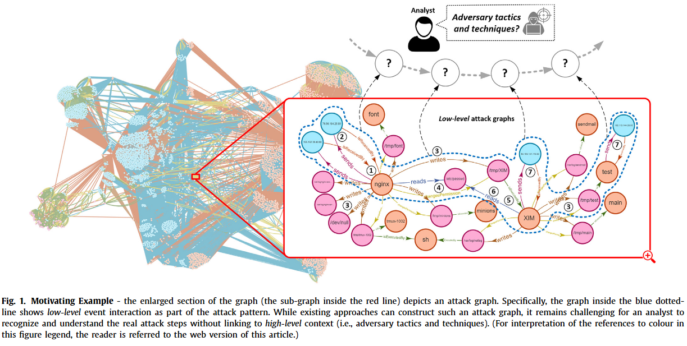
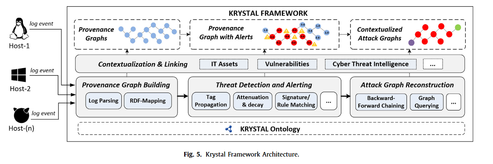

KRYSTAL: 基于图谱的知识框架审计数据对于策略攻击发现

## 摘要：
基于图谱的攻击方法是有希望的方法对于发现攻击和多样的技术最近变得提议。一个关键的限制，然而，到目前为止方法是先进的，巨大的在他们的架构和参差的在他们的模型中。现有的死板的定制化数据模型和代码中的规则执行，而不是陈述性的语言一方面导致它困难的去合并、拓展和复用技术，另一方面阻碍安全知识复用（包括规则检测和威胁情报）。KRYSRAL 索具这些挑战通过提供一个图知识，模块化的框架对于威胁检测、攻击图谱和场景重建，并且基于 RDF（作为一个知识表征的标准模型） 分析。这些方法提供查询选项，促进内部语境化和拓展背景知识，也整合多种检测技术，包括标签传播，攻击签名，和图查询。我们执行了我们的框架在一个开放可用原型和证明了他的适用性在 DARPA 公开的计算数据集的多种情节。我们的评估结果展示，我们框架整合的多种不同的检测技术提高了检测能力。此外，我们发现RDF来源图是可扩展的，可以有效地支持各种威胁检测技术。

<!-- 这是一张图片，ocr 内容为： -->

<!-- 这是一张图片，ocr 内容为： -->

