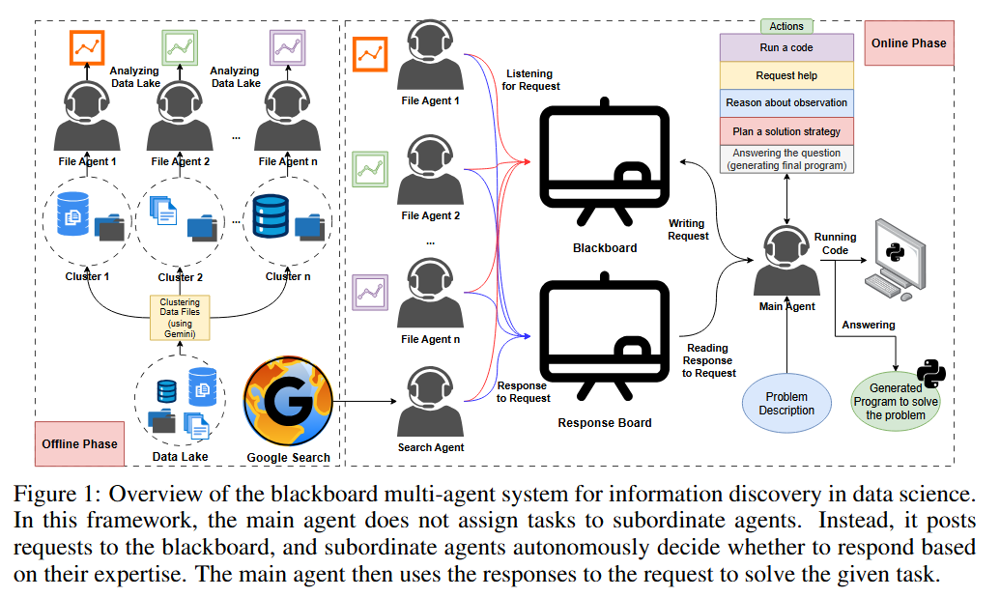

聚焦多 Agent 共享图/黑板、动态状态/任务图

文章比较老了，感觉投了好几轮了，文中使用的还是 gemini2.5

## 摘要

LLM 的快速发展在数据科学开启了新的大门，然而他们实际的部署通常是约束的在大型数据池中查找相关数据的挑战。现有的方法与以下斗争：单 agent 系统被大的目标快速淹没，混杂的文件在数据池中，然而多 agent 系统设计基于主从式的范式依赖一个需要精确每一个子 agent 能力知识的僵化中心控制。为了验证这些限制，我们提出一个新颖的多 agent 交流范式，借鉴黑板架构为传统的 ai 模型。在这个架构中，一个中心 agent 在共享黑板上提出需求，而各自主从属智能体（他们或负责数据池的某一分区，或承担通用信息检索工作）会依据自身能力主动响应。这个设计提升了可拓展性和灵活性通过消除对中心协调者需要拥有全部子 agent 专家先验知识的需求。我们评估我们的方法在三个 benchmarks（需要显式数据挖掘任务）：KramaBench 和为了融入数据挖掘功能而改造后的 DSBench 和 DACode。实验结果证明黑板架构基本上超越 baseline，包括 rag 和主从多智能体范式，实现端到端任务成功相对改善在 13%-57%并且提升 9%相关增长在 F1 数据挖掘分数超过最佳的 baseline 同时涵盖闭源与开源模型。我们的发现证实黑板范式作为一个可拓展的和可归纳的交流框架为多智能体。

## 解决的问题

pk 单智能体和多智能体，他就是提出一个 goal，然后全自动的调用子 agent 围绕这个 goal 来完成这个任务

## METHOD
<!-- 这是一张图片，ocr 内容为： -->

论文中方法的描述也比较简单，也比较容易理解

主 agent：

规划、推理、执行代码、发布任务、提问

子 agent：

文件 agent、搜索 agent

