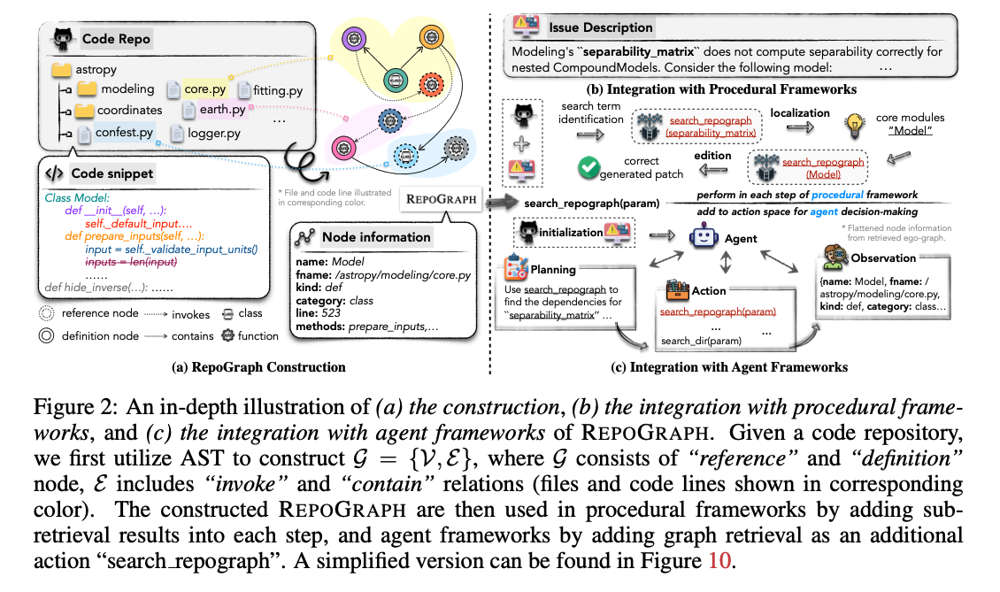

全篇没公式都，完整方法论 2 页

REPOGRAPH 先把代码仓库变成一张“函数/类/调用关系图”，然后根据 issue 里的关键词找出相关子图，把这些结构化上下文喂给 LLM，帮助它更准地定位和修改代码。


## 摘要：
llm 在代码生成领域出色，但是在现代 ai 软件工程任务中还困难。不想传统的函数级别或者文件级别的 coding 任务，ai 软件工程不但需要基础的 coding 熟练，而且需要先进的 skills 用于管理和交互与 code repo。然而，现存的防范通常忽略了 repo 级别的理解需求，这是至关重要的对于精确的掌握广泛的上下文和制定有效的解决方案。

基于此，我们提出了 repograph，一个插件模块用于**管理 repo级别结构**用于现代 ai 软件工程解决方案。rpeograph 提供了所需的引导，并充当存储库

为人工智能软件工程师提供宽导航。我们评估了 repograph 在 swe-bench 通过将它插入 4 个不同的方法，repograph 可观地提升了所有系统的性能，引导了一个新的 sota 开源框架。我们分析也证明了 repograph 的扩展性和灵活性通过在其他 repo 级别的 codeing benchmark 测试。


## METHOD
<!-- 这是一张图片，ocr 内容为：ISSUE DESCRIPTION CODE REPO MODELING'S"SEPARABILITY CORRIX " DOES NOT COMPUTE SEPARABILITY CORRECTLY FOR NESTED COMPOUNDMODELS. CONSIDER THE FOLLOWING MODEL: ASTROPY MODELING (B)INTEGRATION WITH PROCEDURAL FRAMEWORKS FITTING.PY CORE.PY EARTH.PY SEARCH TERM COORDINATES LOCALIZATION CORE MODULES IDENTIFICATION SEARCH REPOGRAPH 个 叫 "MODEL" LOGGER.PY CONFEST.PY (SEPARABILITY MATRIX) EDITION CORRECT SEARCH REPOGRAPH: 个 CODE SNIPPET GENERATED PATCH (MODELL *FILE AND CODE LINE ILLUSTRATED PERFORM IN EACH STEP OF PROCEDURAL FRAMEWORK CLASS MODEL: REPOGRAPH SEARCH_REPOGRAPH(PARAM) IN COMESPONDING COLOR. DEF_INIT_(SELF......): ADD TO ACTION SPACE FOR AGENT DECISION-MAKING SELF.DEFAULT_INPUT... INITIALIZATION *FLATTENED NODE INFORMATION NODE INFORMATION DEFP EF PREPARE INPUTS(SELF,..): FROM RETRIEVED EGO-GRAPH. INPUTSELF._VALIDATE_INPUT_UNITSO OBSERVATION NAME:MODEL INPUTS-LENLINPUT) PLANNING FNAME://ASTROPY/MODELING/CORE.PY (NAME:MODEL, FNAME:/ DEF HIDE_INVERSE(..):...... KIND: DEF USE SEARCH_REPOGRAPH TO ACTION ASTROPY/MODELING/CORE.PY, FIND THE DEPENDENCIES FOR CATEGORY:CLASS KIND:DEF,CATEGORY:CLASS... LINE:523 SEARCH_REPOGRAPH(PARAM) CLASS REFERENCE NODE INVOKES "SEPARABILITY_MATRIX". (METHODS:PREPARE_INPUTS,.. FUNCTION DEFINITION NODE CONTAINS SEARCH_DIR(PARAM) (A)REPOGRAPH CONSTRUCTION (C)INTEGRATION WITH AGENT FRAMEWORKS FIGURE 2: AN IN-DEPTH ILLUSTRATION OF (A) THE CONSTRUCTION,(B)THE INTEGRATION WITH PROCEDURAL FRAME- WORKS, AND (C) THE INTEGRATION WITH AGENT FRANEWORKS OF REPOGRAPH, GIVEN A CODE REPOSITORYS WE FIRST UTILIZE AST TO CONSTRUCT G - (V,EY, WHERE G CONSISTS OF "REFERENCE" AND "DEFINITION" NODE, E INCLUDES "INVOKE" AND "CONTAIN" RELATIONS (FILES AND CODE LINES SHOWN IN CORRESPONDING COLOR). THE CONSTRUCTED REPOGRAPH ARE THEN USED IN PROCEDURAL FRAMEWORKS BY ADDING SUB- CH STEP, AND AGENT FRAMEWORKS BY ADD RETRIEVAL RESULTS INTO EACH STEP ADDING GRAPH RETRIEVAL AS AN ADDITIONAL IFIED VERSION CAN BE FOUND IN FIGURE 10. ACTION"SEARCH REPOGRAPH".A SIMPLIFIED VE -->



### 1. 先扫描整个代码仓库
输入是一个完整 repository，比如：

```plain
astropy/
  modeling/
    core.py
    separable.py
  coordinates/
  fitting.py
  ...
```

REPOGRAPH 会遍历仓库里的代码文件，过滤掉无关文件，比如 `.git`、配置文件、普通文本文件等，只保留真正的代码文件。

### 2. 用 Tree-sitter 解析代码
然后它用 **Tree-sitter** 把每个代码文件解析成 AST，也就是语法树。

它重点找这些东西：

```plain
函数定义
类定义
方法定义
函数调用
类/函数引用
包含关系
```

比如：

```plain
class Model:
    def prepare_inputs(self):
        self._validate_input_units()
```

REPOGRAPH 会识别出：

```plain
Model 是一个类定义
prepare_inputs 是 Model 里的方法
_validate_input_units 是被调用的方法
```

### 3. 过滤掉无关依赖
代码里会有很多对任务没帮助的调用，比如：

```plain
len(x)
list(...)
tuple(...)
print(...)
```

这些 Python 内置函数虽然也是调用，但通常不是修 bug 的关键。还有一些第三方库调用也可能干扰定位。

所以 REPOGRAPH 会过滤掉两类关系：

```plain
Python 内置函数 / 标准库关系
第三方库关系
```

它更关注**当前项目内部的函数、类、模块之间的关系**。

### 4. 构造代码图
构图时，每个节点是一个**代码行级别的节点**。

节点大致分两种：

```plain
def node：定义节点，比如 class Model、def foo()
ref node：引用节点，比如某处调用了 Model 或 foo()
```

边主要有两类：

```plain
invoke 边：表示“谁调用了谁”
contain 边：表示“谁包含了谁”
```

比如：

```plain
class Model
  └── contains → def prepare_inputs

def prepare_inputs
  └── invokes → def _validate_input_units
```

所以最后得到的不是普通目录树，而是一张 repository-level code graph：

```plain
代码行
  ↔ 函数
  ↔ 类
  ↔ 文件
  ↔ 调用关系
  ↔ 包含关系
```

## 如何用这张图？
构好图以后，REPOGRAPH 不会把整张图都塞给 LLM，因为太大了。

它会根据当前任务里的关键词检索一小块相关子图。

比如 issue 里说：

```plain
separability_matrix does not compute correctly
```

那 REPOGRAPH 可能会搜索：

```plain
search_repograph("separability_matrix")
```

然后它会找出：

```plain
separability_matrix 的定义
谁调用了它
它调用了谁
它在哪个文件
它属于哪个类/模块
周围有哪些相关函数
```

这块局部子图叫 **ego-graph**，可以理解为：

以某个关键词为中心，向外扩展一跳或两跳，找出和它有直接结构关系的代码。

然后把这块图展开成文本，放进 prompt 里给 LLM。


## 解决的问题：
llm 在真实软件任务场景中没有仓库级理解的问题。

第一，**普通 RAG 多以文件或文本片段为单位检索**，能找到“语义相似”的代码，但不一定找到“结构相关”的代码。例如 issue 提到了某个函数，但真正需要修改的位置可能在它调用的类、父类、helper function 或跨文件依赖中。论文明确指出 file-level indexing 只能找语义相似片段，不能保证找到真正相关的代码。

第二，**Agentless 这类方法虽然会让 LLM 看仓库结构，但仍然把 repository 当成 flat documents**。也就是说，它能看到目录树、文件名、函数名，但没有显式建模“谁调用谁”“哪个 definition 被哪里 reference”。

第三，**Agent 框架虽然能搜索、打开文件、运行测试，但如果没有全局仓库结构引导，容易陷入局部最优**。模型可能一直围绕某个可见文件打转，而忽略真正相关的跨文件依赖。


## 贡献
第一，提出了一个 **line-level repository code graph**。相比 file-level RAG，它更细；相比普通目录树，它有 def/ref、invoke/contain 等结构关系；相比纯 Agent 搜索，它提供全局结构导航。

第二，REPOGRAPH 是一个 **plug-in module**，不是绑定某个特定框架。它可以接入 procedural framework，也可以接入 agent framework。

第三，它证明了 **repository-level graph context 对 SWE-bench 这类真实软件工程任务确实有增益**。尤其是在 localization 阶段，结构化依赖比单纯语义检索更有效。


## 局限性
系统使用 gpt-4，没有广泛评估别的模型

只在 swe-bench lite 做主评估，泛化能力不足

只覆盖 py，没有其他语言。

repograph 只有定义、饮用、调用和包含关系，没有完整的程序语义，缺少更强的静态分析信息（data flow、control flow、type hierarchy 等）

过滤变量和第三方依赖可能丢失关键信息

纯静态仓库图导航

