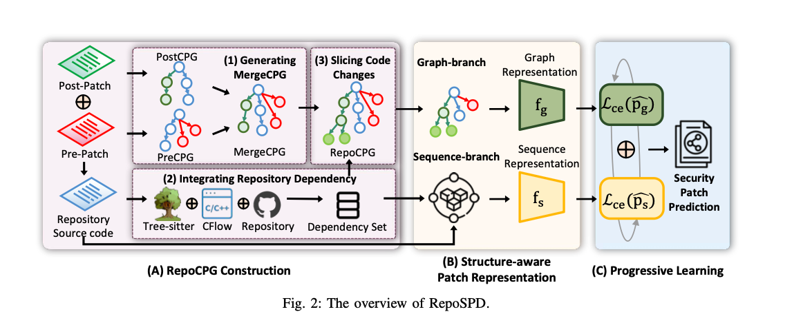
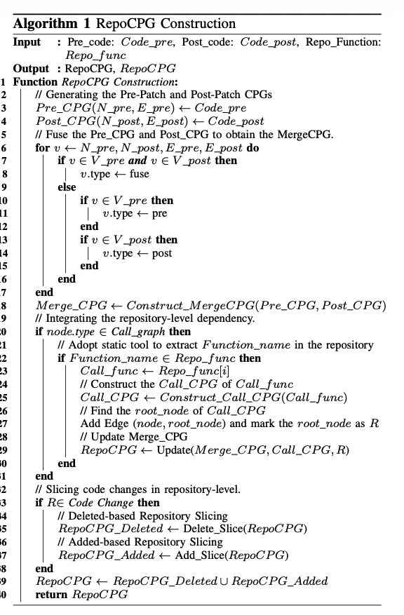
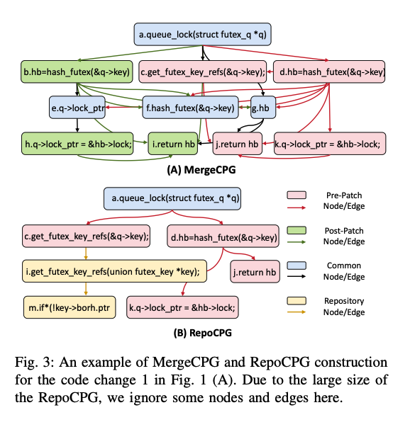

## Abstract
软件供应商通常默默的发布安全补丁，不提供任何建议或者延期更新资源。然而，检测安全补丁是必要的去确保软件安全维护。然而，现有的方法面对以下挑战：1.他们主要针对有 patch 的信息，忽略了 repo 中复杂的依赖 2.安全补丁通常涉及多种的函数和文件，加大了有效学习表征的难度。为了缓和这些挑战，这篇文章提出 了 repo 级别的安全补丁检测框架，名为 RepoSPD，包括三个关键部分 1.repoo 级别的图构建， RepoCPG，代表软件补丁通过融合 pre-patch 和 post-patch 源代码在 repo 级别 2.融合图分支与序列分支的的结构感知补丁表示，意图去理解多处代码更改的关系 3.先进性学习，促进模型平衡语义和结构信息。为了评估 repoSPD，我们使用两种广泛使用的数据集在安全补丁检测：SPI-DB 和 PatchDB。我们进一步拓展了这些数据集的 repo 领域的数据，合并总共 20238 和 28781 版本用 c/c++语言的 repo，分别的，表示为 SPI-DB*和 PatchDB*。我们对比了 RepoSPD 和现有的 6 种安全补丁检测方案和五个静态工具。我们实验结果证明 RepoSPD 超越 SOTA，从两个数据集的精度而言分别的提升了 11.90%和 3.10%。这些结果强调 RepoSPD 在检测安全补丁的效率。此外，RepoSPD 能够检测 151 安全补丁，其准确率相较于最优基准模型高出21.36%

# method

<!-- 这是一张图片，ocr 内容为：POSTCPG GRAPH (3) SLICING CODE (1)GENERATING GRAPH-BRANCH REPRESENTATION MERGECPG CHANGES POST-PATCH LCE (PG) SEGUENCE MERGECPG REPOCPG PRE-PATCH SEQUENCE-BRANCH PRECPG REPRESENTATION (2)LNTEGRATING REPOSITORY DEPENDENCY SECURITY PATCH 目一08 FS LCE PS人 PREDICTION REPOSITORY TREE-SITTER  CFLOW REPOSITORY DEPENDENCY SET SOURCE CODE (B) STRUCTURE-AWARE (A)REPOCPG CONSTRUCTION (C)PROGRESSIVE LEARNING PATCH REPRESENTATION FIG. 2:THE OVERVIEW OF REPOSPD. -->

<!-- 这是一张图片，ocr 内容为：ALGORITHM 1 REPOCPG CONSTRUCTION PRE_CODE: CODE PRE,POST_CODE: CODE POST,REPO_FUNCTION: INPUT REPO_FUNC :REPOCPG,REPOCPG OUTPUT FUNCTION REPOCPG CONSTRUCTION: 11G GENERATING THE PRE-PATCH AND POST-PATCH CPGS PRE CPG(N PRE ,E PRE ) CODE PRE POST_CPG(N_POST,E_POST)CODE POST I/FUSE THE PRE_CPG AND POST_CPG TO OBTAIN THE MERGECPG FOR U PRE,N_POST,E_PRE,E_POST DO IF U E V PRE AND U E V POST THEN 7 U.TYPEFUSE 8 ELSE 6 IFVEVPRETHEN 0 U.TYPEPRE END IF U E V POST THEN U.TYPEPOST END 6 END END MERGE_CPG < CONSTRUCT_MERGECPG(PRE.CPG,POST_CPG) 8 1L INTEGRATING THE REPOSITORY-LEVEL DEPENDENCY. 6 IF NODE.TYPE E CALL GRAPH THEN 0 IL ADOPT STATIC TOOL TO EXTRACT F UNCTION_NAME IN THE REPOSITORY 1 IF FUNCTION MAME E REPO-FUNC THEN 2 CALLFUNCRE REPO_FUNCLI] 3 LL CONSTRUCT THE CALL_CPG OF CALL_FUNC CALLCPGCONSTRUCT_CALLCALL.FUNE) LL FIND THE ROOT_NODE OF CALL_CPG ADD EDGE (NODE,ROOT NODE) AND MARK THE ROOT_NODE AS R L/UPDATEMERGE_CPG 8 REPOCPGUPDATE(MERGE_CPGCALL_CPGR) 9 0 END END // SLICING CODE CHANGES IN REPOSITORY-LEVEL. IF RE CODE CHANGE THEN 3 L/ DELETED-BASED REPOSITORY SLICING REPOCPG_DELETED DELETE SLICE(REPOCPG) 5 LL ADDED-BASED REPOSITORY SLICING 9 REPOCPG ADDED ADD_SLICE(REPOCPG) END REPOCPGREPOCPG DELETEDUREPOCPG ADDED RETURN REPOC PG -->

<!-- 这是一张图片，ocr 内容为：A.QUEUE_LOCK(STRUCT FUTEX_Q*Q) D.HBHASH_FUTEX(&Q->KEY) B.HB-HASH_FUTEX(&Q->KEY) C.GET_FUTEX KEY_REFS(&Q->KEY); F.HASH_FUTEX(&Q->KEY) E.Q->LOCK_PTR IG.HB H.Q->LOCK_PTR-&HB->LOCK; J.RETURN HB I.RETURN HB K.Q->LOCK_PTR&HB->LOCK; (A)MERGECPG 0101 01 PRE-PATCH A.QUEUE_LOCK(STRUCT FUTEX_Q*Q) NODE /EDGE POST-PATCH D.HBHASH_FUTEX(&Q->KEY) C.GET FUTEX_KEY_REFS(&Q->KEY): NODE /EDGE COMMON J.RETURN HB I.GET _FUTEX _KEY_REFS(UNION FUTEX KEY *KEY); NODE/EDGE REPOSITORY K.Q->LOCK_PTR-&HB->LOCK; M.IF*(!KEY-BORH.PTR NODE /EDGE (B)REPOCPG FIG.3 : AN EXAMPLE OF MERGECPG AND REPOCPG CONSTRUCTION FOR THE CODE CHANGE 1 IN FIG. 1(A). DUE TO THE LARGE SIZE OF THE REPOCPG,WE IGNORE SOME NODES AND EDGES HERE. -->

### 解决的问题：
1. 布丁依赖仓库级上下文，大部分方法只看 diff 片段或相关上下文，会丢掉关键语义

2.安全补丁常常垮多个函数、多文件、多 code change。这些变更不是线性相关，不能简单当作 diff 文本。例如同一个 commit 可能同时改多个函数，不同 diff hunk 之间通过调用关系、数据依赖或控制依赖关联。序列模型很难显式捕获这种结构关系。

### 贡献：
第一，提出了 RepoCPG，把 pre/post patch 的 CPG 融合起来，并引入仓库级调用依赖。  
第二，提出了 graph + sequence 双分支表示。Graph branch 负责结构依赖，Sequence branch 负责代码变更语义，两者互补。  
第三，构建了 SPI-DB* 和 PatchDB*，把原本 patch-level 的数据扩展为 repository-level 数据集，这对后续研究很有价值。

### 局限性：
仅支持 c/c++，迁移性不好

只考虑了 delted-bases 和 add-only，漏掉了 mix patch

repository-level dependency 主要基于静态函数调用，未充分覆盖函数指针、宏展开、条件编译、跨模块动态绑定、多级调用链等

LLM baseline 选的非常弱：Llama3-70B 的单 prompt，不能代表 llm/agent 的能力。

