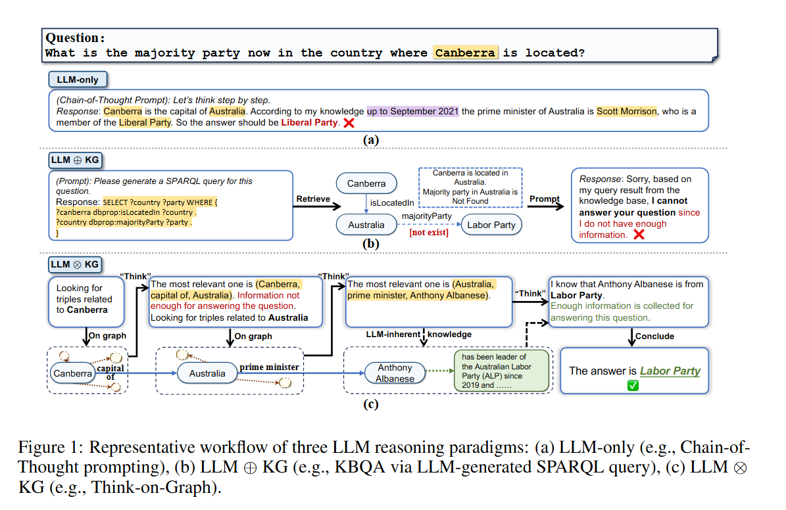
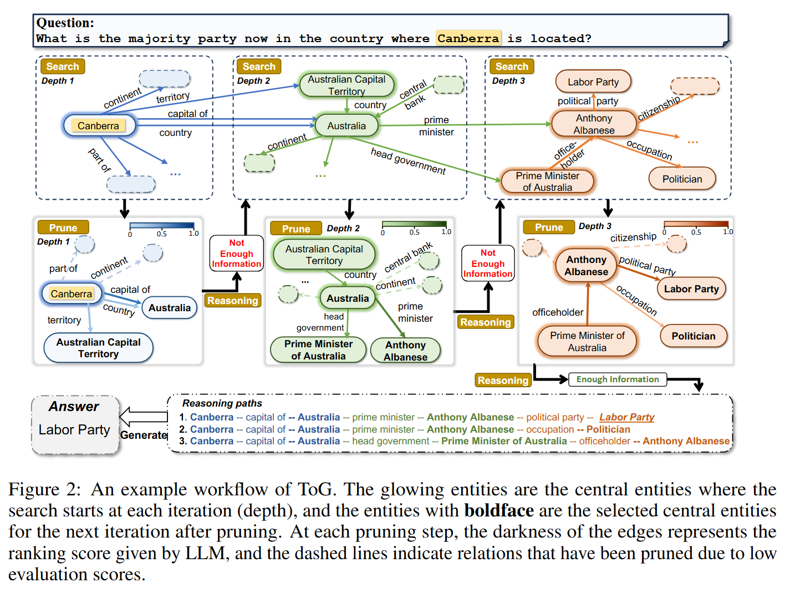

## 摘要：
尽管大模型已经实现了巨大的成功在多样的任务中，他们经常面临幻觉问题，尤其是需要深入和负责推理的场景。这个问题能被部分解决通过引进外部的知识图谱在 llm 推理中。在这篇文章，我们提出了一个新的 LLM-KG 集成范例“LLM ⊗ KG”这个范例看作 llm 作为一个 agent 交互式的拓展相关字符实体和关系在 kg 上，并且执行推理基于补偿知识。我们进一步执行这个范例通过引入一个新的方法称为 TOG，agent 迭代执行 beam 搜索在 kg，发现了最有希望的推理路径，并且返回了最客观的推理结果。我们使用大量的好设计实验去解释和证明 TOG 的以下优点：1.与 llms 对比，TOG 有更深入的推理能力 2.TOG 知识可追溯性的和知识可修正性的能力通过充分利用 llm 推理和专家回滚 3.TOG 提供了针对不同的 llm可以修复的插件-执行框架，KG 和 prompt 策略没有任何添加训练花费 4.TOG 在小模型的专业性能超出类似 gpt4 的大模型在某几个场景并且这些减少了 LLM 部署和应用的花费。作为一个有着更少计算资源花费和更好普适性的无需训练的方法，TOG 在 9 个数据集中有 6 个超过了所有 sota，这些 sota 都需要额外训练。开源地址：[https://github.com/DataArcTech/ToG](https://github.com/DataArcTech/ToG)

## METHOD

对比：

<!-- 这是一张图片，ocr 内容为： -->

TOG 方法：

<!-- 这是一张图片，ocr 内容为： -->

