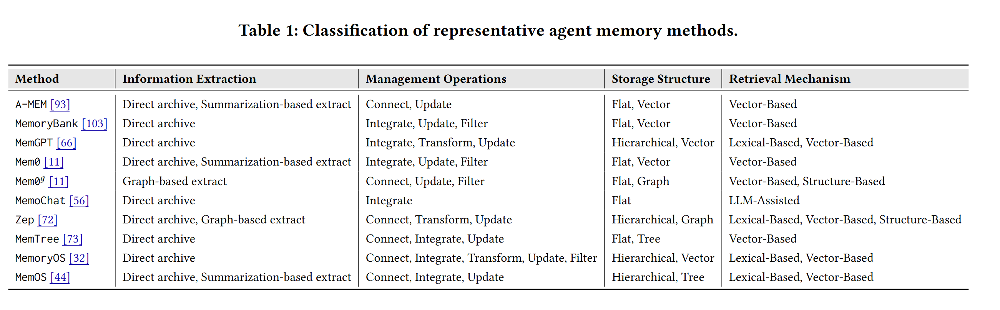
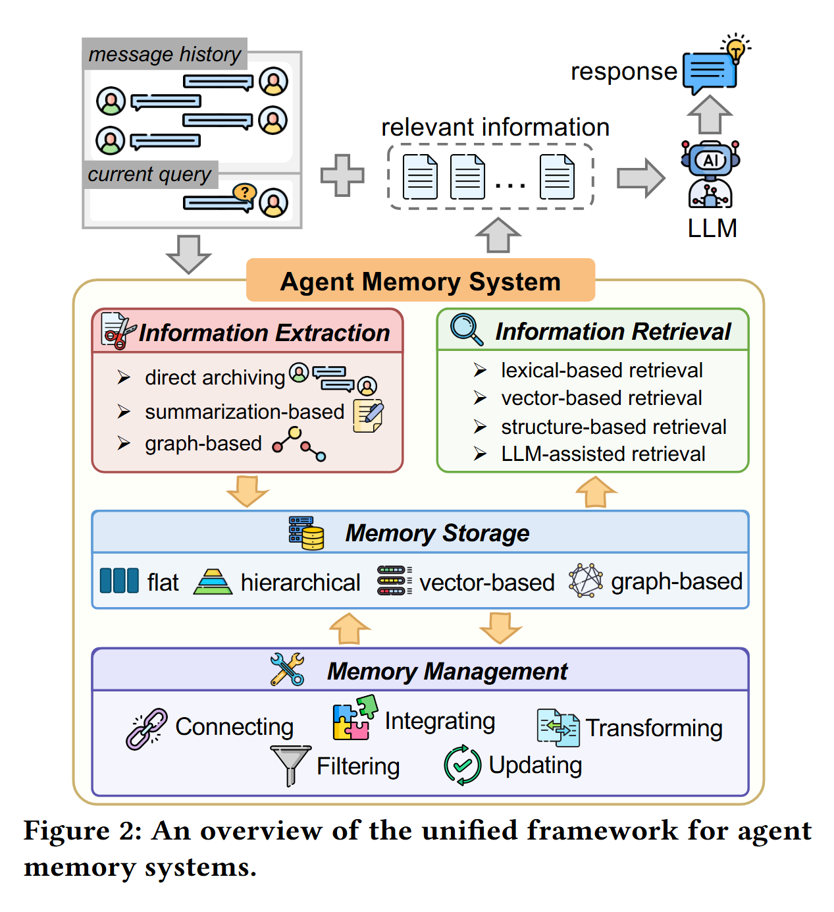
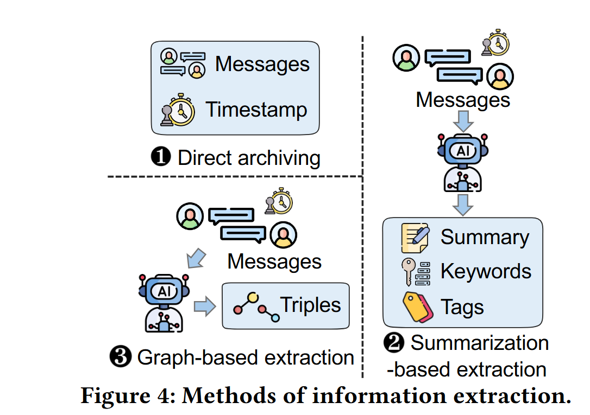
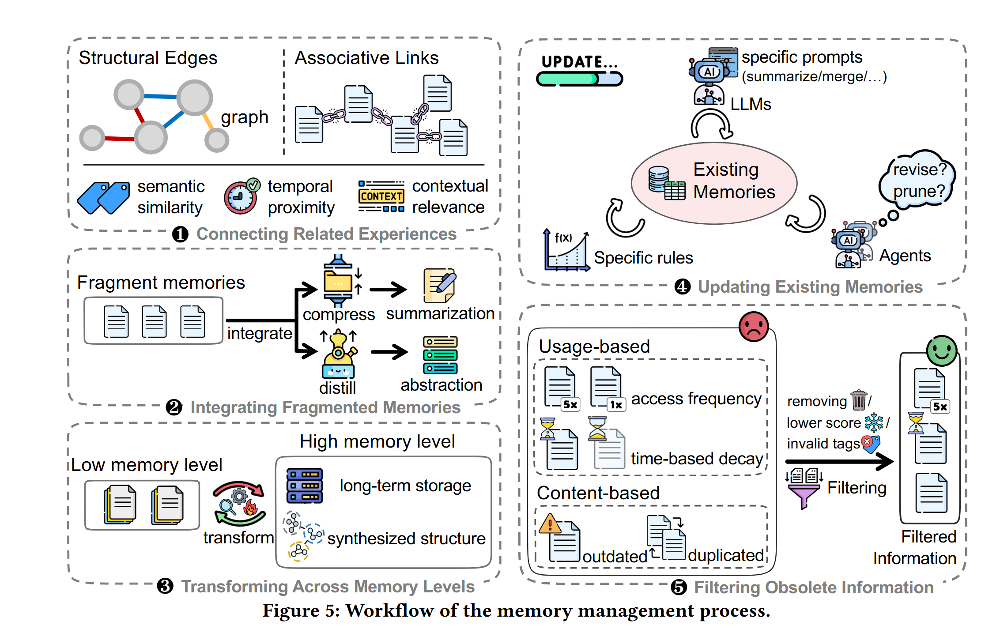
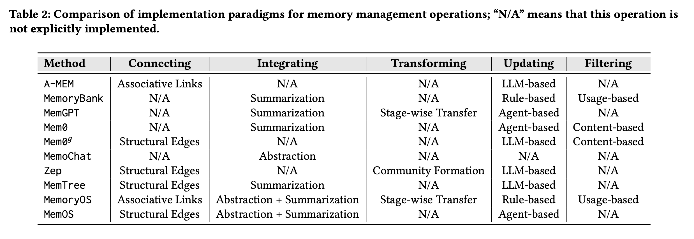
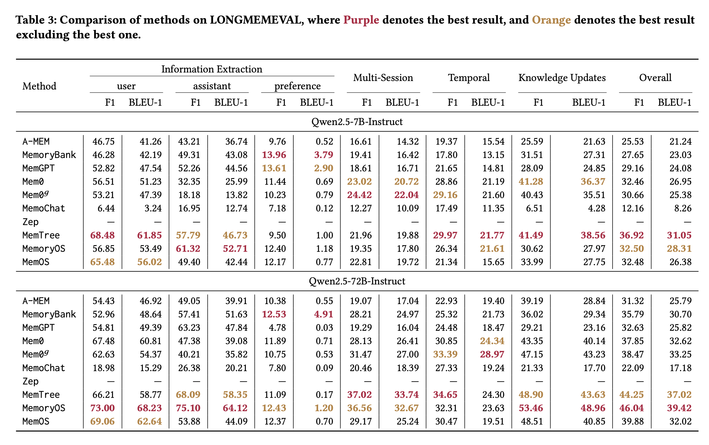

## 摘要：
记忆显现随着基于 llm 的 agent 针对长期复杂任务（例如，多轮对话，游戏对战，科学发现），记忆能够实现知识积累，迭代推理和自进化。大量的记忆防范已经提出。然而，这些方法还未系统化和彻底的对比在同样的实验设置下。在这篇文章中，我们第一次概述了一个一致性的框架（混合所有的现存的 agent 记忆防范从一个高等级的视角）。我们广泛的对比有代表性的 agent mem 方法在两个广为人知的 benchmark 和考核所以体育的方法的有效性，提供一个彻底的分析对这些方法。作为我们评估分析的副产品，我们也设计一种新的 mem 方法（超过了 sota）通过利用现有方法的模块。最终，基于所有的发现，我们提供了有前途的研究机会。我们相信，对现有方法行为的深入理解能够提供有价值的新视角对于未来的研究。

## 贡献

1.提出一个统一的框架（分解有代表性的 agent mem 方法成为四种模块化的组件），使得系统性的对比他们的不同

2.我们带领全面的实验研究在 LOCOMO 和 LONGMEMEVAL，一起分析了 token 花费，山下文可拓展性，证明位置敏感性和 llm 主干网依赖

3.基于上述分析，我们提出一种新的 agent mem 方法（超越 sota），我们提出了若干关键视野和高度期待的研究方向

## METHOD

<!-- 这是一张图片，ocr 内容为： -->

现有的方法，然后做了 decompose

<!-- 这是一张图片，ocr 内容为： -->

这个统一分析的 mem 框架，做系统性的对比

### 信息提取
三种信息提取方式：1 直接实现；2 基于总结的提取；3 基于图的提取

<!-- 这是一张图片，ocr 内容为： -->

基于图的提取：该方法利用大语言模型从数据M中抽取细粒度实体与关系，构建用于知识图谱搭建的 主语-谓语-宾语 三元组（例如Mem0、Zep）。此外，系统会记录创建时间、失效时间等时间元数据，为图谱化记忆的动态更新与时序推理提供支撑。附录A中给出了针对图谱信息抽取所设计的具体提示词示例。

### 记忆管理
<!-- 这是一张图片，ocr 内容为： -->

1 关联相关经历

2 整合支离破碎的记忆

3 记忆转换：低级记忆、长记忆、综合记忆

4 更新现有记忆：

基于规则的更新：memorybank，memos。基于语义和关键词相似度整合新记忆

基于 llm 的更新：memtree。引导 llm 做记忆压缩

基于 agent 的更新：memgpt，memos。

5 过滤过时信息（obsolete）

Usage-based : mmeos,memorybank. memories created a long time age and rarely retrived are filtered first

content-based : 使用 llm 来检测和过滤过时的知识，降低噪声和验证检索精度

### 记忆存储
主要对比向量存储和图存储

1 Flat storage : single-tier storage 

2 Hierarchical(分层) storage

3 vector-based storage : encode etxtual memory into high-dimensional embedding, subsequently indexed in dedicated vector libraries or databases, such as FAISS and Qdrant.  Vector-based storage can function as a standalone repository or serve as a foundational building block frequently integrated into more complex storage architecture.

4 graph-based storage: graph topologies(拓扑). trees , knowledge graph , temporal graph. rich structural information. MEMTree organized memory into a hierarchical tree where each node encapsulates(概括的）  aggregated(总计的) textual content. 

 Zep 应用一个时序图谱

这类基于图的存储方式能够捕捉复杂关联与多跳联系，而这些关系是单纯的向量相似度指标无法体现的。

 

### 信息检索
<!-- 这是一张图片，ocr 内容为：TABLE ZICOMPARISON OF INDLEMENTATION PARADIG FOR MEMOR MEMORY MANAGEMENT OPERATIONS THAT THAT THIS OS NOT EXPLICITLY IMPLEMENTED. METHOD UPDATING FILTERING CONNECTING TRANSFORMING INTEGRATING LLM-BASED N/A N/A N/A ASSOCIATIVE LINKS A-MEM N/A USAGE-BASED RULE-BASED N/A SUMMARIZATION MEMORYBANK STAGE-WISE TRANSFER N/A MEMGPT AGENT-BASED N/A SUMMARIZATION CONTENT-BASED N/A SUMMARIZATION MEMO N/A AGENT-BASED N/A N/A STRUCTURAL EDGES CONTENT-BASED MEM09 LLM-BASED N/A N/A MEMOCHAT ABSTRACTION N/A N/A N/A STRUCTURAL EDGES LLM-BASED COMMUNITY FORMATION N/A ZEP N/A LLM-BASED SUMMARIZATION STRUCTURAL EDGES N/A MEMTREE RULE-BASED ASSOCIATIVE LINKS USAGE-BASED MEMORYOS STAGE-WISE TRANSFER ABSTRACTION + SUMMARIZATION N/A MEMOS ABSTRACTION +SUMMARIZATION STRUCTURAL EDGES N/A AGENT-BASED -->

## Experiment

<!-- 这是一张图片，ocr 内容为：TABLE 3-CAMPARISON OF METHODS ON  JONGMEVAL, WHE BESULT EXCLUDING THE BEST ONE. INFORMATION EXTRACTION KNOWLEDGE UPDATES MULTI-SESSION OVERALL TEMPORAL METHOD PREFERENCE ASSISTANT USER F1 F1 F1  BLEU-1 BLEU-1 BLEU-1 BLEU-1 F1 F1 BLEU-1 F1 BLEU-1 F1 QWEN2.5-7B-INSTRUCT 43.21 A-MEM 21.63 9.76 19.37 25.59 46.75 41.26 14.32 25.53 15.54 0.52 16.61 36.74 21.24 MEMORYBANK 42.19 27.31 19.41 13.96 16.42 23.03 49.31 17.80 27.65 13.15 3.79 31.51 43.08 46.28 18.61 MEMGPT 24.85 13.61 24.08 47.54 52.26 2.90 29.16 21.65 16.71 44.56 28.09 52.82 14.81 23.02 26.95 MEMO 51.23 11.44 28.86 36.37 20.72 0.69 56.51 25.99 32.35 41.28 32.46 21.19 29.16 24.42 35.51 10.23 0.79 25.38 MEM0G 13.82 53.21 47.39 22.04 40.43 30.66 18.18 21.60 7.18 8.26 17.49 MEMOCHAT 12.74 12.27 0.12 4.28 6.51 3.24 16.95 10.09 12.16 11.35 6.44 ZEP 21.96 9.50 29.97 61.85 57.79 68.48 46.73 31.05 21.77 41.49 19.88 1.00 MEMTREE 36.92 38.56 56.85 28.31 MEMORYOS 52.71 12.40 53.49 19.35 17.80 26.34 61.32 1.18 30.62 32.50 21.61 27.97 26.38 12.17 56.02 MEMOS 19.72 27.75 21.34 33.99 0.77 42.44 22.81 65.48 15.65 49.40 32.48 OWEN2.5-72B-INSTRUCT A-MEM 25.79 49.05 22.93 17.04 28.84 39.19 10.38 31.32 0.55 54.43 19.40 19.07 46.92 39.91 MEMORYBANK 30.70 29.34 25.32 28.21 48.64 51.63 57.41 24.97 21.73 12.53 35.79 52.96 4.91 36.02 23.16 25.82 MEMGPT 24.48 49.39 47.84 19.29 32.63 63.23 0.03 54.81 29.21 4.78 16.04 18.47 40.14 28.13 MEMO 0.71 30.85 26.41 47.38 43.35 67.48 60.81 39.08 11.89 37.85 32.62 24.34 47.15 MEM0G 10.75 43.23 35.82 33.39 27.00 31.47 33.25 40.21 0.53 38.47 62.63 54.37 28.97 7.80 17.18 15.29 17.70 MEMOCHAT 27.33 26.38 21.33 20.46 20.21 18.39 22.09 18.98 19.24 0.09 ZEP 58.77 66.21 43.63 11.09 58.35 37.02 34.65 68.09 37.02 0.17 44.25 33.74 MEMTREE 48.90 24.30 73.00 32.31 75.10 39.42 64.12 36.56 12.43 68.23 23.63 48.96 32.67 MEMORYOS 53.46 46.04 1.20 29.17 25.24 MEMOS 0.70 30.47 32.02 12.37 53.88 40.85 48.51 19.51 69.06 62.64 39.88 44.09 -->

## LESSONS
1 层级化 memory 优于扁平 memory

2 结构化表示不能牺牲原始上下文：虽然三元组、图结构等 structured representations 能提升组织能力，但仍然需要保留 raw dialogue context，否则在信息抽取或检索阶段容易发生语义损失

3 memory 粒度要优化，不能一轮对话一条 memory：把多个 dialogue turns 作为一个整体单元进行信息抽取或 memory management，可以显著减少 token 消耗；同时，合适的切分还能保持检索信息的连贯性

## OPPORTUNITIES
1 统一的异构/多模态 memory：真实场景中的 memory 来源很复杂，包括文本对话、历史交互轨迹，以及音频、图片、视频等多模态信号；但现有 memory 方法通常只支持单一或有限形式。因此，一个重要方向是构建能在同一存储与检索框架下支持 heterogeneous and multimodal memory 的机制

2 高密度 memory 压缩，而不是无限增长：竞争力较强的 memory 方法往往会导致存储规模快速增长，从而增加管理和检索开销。未来需要研究如何在不丢失有用信息的情况下压缩 memory，包括 latent representation 和 learned compression mechanism

3 层级 memory 需要支持双向转换：现有 hierarchical memory 主要关注从 short-term memory 到 long-term storage 的 consolidation，但缺少反向转换。未来可以设计 bidirectional memory transformation，使 memory 能在不同层级之间高效压缩和重建

