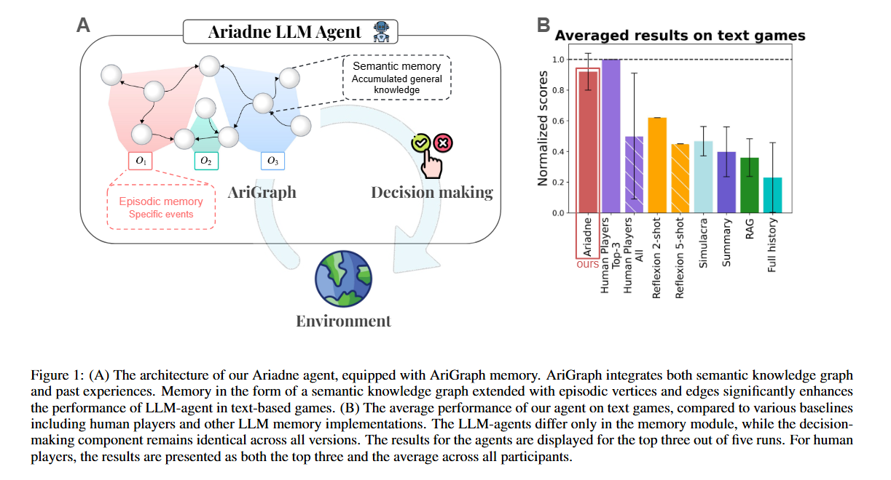
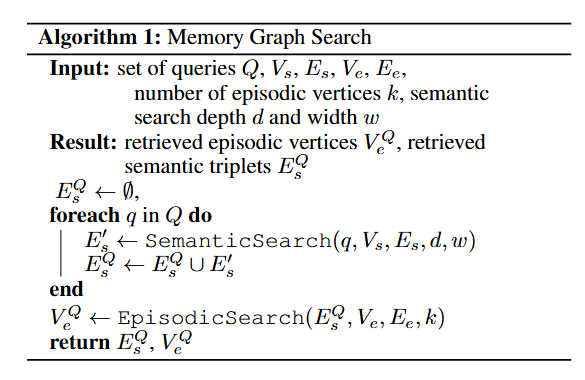
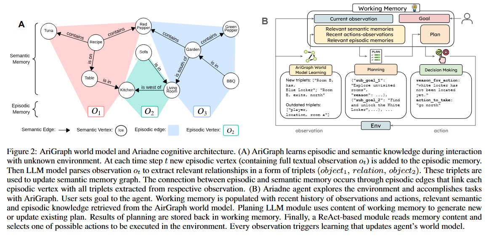
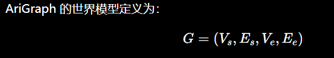
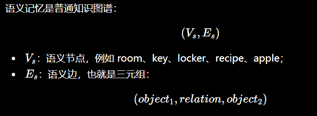
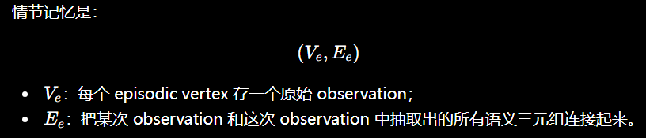
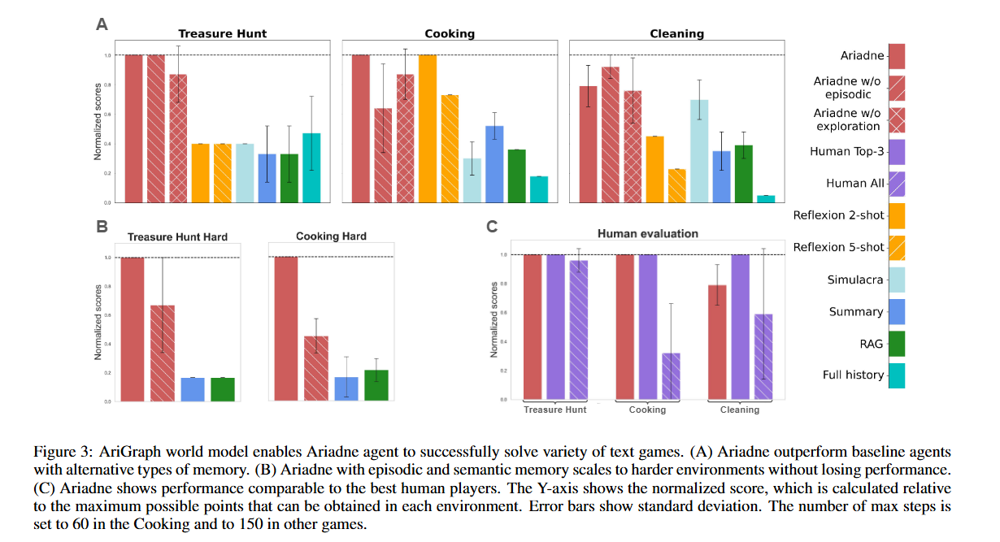

> 发表时间：202407
>
> 会议/期刊：IJCAI
>
> 作者：Petr Anokhin Russia
>
> 论文链接：[https://arxiv.org/pdf/2407.04363](https://arxiv.org/pdf/2407.04363)
>
> 代码/数据集链接：
>
> Tag：

---

# ABSTRACT

llm 的先进能力已经创造了一个坚实的地基为发展全自动化 agent。有了正确的 tools，这些 agents 能够学习解决环境中遇到的任务通过积累和更新他们的知识。

当前的基于 llm 的 agent 梳理过往经验使用完整的结果记忆，摘要，检索扩充。

然而，这些非结构化的记忆表征，不能促进推理和规划针对复杂的决策制定。

在我们的研究中，我们介绍了 AriGraph，一个新颖的方法（agent 构建和更新一个记忆图，整合了语义和一系列探索环境的记忆）。

我们证明了我们的 Ariadne LLM Agent，由增设了规划和决策制定的新型记忆架构构成，使用交互式文本环境有效解决了复杂的任务，这些任务人都感觉到难。

结果展示，我们的方法显著的超越了其他资深的记忆方法和强壮的 RL Baseline 在一系列多样性的复杂任务。

其次，AriGraph 证明了有竞争力的性能对比专门 graph-based 方法在静态 multi-hop 问题提出。

# PROBLEM TO SOLVE

### problem description:

RQ1：Can LLM based agents learn useful structured world model `<u>`from scratch(从 0 开始) `</u>`via interaction with an environment?

RQ2：Does structured knowledge representation improve retrieval of relevant facts from memory and enable effective exploration?

### Limitations of Existing Methods

现有方法的问题是：记忆是非结构化的

1.Full history：把所有的历史 observation/action 都塞进上下文

2.Summary mem：不断总结历史

3.Vector RAG：把过去经验向量化，按相似度检索

4.Reflection memory：失败后总结经验，下次使用

# METHOD

## overview

<!-- 这是一张图片，ocr 内容为： -->



<!-- 这是一张图片，ocr 内容为： -->



Agent 每一步接收文本观察，然后 LLM 抽取三元组，更新语义图；同时把原始 observation 存成 episodic vertex，并用 episodic edge 把这次观察和抽取出的三元组连接起来。之后规划器和决策器都从工作记忆里读取这些图检索结果。

<!-- 这是一张图片，ocr 内容为： -->



| 名称               | 作用                            |
| ------------------ | ------------------------------- |
| **AriGraph** | 记忆 / 世界模型模块             |
| **Ariadne**  | 使用 AriGraph 的完整 Agent 架构 |

## pipeline

```plain
Environment observation
        ↓
LLM extracts triplets
        ↓
AriGraph updates semantic + episodic memory
        ↓
Graph retrieval returns relevant facts + episodes
        ↓
Working memory
        ↓
Planner updates sub-goals
        ↓
ReAct decision maker selects action
        ↓
Environment
```

### AriGraph 定义核心数据结构

<!-- 这是一张图片，ocr 内容为： -->



<!-- 这是一张图片，ocr 内容为： -->



<!-- 这是一张图片，ocr 内容为： -->



### Constructing AriGraph：From observation to Dynamic world model

step1:LLM 抽取三元组。LLM 从 observation 抽取三元组，抽取的结果要短、具体、原子化

step2:检测过时的边。环境是动态的，所以图不能只增不删

step3:更新 semantic graph。把新实体和新边加入，同时删除过时边

step4:更新 episodic memory（情景记忆）

### 图检索过程：semantic search+Episodic search

AriGraph 的检索不是简单 top-k 向量检索，而是两阶段。

1.Semantic Search：先找相关三元组（搜索过程也会定义搜索深度 d 和搜索宽度 w）

query → relevant triplets → related entities → more triplets

2.Episodic Search：找相关历史观察。Semantic Search 得到一批相关三元组后，系统会通过 episodic edges 找到与这些三元组相关的历史 observation。

### Ariadne Agent 架构：图记忆如何参与规划和决策

```plain
Long-term memory: AriGraph
Working memory
Planner
Decision maker
Exploration helper
Environment interface
```

#### 1.工作记忆：

+ 当前 observation；
+ 最近几步 observation/action；
+ 主目标；
+ 上一轮 plan；
+ 从 AriGraph 检索出的 semantic memories；
+ 从 AriGraph 检索出的 episodic memories；
+ 未探索出口信息。

#### 2.Planning：生成或更新子目标

Planner 根据工作记忆生成 plan

#### 3.Decision Making：ReAct 动作选择

### Exploration 机制

AriGraph 不只是记忆，还辅助探索。它会从图中抽取类似：

```plain
kitchen, has unexplored exit, south
hall, east of, kitchen
```

然后检测当前房间有哪些“已发现但未探索”的出口。这样 Agent 可以系统性探索环境，而不是靠 LLM 自己猜。

这个机制对 Treasure Hunt 这种导航任务很重要，因为 Agent 必须构建地图、找到钥匙、箱子和目标物。论文的实验表明，去掉 exploration 后性能会下降

# CONTRIBUTION

### Claimed Contributions

ProPosed by the author

### Personal Assessment

My opinion: Novelty(new tasks? new dateset? new concept? innovation? new gap?  new theory? Combinatorial methods? )

# EXPERIMENTATION

Dataset:

BaseLine:

Result:

Ablation experiment:

Case Study:

<!-- 这是一张图片，ocr 内容为： -->



# Limitation
