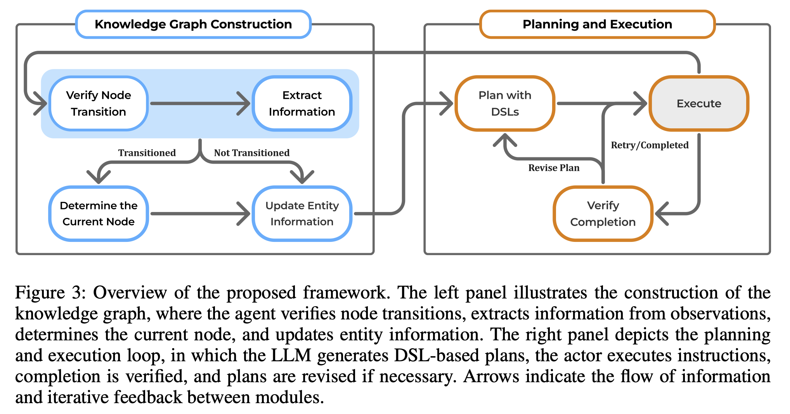
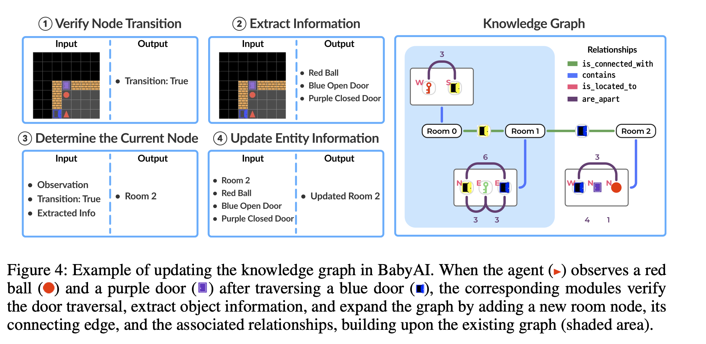

Graphmind：llm 作为一个动态的知识构建者对于时序决策制定

> 发表时间：ICLR 2026
>
> 作者：Yutong Li
>
> 论文链接：[https://openreview.net/pdf?id=XromAiEaE3](https://openreview.net/pdf?id=XromAiEaE3)
>
> 代码/数据集链接：[https://anonymous.4open.science/r/GraphMind-1080](https://anonymous.4open.science/r/GraphMind-1080)
>
> Tag：

---

# ABSTRACT

当前 llm 有了强大的推理能力，归咎于他们拓展外部知识，有效地内在化并且充分利用新消息在动态环境中一直是一个有意义的挑战。

这个限制是尤其明显的在部分可观测到的环境，这需要 agent 去管理统计且执行有效的探索在不完全信息中。

为了解决这个问题，我们提出了一个 llm agent 架构（整合一个知识图谱作为一个基于图的记忆模块去促进高级别行为规划。agent 逐步的从交互式环境中构建知识图谱，检索相关信息去生成有效规划。

我们评估了我们的方法，在复杂的导航式特殊任务，专为现有长时序和部分客观测挑战。实验结果表明，结合一个知识图谱作为一个拓展记忆显著增强了 llm 规划能力的成功率和有效性

# PROBLEM TO SOLVE

### problem description:

要解决 LLM agent 的长期交互记忆组织问题，不是单纯的知识图谱构建。

### Limitations of Existing Methods

1.只放最近轨迹的上下文：上下文窗口有限，长程任务中旧信息丢失

2.把历史压缩成摘要或者 stack memory：信息线形堆叠，难以区分空间位置、对象身份、门的连接关系

3.普通 RAG/GraphRAG 多是静态知识源：适合问答文档检索，不适合 agent 在探索过程中不断生成新知识、修正旧知识的场景。作者明确把自己和静态 rag/graphRAG 区分开：GraphMind 的知识库是不完整切不断演化的。

它的关键 insight 是：

对部分可观测的长程决策任务，mem 的结构化比 mem 的容量更重要。

线性记忆会让 agent“记得很多但用不好”；图结构能显示表示实体、位置、连接、方向和距离，从而服务规划。

# METHOD

### overview

<!-- 这是一张图片，ocr 内容为：PLANNING AND EXECUTION KNOWLEDGE GRAPH CONSTRUCTION EXTRACT PLAN WITH VERIFY NODE EXECUTE DSLS TRANSITION INFORMATION RETRY/COMPLETED NOT TRANSITIONED TRANSITIONED REVISE PLAN DETERMINE THE VERIFY UPDATE ENTITY COMPLETION CURRENT NODE INFORMATION FIGURE 3: OVERVIEW OF THE PROPOSED FRAN ID FRAMEWORK. THE LEFT PANEL ILLUSTRATES THE CONSTRUCTION OF THE THE KNOWLEDGE GRAPH, WHERE TH WHERE THE AGENT VERIFIES NODE TRANSITIONS, EXTRACTS INFORMATION FROM A OBSERVATIONS, DETERMINES THE CURRENT NODE, AND UPDATES ENTITY INFORMATION. THE RIGHT PANEL D PANEL DEPICTS THE PLANNING AND EXECUTION LOOP. IN WHICH THE LLM GENERATES DSL-BASED PLANS, THE ACTOR EXECUTES INSTRUCTIONS. COMPLETION IS VERIFIED, AND PLANS ARE REVISED IF NECESSARY.ARROWS IN E INFORMATION WS INDICATE THE FLOW OF INF D ITERATIVE FEEDBACK BETWEEN MODULES. AND ITER -->

KG：把每一步执行的结果总结进入图谱

Planing and execution：LLM 调用图谱工具，生成 DSL 计划、执行、验证、修正

<!-- 这是一张图片，ocr 内容为：VERIFY NODE TRANSITION KNOWLEDGE GRAPH EXTRACT INFORMATION OUTPUT INPUT OUTPUT INPUT RELATIONSHIPS IS CONNECTED WITH RED BALL CONTAINS TRANSITION:TRUE BLUE OPEN DOOR IS LOCATED_TO PURPLE CLOSED DOOR ARE_APART ROOM O ROOM ROOM 2 UPDATE ENTITY INFORMATION DETERMINE THE CURRENT NODE OUTPUT INPUT INPUT OUTPUT ROOM  2 OBSERVATION RED BALL UPDATED ROOM 2 ROOM 2 TRANSITION:TRUE BLUE OPEN DOOR EXTRACTED INFO PURPLE CLOSED DOOR FIGURE 4: EXAMPLE OF UPDATING THE KNOWLEDGE GRAPH IN BABYAL. WHEN THE AGENT ( ) OBSERVES A RED ) AND A PURPLE DOOR ( ) AFTER TRAVERSING A BLUE DOOR (I), THE CORRESPONDING MODULES VERIFY BALL THE DOOR TRAVERSAL, EXTRACT OBJECT INFORMATION, AND EXPAND THE GRAPH BY ADDING A NEW ROOM NODE,ITS CONNECTING EDGE, AND THE ASSOCIATED RELATIONSHIPS, BUILDING UPON THE EXISTING GRAPH (SHADED AREA)- -->

### 知识图谱设计

GraphMind 的图谱节点主要是 rooms / entities，边表示实体和位置之间的关系。论文中用了四类关系：

| Relation              | 含义                                         |
| --------------------- | -------------------------------------------- |
| `is_connected_with` | 房间/门之间的空间连接                        |
| `contains`          | 某个房间包含哪些对象                         |
| `is_located_to`     | 对象相对方向                                 |
| `are_apart`         | 对象之间的相对距离，用于区分视觉上相似的实体 |

作者把房间建模为节点，把门作为连接房间的边，房间中的对象通过 contains 和 is_located_to 注入图谱，同房间对象之间用 are_apart 表示相对距离。

图谱构建有四个 LLM 模块：

| 模块                                | 作用                                                            |
| ----------------------------------- | --------------------------------------------------------------- |
| **Verify Node Transition**    | 判断 agent 是否真的从一个房间转移到了另一个房间，并更新连接关系 |
| **Extract Information**       | 从当前 observation 里抽取对象、方向、相对距离                   |
| **Determine Current Node**    | 根据观察、上一节点、连接关系判断当前所在图节点                  |
| **Update Entity Information** | 把当前观察和已有节点信息融合，维护一致的实体状态                |

其中 Verify Node Transition 很关键，因为一旦误判“进入了新房间”，图谱会错误扩张。作者对这个模块用了 5 次 LLM 查询投票，并加入 self-evaluation 来提高鲁棒性

### 图谱工具调用

GraphMind 不是每轮都把完整图谱塞进 prompt，而是提供外部工具，让 LLM 按需查询。工具包括：

| Tool                                      | 作用                                                 |
| ----------------------------------------- | ---------------------------------------------------- |
| **Get Neighbor Entity Information** | 查询某节点及邻居节点的信息，并返回访问次数，辅助探索 |
| **Search Closest Entity**           | 用 BFS 找离当前节点最近的目标实体                    |
| **Find Unexplored Closed Door**     | 用 BFS 找最近的未探索关闭/锁定门                     |

# CONTRIBUTION

### Claimed Contributions

ProPosed by the author

### Personal Assessment

My opinion: Novelty(new tasks? new dateset? new concept? innovation? new gap?  new theory? Combinatorial methods? )

部分可观测环境中，如何动态构建结构化外部记忆，并通过工具调用图谱来做长期规划。

# EXPERIMENTATION

Dataset:

BaseLine:

Result:

Ablation experiment:

Case Study:

# Limitation
