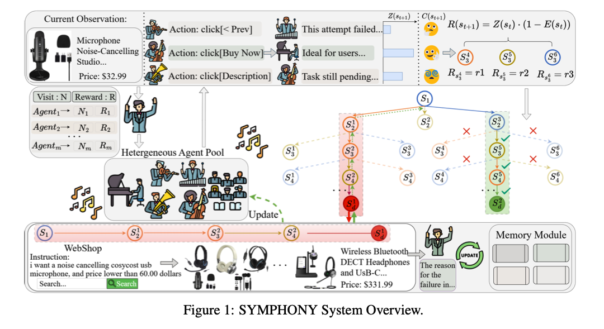
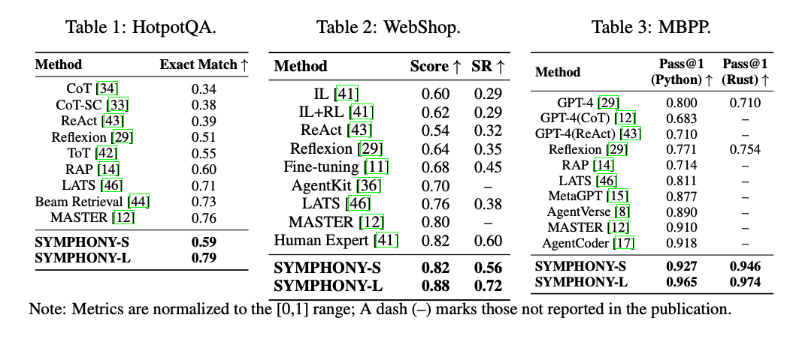
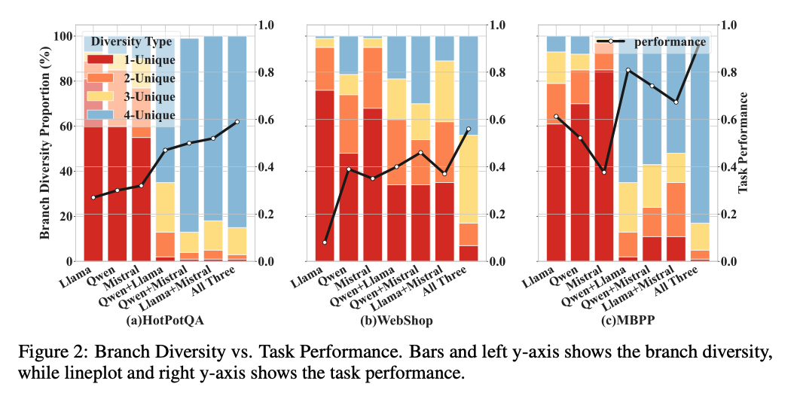

SYMPHONY：多智能体协同规划使用多样的大语言模型集群

> 发表时间：202601
>
> 会议/期刊：Neurips 2026
>
> 作者：Wei Zhu Yunnan University
>
> 论文链接：[https://arxiv.org/pdf/2601.22623](https://arxiv.org/pdf/2601.22623)
>
> 代码/数据集链接：
>
> Tag：Multi-Agent；Agent Planning
>

---

# ABSTRACT

现在使用 llm 构造自动化的 agent 去解决复杂任务

现存方法实用单一 agent 框架去生成搜索分支并且估计奖励在 MCTS（Monte carlo tree search）规划期间

为了解决这个限制，我们提出了 Synergistic Mutli-Agent Planning with Heterogeneous LaNguage model assembly（SYMPHONY），一个新颖的规划框架，集成一个池基于异构 LLM Agents。

通过充分利用 Agent 多样化的推理模式，SYMPHONY 增强首次出现的差异和促进更多有效拓展

以经验为依据的多个 benchmark 任务结果展示了 SYMPHONY 杰出的性能（甚至当开源模型部署在消费者级别的硬件上），当使用云端 api，SYMPHONY 证明显著提升，超越 sota 并且强调了规划任务中的异构多智能体协调的效果。

# PROBLEM TO SOLVE

### problem description: 
MDP：MarKov Decision Process

MCTS

### Limitations of Existing Methods

# METHOD

### overview
<!-- 这是一张图片，ocr 内容为：Z(ST+1):C(8T+1) CURRENT OBSERVATION: R(ST+1) THIS ATTEMPT FAILED... ACTION:CLICK[<PREV] MICROPHONE NOISE-CANCELLING IDEAL FOR USERS... ACTION:CLICK[BUY NOW] STUDIO... R S F F MI RST RSSS ACTION:CLICK[DESCRIPTION] TASK STILL PENDING... PRICE:S32.99 VISIT:NREWARD:R AGENTANRI AGENT2`N2R2 NM RM AGENTM SL HETERGENEOUS AGENT POOL X S S? S S BB UPDATE MEMORY MODULE WEBSHOP WIRELESS BLUETOOTH [UPDATE INSTRUCTION: DECT HEADPHONES I WANT A NOISE CANCELLING COSYCOST USB THE REASON AND  USB-C... MICROPHONE,AND PRICE LOWER THAN 60.00 DOLLARS FOR THE PRICE:S331.99 FAILURE IN... SEARCH... SEARCH FIGURE 1:SYMPHONY SYSTEM OVERVIEW. -->

### pipeline
1.Heterogeneous Agent Pool：增强推送多样化，通过多样的有意向的归纳和推理行为（不像 MCTS）。

2.Agent 调度：整合一个自适应调度机制，建立在 Vpper Confidence Bound 准则，制定 agent 选择在 MCTS 推送机制作为结构性多武装土匪问题

3.智能池记忆分享：agents update their behavior by integrating peer-generated reflections into prompt-level memory

4.熵调制节点评价：调节阈值，优化效果。

# CONTRIBUTION

### Claimed Contributions
ProPosed by the author

a multi-agent planning framework that combines MCTS with a diverse pool of language models.

SYMPHONY improves both search diversity and planning effectiveness.

### Personal Assessment
My opinion: Novelty(new tasks? new dateset? new concept? innovation? new gap?  new theory? Combinatorial methods? )

Combinatorial methods

# EXPERIMENTATION

<!-- 这是一张图片，ocr 内容为：TABLE 1:HOTPOTQA TABLE 3:MBP. TABLE 2:WEBSHOP. PASS@1 PASS@1 SCORE个SR个 EXACT MATCH 个 METHOD METHOD METHOD (PYTHON)(RUST)个 COT[34] 0.34 IL41] 0.60 0.29 GPT-4[29] 0.800 0.710 COT-SC[33] 0.38 IL+RL[41] 0.29 0.62 GPT-4(COT)12] 0.683 REACT [43] 0.39 REACT [43] 0.32 0.54 GPT-4(REACT)[43] 0.710 REFLEXION [29] 0.51 REFLEXION [29] 0.35 0.64 291 REFLEXION 0.754 0.771 TOT [42] 0.55 0.714 FINE-TUNING [11] RAP[14] 0.45 0.68 RAP [14] 0.60 LATS [46] 0.811 I AGENTKIT [36] LATS 46] 0.70 0.71 METAGPT |15] 0.877 - LATS [46] 0.73 BEAM RETRIEVAL[44] 0.38 0.76 AGENT VERSE (8] 0.890 MASTER 12] 0.76 MASTER [12] 0.80 - 0.910 MASTER |2] - HUMAN EXPERT [41] 0.60 0.82 SYMPHONY-S 0.918 0.59 AGENTCODER [17] SYMPHONY-L 0.79 0.927 0.946 SYMPHONY-S 0.56 SYMPHONY-S 0.82 SYMPHONY-L 0.974 0.965 0.72 0.88 SYMPHONYL NOTE: METRICS ARE NORMALIZED TO THE (O,1) MARKS A DASH (-) MARKS THOSE NOT REPORTED IN THE PUBLICATIO -->

<!-- 这是一张图片，ocr 内容为：1.0 1.0 1.0 100 DIVERSITY TYPE PERFORMANCE BRANCH DIVERSITY PROPORTION(%) 1-UNIQUE 0.8 -0.8 0.8 2-UNIQUE 80 3-UNIQUE TASK PERFORMANCE 4-UNIQUE 97 0.6 0.6 -0.4 0.4 40 0.2 0.2 0.2 20- -0.0 0.0 0.0 QWEN LLAMA LLAMA LLAMA QWEN MISTRAL QWEN MISTRAL MISTRAL ALL THREE ALL THREE ALL THREE OWEN+LLAMA OWEN+LLAMA QWEWEWELISTRAL OWEN+MISTRAL OWEN+MISTRAL LLAMA+MISTRAL LLAMA+MISTRAL LLAMA+MISTRA (A)HOTPOTQA (C)MBPP (B)WEBSHOP FIGURE Z: BRANCH DIVERSITY VS. TASK PERFORMANCE. BARS AND LEFT Y-AXIS SHOWS THE BRANCH DIVERSITY, WHILE LINEPLOT AND RIGHT Y-AXIS SHOWS THE TASK PERFORMANCE. -->

# Limitation
调阈值真的可靠吗？我的理解就是，做数据集的适配。不过好多顶会的文章都是这么做的，包括 ai 的，安全四大，说明肯定是具有可行性的。

