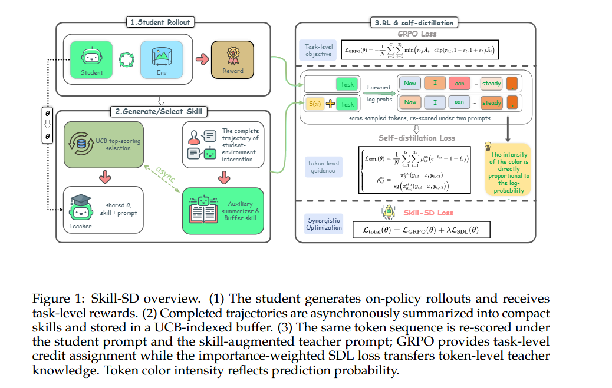
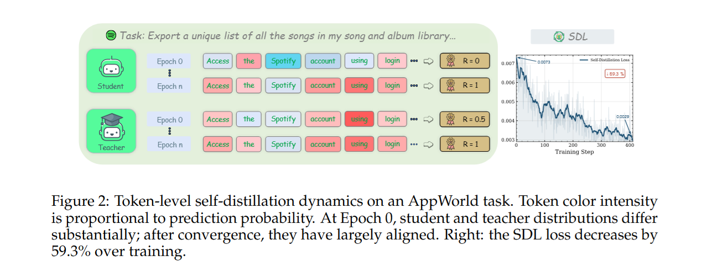

> 发表时间：202604
>
> 会议/期刊：arxiv
>
> 作者：hao wnag CAS
>
> 源码：[https://skill-sd.github.io/](https://skill-sd.github.io/)
>
> Tag：

---

# ABSTRACT

RL has been widely used to tarin llm agents for multi-turn interactive tasks, but its sample effciency is severly limited by sparse rewards and long horizons(长周期).

On-policy self-distillation(OPSD) alleviates this by providing dense token-level supervision from a provileged teacher that has access to ground-truth answers. Howervr, such fixed privileged information cannot capture the diverse valid strategies in agent tasks, and naively combining OPSD with RL often leads to training  cokkapse.

To address these limitations, we introduce Skill-SD, a framework that turns the agent's own trajectories into dynamic training-only supervision. Completed trajectories are summarized into compact natural language skills that describe successful behaviors, mistakes, and workflows. These skills serve as dynamic privileged information conditioning only the teacher, while the student always acts under the plain task prompt and learns to internalize the guidance through distillation.

To stabilize the training, we derive an importance-weighted reverse-KL loss to provide gradient-correct tolen-level distillation, and dynamically synchronize the teacher with the improving student. Experimtntal results on agentic benchmarks demonstrate that Skill-SD substantially outperforms on agentic benchmarks demonstrate that skills-SD substantially outperforms the standard RL baseline, improving both vanilla GRPO(+14.0% / + 10.9% on AppWorld / Sokoban) and vanilla OPD(+42.1% / +40.6%)

# PROBLEM TO SOLVE

### problem description:

1. what should the teacher know?
2. How to keep training stable?

## overview

<!-- 这是一张图片，ocr 内容为： -->

<!-- 这是一张图片，ocr 内容为： -->

## pipeline

> What is Input?
>
> What does each model do?
>
> What is indicated in the middle?
>
> What is Output?

1.Plain-prompt-on-Policy Rollouts: The student generates rollouts using only the task prompt - no distilled skills - preserving identical train/test conditioning.

2.Trajectory-to-skill distillation: an auxiliary llm compresses each episode into a reusable skill summary of success, failures, and workflow.

3.Teach-Only skill replay: retrived skills go only to the teacher, which re-scores the trajectory token by token - student inputs stay unchanged.

4.Joint RL + Distillation: GRPO handles trajectory-level reward; importance-weighted  reverse-KL distills token-livel guidance and corrects teacher-student mismatch.

# CONTRIBUTION

### Claimed Contributions

ProPosed by the author

1.skill as dynamic teacher signal

2,importance-weighted reverse-KL loss

3.Necessity of dynimic teacher synchronization

dynamic skill summaries: each completed trajectory us asynchronously summarized into a structured skill: success patterns, mistake analysis, and golden workflow.

Teach-only Guidance: skills augment the teacher's prompt only. The student always operates under a clean task prompt, eliminating train-test mismatch.

Gradient-correct Distillation: An imprtance-weighted reverse-KL loss corrects pertoken gradient bias caused by teach and student distribution mismatch.

### Personal Assessment

My opinion: Novelty(new tasks? new dateset? new concept? innovation? new gap?  new theory? Combinatorial methods? )

# EXPERIMENTATION

Dataset:

BaseLine:

Case Study:

Result:

Ablation experiment:

# Limitation
